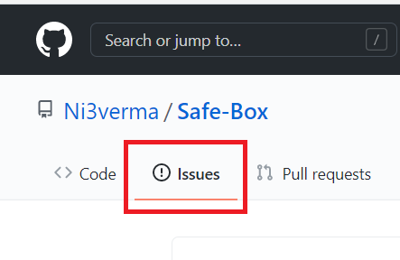
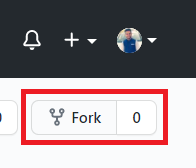
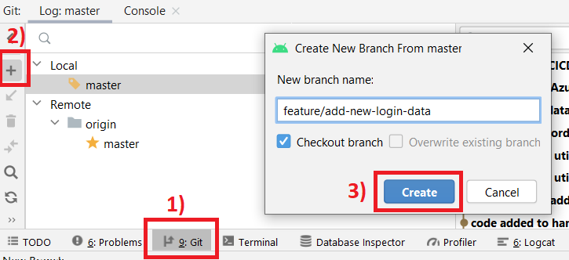
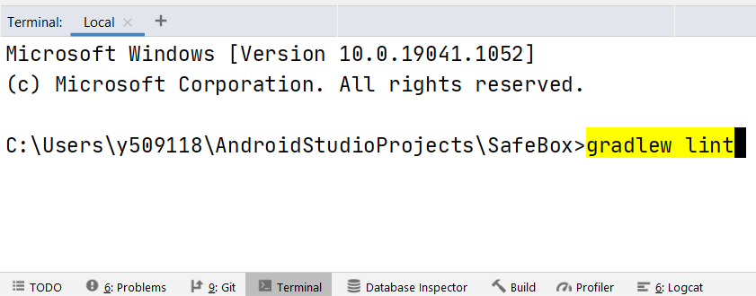
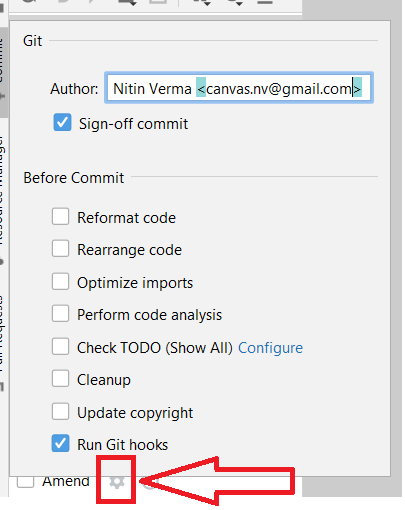
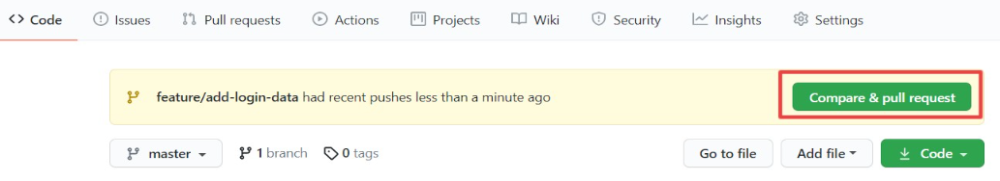
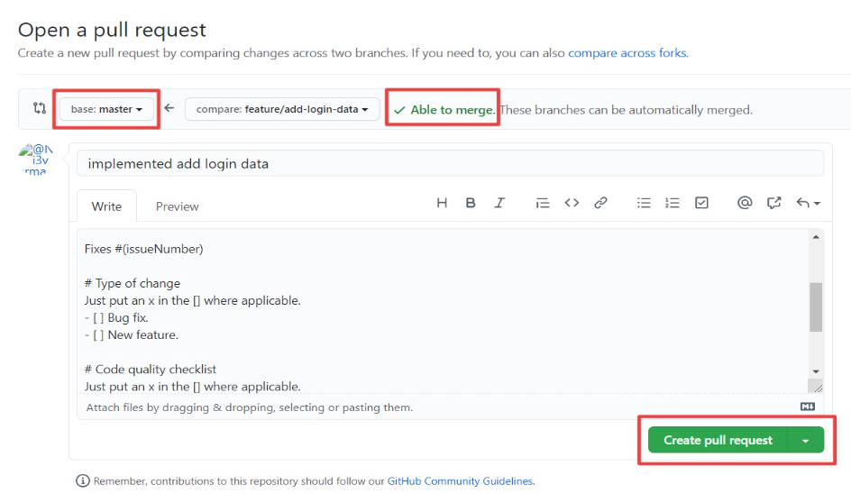

# Contributing

When contributing to this repository, please first raise a new issue or discuss on an existing issue.

## Overview Of Process (For experienced developers)
1. Find/Create a Issue > Fork the repo > work on your branch (name = `feature/nameOfFeature`).
2. Verify lint report.
```
gradlew lint
```
3. push > wait for CI pipeline to complete > verify the reports in artifacts.
4. Wait for your changes to be merged.

## Pull Request Process (In-Detail)

### 1. Explore
* Run the app, find issues and raise one in github
* **OR** see the issues section in github, leave a comment on a issue on which you want to work. If no one is working on it then it will be assigned to you and you can start to work on it.


### 2. Fork the repository



### 3. Create a new branch
* From android studio

  
* **OR** From command line

  `git checkout -b feature/add-new-login-data`
  
IMPORTANT : Follow this naming convention for new branch names : `feature/nameOfFeature`

### 4. Run the project locally and test your changes on emulator/Real device. Feel free to ask for help on slack. Everyone is beginner at first.

### 5. Run `gradlew lint` in Android studio integrated terminal.As shown below the command will be automatically highlighted in Yellow, after this press `ctrl+enter`. You can find report at this location `app/build/reports/lint-results.html`. If you see a new error/warning because of your code, make sure you fix it before making a PR.


### 6. Before you push your changes, make sure you merge latest master changes in your feature branch.
```
First pull latest changes from my master to your master:
git remote add upstream git://github.com/Ni3verma/Safe-Box.git
git checkout master
git pull upstream master

Now checkout your new branch and merge master in it:
git checkout yourNewBranchNameHere
git merge master
```

### 7. Commit your changes

Use (`Cmd/Ctrl+K`) to open commit window in Android Studio. In the Author box, use this format :
`name <email>`. eg: `Nitin Verma <canvas.nv@gmail.com>`



### 8. Create Pull Request
Open the forked repo in browser. You should see an option to create pull request.



Then in this dialog verify that:
* base is master.
* compare is your new branch.
* Able to merge is green tick.
* Fill data required in description box.



Create the pull request and verify that all the checks are green before sening it for review.

### 9. Wait for someone to review your code and merge changes.
