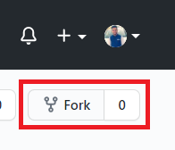
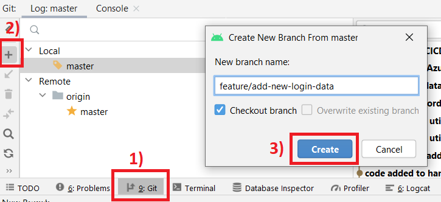
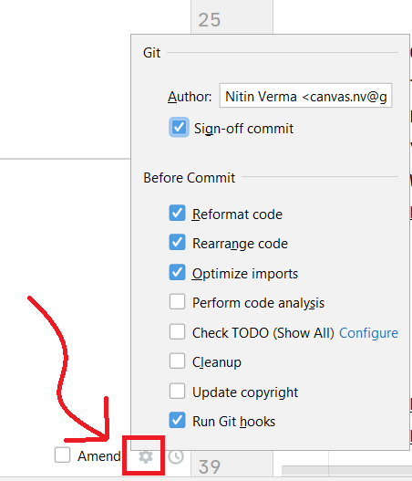

# Contibuting

When contributing to this repository, please first raise a new issue or discuss on an existing issue.

## Overview Of Process (For those who have worked on open source projects before)
1. Find/Create a Issue > Fork the repo > work on your branch (name = `feature/nameOfFeature`).
2. Verify detekt, ktlint, lint reports.
3. push > wait for CI pipeline to complete > verify the reports in artifacts.
4. Wait for your changes to be merged.

## Pull Request Process (In-Detail)

### 1. Explore
* Run the app, find issues and raise one in github
* **OR** see the issues section in github, leave a comment on a issue on which you want to work. If no one is working on it then it will be assigned to you and you can start to work on it.


### 2. Fork the repository



### 3. Create a new branch
* From android studio

  
* **OR** From command line

  `git checkout -b feature/add-new-login-data`
  
IMPORTANT : Follow this naming convention for new branch names : `feature/nameOfFeature`

### 4. Run the project locally and test your changes on emulator/Real device.

### 5. Run Analyze>Inspect Code. In the "Inspection Scope" section, choose uncommited files and click "OK" and fix the issues.

### 6. Run ktlint formatter.
* You can either install ktlint plugin > select app from left side project navigation > Select Refactor then "Format with ktlint" option towards bottom.
* **OR** you can run `gradlew ktlintFormat` in Android studio integrated terminal.

### 7. Run `gradlew lint` in Android studio integrated terminal. You can find report at this location `app/build/reports/lint-results.html`. If you see a new error/warning because of your code, make sure you fix it before making a PR.

### 8. Commit your changes
* You can commit from command line. On commit detekt and ktlint will run automatically to verify code quality. If you have already run the ktlint formatter then you should not see many errors.
```
git add .
git commit -m'a descriptive message here'
```
* Incase you are commiting from Android studio (`ctrl+K`) then make sure to select these below options and in the Author box enter in this format only : `name <email>`. eg: `Nitin Verma <canvas.nv@gmail.com>`



### 9. Solve detekt, ktlint errors
In case your commit was failed. then correct issues in detekt and ktlint reports found in below locations respectively and re-commit:
```
app/build/reports/detekt/detekt.html
app/build/reports/ktlint/ktlintMainSourceSetCheck/ktlintMainSourceSetCheck.txt
```
INFO : For ktlint : errors can also be found in the commit error message.

NOTE : untill ktlint and detekt issues are fixed, you will not be able to commit your changes.

Once commit is done, push your changes.

### 10. Create Pull Request
Open the forked repo in browser. You should see an option to create pull request.


Then in this dialog verify that:
* base is master.
* compare is your new branch.
* Able to merge is green tick.
* Fill data required in description box.


After create pull request, wait for all the checks to pass


You can also track progress in actions tab. Click on the workflow to see which steps have executed or have error. If you scroll to the bottom of a workflow then you can also see the reports. Download and verify the reports.


### 11. Wait for someone to review your code and merge changes.
