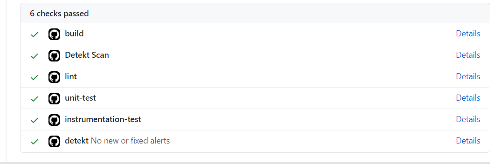
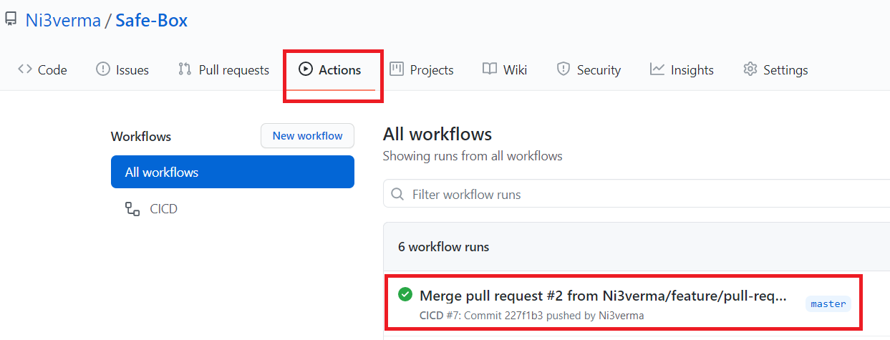

# Contributing

When contributing to this repository, please first raise a new issue or discuss on an existing issue.

## Overview Of Process (For experienced developers)
1. Find/Create a Issue > Fork the repo > work on your branch (name = `feature/nameOfFeature`).
2. Verify lint report. Detekt and ktlint check will automatically happen in pre-commit hook.
```
gradlew lint
```
3. push > wait for CI pipeline to complete > verify the reports in artifacts.
4. Wait for your changes to be merged.

## Pull Request Process (In-Detail)

### 1. Explore
* Run the app, find issues and raise one in github
* **OR** see the issues section in github, leave a comment on a issue on which you want to work. If no one is working on it then it will be assigned to you and you can start to work on it.


### 2. Fork the repository


### 3. Create a new branch
* From android studio

  
* **OR** From command line

  `git checkout -b feature/add-new-login-data`
  
IMPORTANT : Follow this naming convention for new branch names : `feature/nameOfFeature`

### 4. Run the project locally and test your changes on emulator/Real device. Feel free to ask for help on slack. Everyone is beginner at first.

### 5. Run `gradlew lint` in Android studio integrated terminal.As shown below the command will be automatically highlighted in Yellow, after this press `ctrl+enter`. You can find report at this location `app/build/reports/lint-results.html`. If you see a new error/warning because of your code, make sure you fix it before making a PR.


### 6. Before you push your changes, make sure you merge latest master changes in your feature branch.
```
First pull latest changes from my master to your master:
git remote add upstream git://github.com/Ni3verma/Safe-Box.git
git checkout master
git pull upstream master

Now checkout your new branch and merge master in it:
git checkout yourNewBranchNameHere
git merge master
```

### 7. Commit your changes
* (Not Recommended) You can commit from command line.
```
git add .
git commit -m'a descriptive message here'
```
* (Recommended way) In case you are committing from Android studio (`ctrl+K`) then make sure to select these below options and in the Author box enter in this format only : `name <email>`. eg: `Nitin Verma <canvas.nv@gmail.com>`


On commit detekt and ktlint will run automatically to verify code quality.

### 8. Solve detekt, ktlint errors
In case your commit failed, then correct issues in detekt and ktlint reports found in below locations respectively and re-commit:
```
app/build/reports/detekt/detekt.html
app/build/reports/ktlint/ktlintMainSourceSetCheck/ktlintMainSourceSetCheck.txt
```
INFO : For ktlint, errors can also be found in the terminal.
INFO : Incase Detekt fails, then report will automatically open in browser
NOTE : until ktlint and detekt issues are fixed, you will not be able to commit your changes.

Once commit is done, push your changes.

### 9. Create Pull Request
Open the forked repo in browser. You should see an option to create pull request.


Then in this dialog verify that:
* base is master.
* compare is your new branch.
* Able to merge is green tick.
* Fill data required in description box.


After create pull request, wait for all the checks to pass



You can also track progress in actions tab. Click on the workflow to see which steps have executed or have error. If you scroll to the bottom of a workflow then you can also see the reports. Download and verify the reports.



### 10. Wait for someone to review your code and merge changes.
