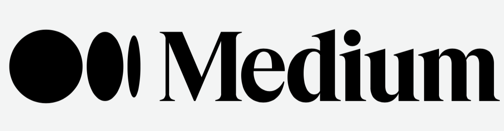
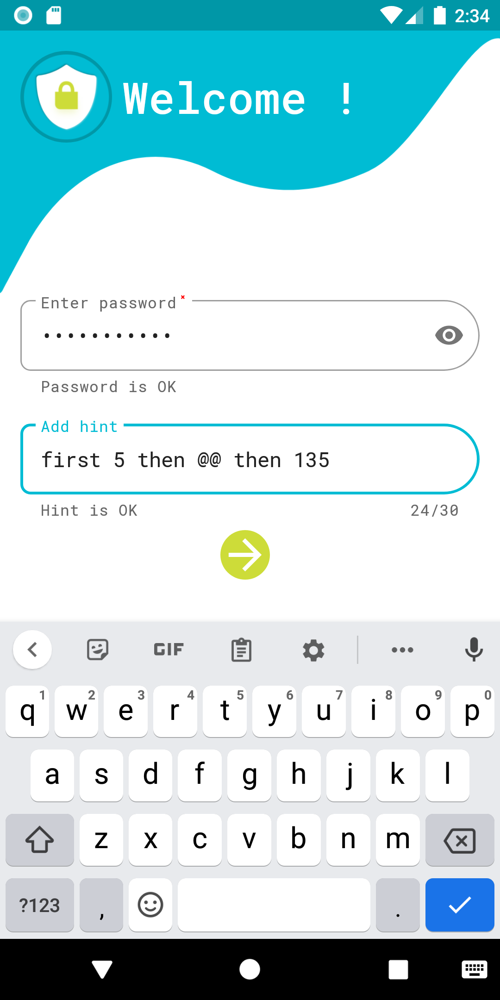
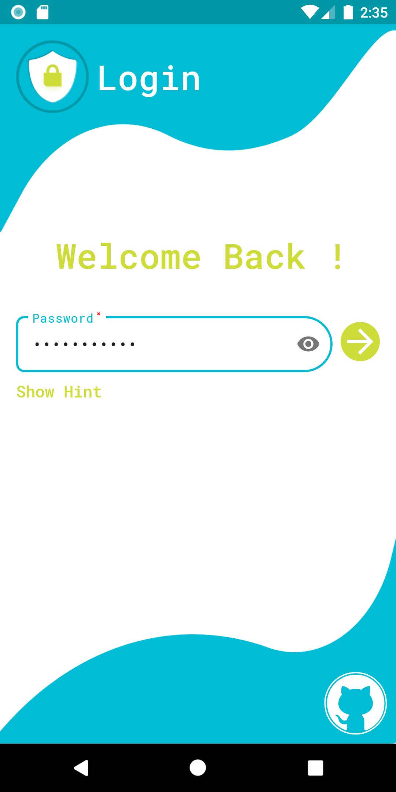

# Safe Box   

>Need a secure app to store all your passwords, private data?

Safe Box is an easy to use, secure app which will store all your data in a super secured encrypted manner. No data ever leave your mobile device. Any kind of personal user data will be never stored on any server.

## Contributing to this project
Want to contribute to Safe Box? Please read [Contribution process](https://github.com/Ni3verma/Safe-Box/blob/master/CONTRIBUTING.md). In case you have any questions, feel free to reach me on canvas.nv@gmail.com

## Connect with me on

 &emsp;
 &emsp;

  

 . . . .
 . . . .

 

## Everything is stored only **locally** and **encrypted**

 

## Add different kind of personal data

Login Data| Bank Account Data| Bank Card Data| Secure Note Data
--- | --- | --- | ---
 |  |  | 

 

Easy navigation | Add new data | Everything in one place | Delete on swipe
--- | --- | --- | ---
 |  |  | 
