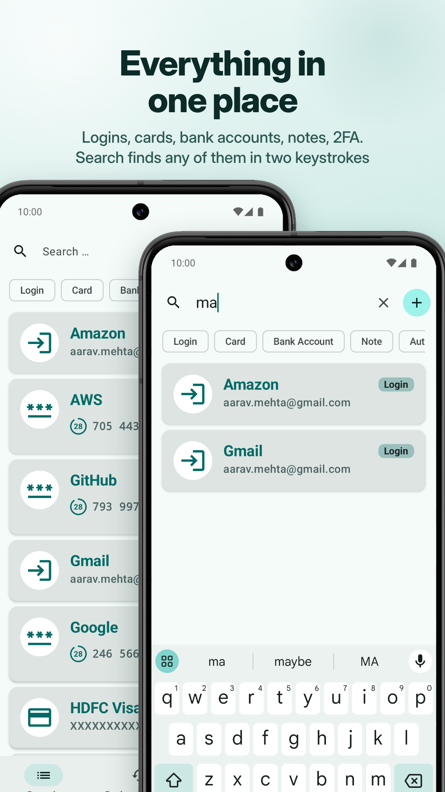
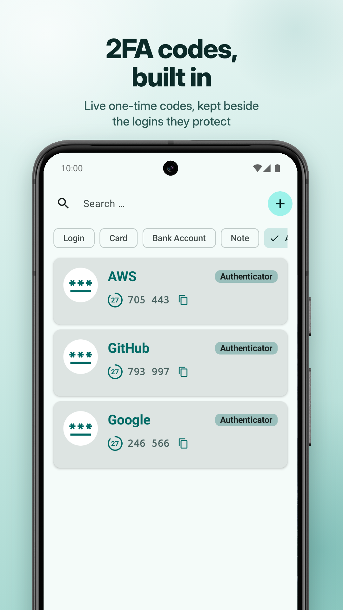
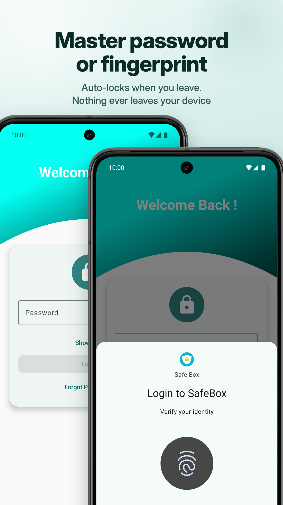
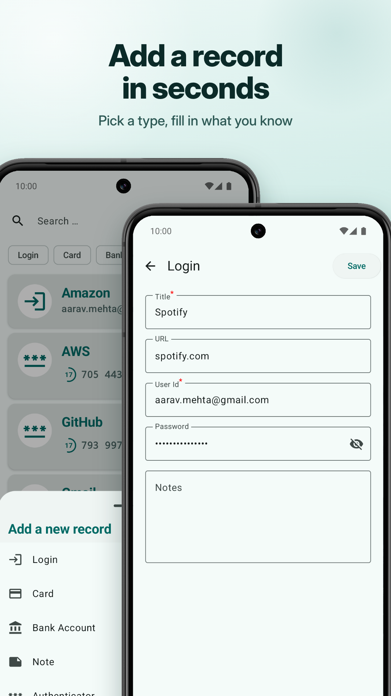
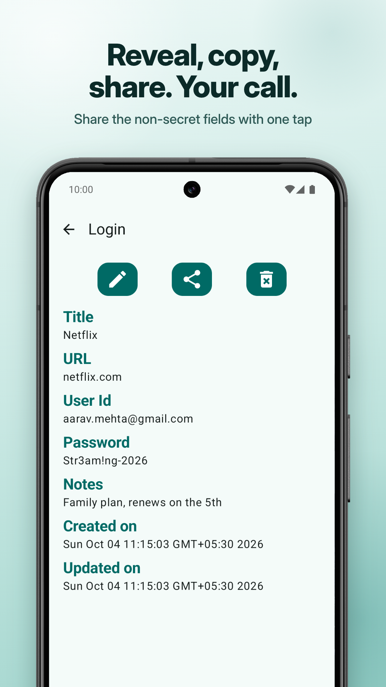
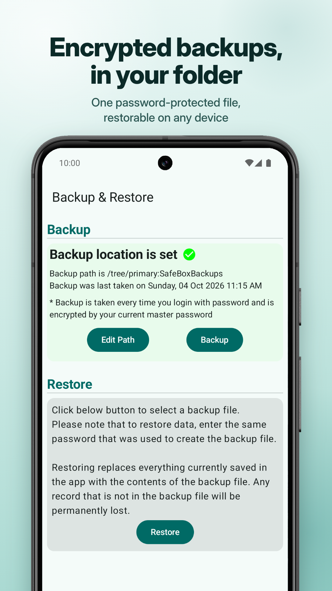
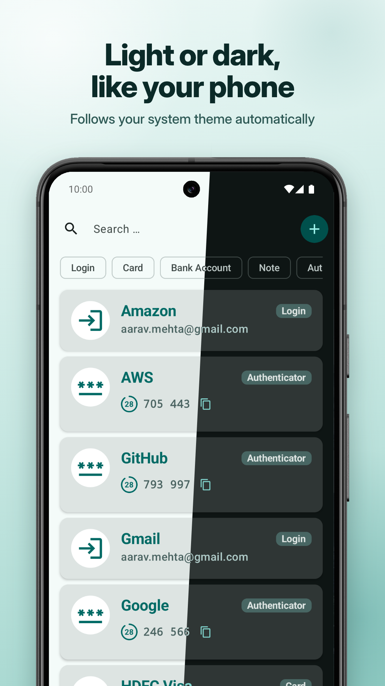
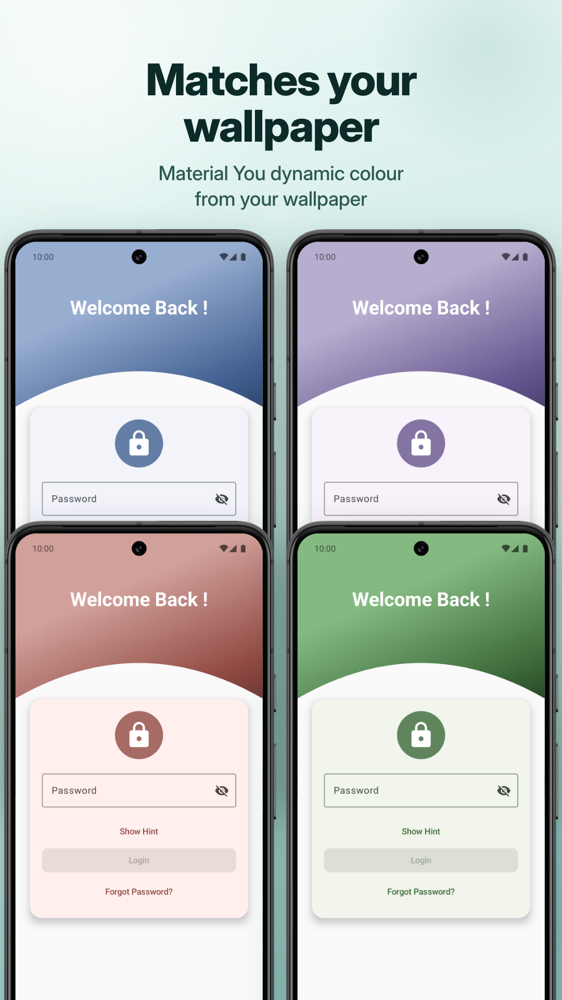
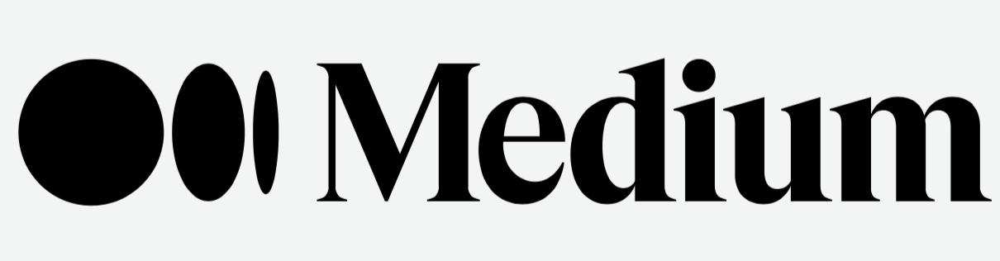

# Safe Box   [](https://github.com/Ni3verma/Safe-Box/actions/workflows/release.yml)

>Need a secure app to store all your passwords, private data?

Safe Box is an easy to use, secure app which will store all your data in a super secured encrypted manner. No data ever leave your mobile device. Any kind of personal user data will be never stored on any server.

<a href="https://play.google.com/store/apps/details?id=com.andryoga.safebox">
    
</a>

## Features

* Login with master password or biometric (fingerprint/IRIS/Face).
* Add different kind of personal data and Easy navigation.
* Store everything locally on the device.
* Supports dynamic theme(based on device wallpaper) on eligible devices and Day/Night theme as well.
* Share non-confidential data from a record with a single click.
* Backup and Restore data locally.

<hr>

<!-- store-screenshots:start -->
<!-- Generated by scripts/store-screenshots/render.py from scenes.json; edit that file and re-run, not this block. -->

&emsp;&emsp;

&emsp;&emsp;

&emsp;

<!-- store-screenshots:end -->

<hr>

## Testing

Run unit tests, lint checks, and instrumented UI tests locally:

```bash
# Run unit tests
./gradlew testDebugUnitTest

# Run lint check
./gradlew lintDebug

# Run all instrumented UI tests on a connected emulator or real device
./gradlew connectedDebugAndroidTest

# Run all instrumented UI tests on the CI Gradle Managed Device (Pixel 8 API 34 ATD)
./gradlew pixel8Api34DebugAndroidTest

# Run a specific instrumented UI test on the CI Managed Device
./gradlew pixel8Api34DebugAndroidTest -Pandroid.testInstrumentationRunnerArguments.class=com.andryoga.safebox.e2e.LoginBiometricAndHintE2ETest#biometricErrorOrCancellation_shouldResetUiStateAndPreventInfinitePromptLoop

```

### Running Tests Manually on GitHub Actions

You can run instrumented UI tests on a dedicated GitHub CI runner without executing the full CI/CD
pipeline:

1. Go to your repository on GitHub -> **Actions** tab -> **Manual UI Test Runner**.
2. Click **Run workflow**.
3. Leave the **Optional test filter** empty to run the entire suite, or paste a class/method
   filter (e.g.,
   `-Pandroid.testInstrumentationRunnerArguments.class=com.andryoga.safebox.e2e.LoginBiometricAndHintE2ETest#biometricErrorOrCancellation_shouldResetUiStateAndPreventInfinitePromptLoop`).
4. Click **Run workflow**. Once finished, inspect the test report under the **Artifacts** section of
   the run.

<hr>

## Contributing to this project
Want to contribute to Safe Box? Please read [Contribution process](https://github.com/Ni3verma/Safe-Box/blob/master/CONTRIBUTING.md). In case you have any questions, feel free to reach me on canvas.nv@gmail.com

<hr>

## Connect with me on

<a href="https://join.slack.com/t/safe-box-workspace/shared_invite/zt-yatwfl44-uu3BgU3JohO2RQSuOuY3xA">
    
</a> &emsp;
<a href="https://www.linkedin.com/in/nitinverma1120/">
    
</a> &emsp;
<a href="https://nitin-code.medium.com/">
    
</a>

<br><br><hr>
