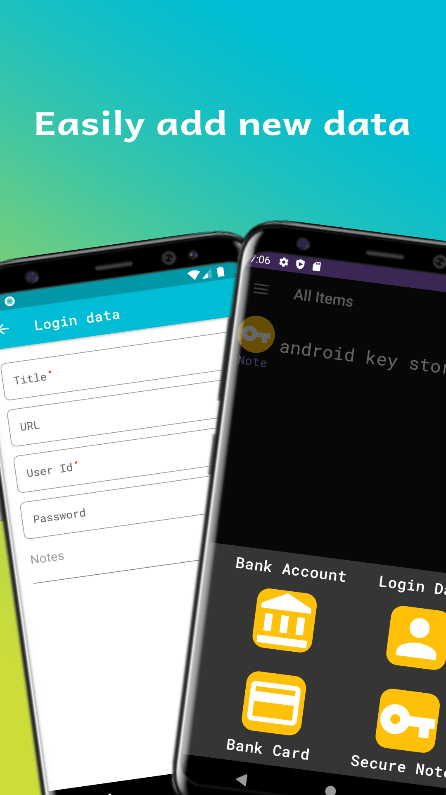
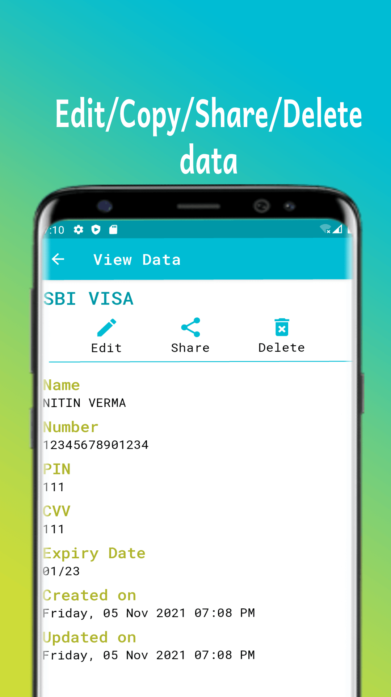
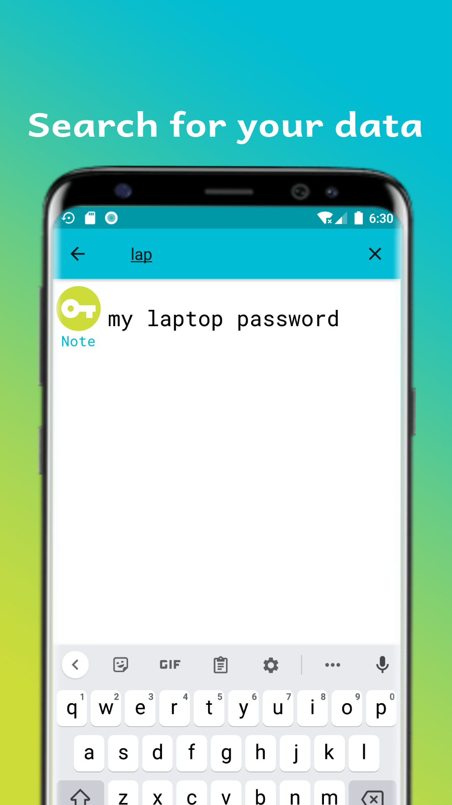

# Safe Box   

>Need a secure app to store all your passwords, private data?

Safe Box is an easy to use, secure app which will store all your data in a super secured encrypted manner. No data ever leave your mobile device. Any kind of personal user data will be never stored on any server.

## Features

* Login with master password or biometric (fingerprint/IRIS/Face).
* Add different kind of personal data and Easy navigation.
* Store everything locally on the device.
* Supports dynamic theme(based on device wallpaper) on eligible devices and Day/Night theme as well.
* Share non-confidential data from a record with a single click.
* Backup and Restore data locally.

&emsp;
&emsp;

  

&emsp;
&emsp;

  

&emsp;
&emsp;

## Contributing to this project
Want to contribute to Safe Box? Please read [Contribution process](https://github.com/Ni3verma/Safe-Box/blob/master/CONTRIBUTING.md). In case you have any questions, feel free to reach me on canvas.nv@gmail.com

## Connect with me on

 &emsp;
 &emsp;

  

