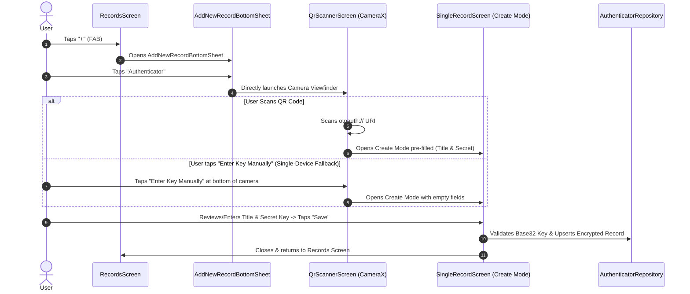

# Safe-Box 2FA (TOTP) Authenticator — Architecture & Design Document

## 1. Overview & Architectural Principles

This document defines the complete technical and UX specifications for the **2FA (TOTP - RFC 6238)
Authenticator** feature in **Safe-Box**.

### Core Principles

1. **Full Architectural Uniformity:** Standardized with existing record types (`Login`,
   `Bank Account`, `Card`, `Note`). Uses the
   unified [RecordsScreen](../app/src/main/java/com/andryoga/safebox/ui/home/records/RecordsScreen.kt)
   filter
   and [SingleRecordScreen](../app/src/main/java/com/andryoga/safebox/ui/singleRecord/SingleRecordScreen.kt)
   dynamic layout engine.
2. **Simplified Data Model:** Streamlined to `Title` and `Secret Key` (no separate account name
   field).
3. **Consistent List Interaction:** Tapping a card opens the View page; a dedicated clipboard icon
   button on the card copies the 6-digit code.
4. **Universal Vault Security:** All operations occur within the authenticated session (Master
   Password / Biometrics).

---

## 2. Data Model & Encryption

### 2.1 Entity Schema

```kotlin
package com.andryoga.safebox.data.db.entity

import androidx.room.Entity
import androidx.room.PrimaryKey
import java.util.Date

@Entity(tableName = "authenticator_data")
data class AuthenticatorDataEntity(
    @PrimaryKey(autoGenerate = true)
    val key: Int = 0,
    val title: String,                // User-defined title (e.g., "Google", "GitHub - work")
    val secretKey: String,            // AES-GCM Encrypted Base32 secret string
    val creationDate: Date,
    val updateDate: Date,
)
```

### 2.2 Secure DAO Layer

Handled via `AuthenticatorDataDaoSecure`, encrypting `secretKey` on write using`SymmetricKeyUtils` (
AES-GCM/NoPadding) and decrypting on read.

---

## 3. End-to-End Add Flow (Creation Workflow)



### 3.1 Step Details

1. **Entry Point:** User taps `+`
   on [RecordsScreen](../app/src/main/java/com/andryoga/safebox/ui/home/records/RecordsScreen.kt) $\rightarrow$
   taps **"Authenticator"**
   in [AddNewRecordBottomSheet](../app/src/main/java/com/andryoga/safebox/ui/home/records/components/AddNewRecordBottomSheet.kt).
2. **Direct Camera Launch:** Camera opens **immediately** with no intermediate dialogs.
3. **Single-Device Mobile Fallback:**
    * If setting up 2FA directly on the same phone (e.g. mobile browser where camera cannot scan its
      own screen), a simple `"Enter key manually"` text button at the bottom of the camera screen
      opens `SingleRecordScreen` in Create mode with empty fields.
4. **Save & Commit:** Tapping **Save** validates the Base32 seed, encrypts the record via AES-GCM,
   saves to DB, and returns to the Records list.

---

## 4. UI & Screen Technical Architecture

### 4.1 Timer & ViewModel Interaction Architecture

```
+----------------------------------------------------------------------------------------------------+
|                                Reactive Timer Architecture                                         |
|                                                                                                    |
|   +--------------------------+                                                                     |
|   |  RecordsViewModel (DB)   |  Emits list snapshots only on DB changes (No 1s polling!)           |
|   +------------+-------------+                                                                     |
|                | StateFlow<List<RecordListItem>>                                                   |
|                v                                                                                   |
|   +--------------------------+                                                                     |
|   |    RecordItem (Card)     |                                                                     |
|   +------------+-------------+                                                                     |
|                |                                                                                   |
|                v                                                                                   |
|   +--------------------------+                                                                     |
|   |   TotpBadge Composable   |  <-- Runs internal 1s ticker via produceState(epochSeconds)        |
|   +--------------------------+  <-- Atomically derives: Code = f(Secret, Epoch/30)                 |
|                                 <-- Atomically derives: RemainingSeconds = 30 - (Epoch % 30)       |
|                                 <-- ONLY this badge recomposes every 1s (Zero full-list recompose) |
+----------------------------------------------------------------------------------------------------+
```

#### How the Timer Renders Dynamically:

* **Database & ViewModel Layer:
  ** [RecordsViewModel.kt](../app/src/main/java/com/andryoga/safebox/ui/home/records/RecordsViewModel.kt)
  remains purely reactive and event-driven. It does **not** run an active 1-second coroutine timer,
  preventing unnecessary ViewModel allocations and full-list recompositions.
* **Composable Level (`TotpBadge`):**
  ```kotlin
  @Composable
  fun TotpBadge(secretKey: String, modifier: Modifier = Modifier) {
      val epochSeconds by produceState(initialValue = System.currentTimeMillis() / 1000) {
          while (true) {
              delay(1000)
              value = System.currentTimeMillis() / 1000
          }
      }
      val remainingSeconds = (30 - (epochSeconds % 30)).toInt()
      val otpCode = remember(epochSeconds / 30) {
          TotpGenerator.generateCode(secretKey, epochSeconds)
      }

      Row(verticalAlignment = Alignment.CenterVertically) {
          Text(text = otpCode, style = MaterialTheme.typography.titleMedium, fontFamily = FontFamily.Monospace)
          Spacer(Modifier.width(8.dp))
          CircularCountdownRing(progress = remainingSeconds / 30f, text = "${remainingSeconds}s")
      }
  }
  ```

---

### 4.2 Camera & QR Code Scanner Placement

* **Immediate Launch on Record Creation:** Tapping `Authenticator`
  in [AddNewRecordBottomSheet.kt](../app/src/main/java/com/andryoga/safebox/ui/home/records/components/AddNewRecordBottomSheet.kt)
  opens the Camera Viewfinder instantly.
* **Manual Setup Fallback Button on Camera Screen:** A prominent `"Enter key manually"` text button
  at the bottom of the camera screen provides immediate fallback for single-device mobile browser
  setups.
* **No Clutter in Form Fields:** Eliminates redundant trailing camera buttons inside input fields.

---

### 4.3 `SingleRecordScreen` & `LayoutPlan` Extension Architecture

Rather than creating an ad-hoc screen that breaks the generic pattern, we extend the
existing [LayoutPlan](../app/src/main/java/com/andryoga/safebox/ui/singleRecord/dynamicLayout/models/LayoutPlan.kt)
and [FieldUiState](../app/src/main/java/com/andryoga/safebox/ui/singleRecord/dynamicLayout/models/FieldUiState.kt)
system with a single clean, backward-compatible property:

#### 1. Additions to [FieldUiState.kt](../app/src/main/java/com/andryoga/safebox/ui/singleRecord/dynamicLayout/models/FieldUiState.kt)

```kotlin
@Immutable
data class Cell(
    @param:StringRes val label: Int = -1,
    val isMandatory: Boolean = false,
    val isPasswordField: Boolean = false,
    val singleLine: Boolean = true,
    val minLines: Int = 1,
    val maxLines: Int = if (singleLine) 1 else Int.MAX_VALUE,
    val keyboardType: KeyboardType = KeyboardType.Unspecified,
    val isVisibleOnlyInViewMode: Boolean = false,
    val isCopyable: Boolean = false,
    val visualTransformation: VisualTransformation = VisualTransformation.None,
    val maxLength: Int = Int.MAX_VALUE,

    // NEW EXTENSION FOR AUTHENTICATOR / TOTP SUPPORT:
    val isTotpCodeField: Boolean = false, // In View Mode, renders live rolling 6-digit code + timer ring
)
```

#### 2. Additions to [FieldId.kt](../app/src/main/java/com/andryoga/safebox/ui/singleRecord/dynamicLayout/models/FieldId.kt)

```kotlin
enum class FieldId {
    // ... Existing field IDs ...

    // AUTHENTICATOR field ids
    AUTHENTICATOR_TITLE,
    AUTHENTICATOR_TOTP_CODE,
    AUTHENTICATOR_SECRET_KEY,

    // ... Common field IDs ...
}
```

#### 3. How `RowField.kt` Composes the New Field

In [RowField.kt](../app/src/main/java/com/andryoga/safebox/ui/singleRecord/dynamicLayout/RowField.kt):

* **In View Mode (`viewMode == ViewMode.VIEW`):**
    * If `uiState.cell.isTotpCodeField == true`: Renders
      `TotpCodeDisplayCard(secretKey = uiState.data)` displaying the large 6-digit rolling code,
      circular countdown progress, and single-tap copy.
    * Standard fields (Title, Creation Date) render as existing text fields.
* **In Edit/Create Mode (`viewMode != ViewMode.VIEW`):**
    * Title and Secret Key render as standard `OutlinedTextField` composables.

#### 4. New `AuthenticatorLayoutImpl.kt`

```kotlin
class AuthenticatorLayoutImpl(
    private val recordId: Int?,
    private val authenticatorRepository: AuthenticatorRepository,
) : Layout {
    override suspend fun getLayoutPlan(): LayoutPlan {
        val record = recordId?.let { authenticatorRepository.getAuthenticatorByKey(it) }
        return LayoutPlan(
            id = LayoutId.AUTHENTICATOR,
            arrangement = listOf(
                listOf(LayoutPlan.Field(FieldId.AUTHENTICATOR_TITLE)),
                listOf(LayoutPlan.Field(FieldId.AUTHENTICATOR_TOTP_CODE)), // Visible in View Mode
                listOf(LayoutPlan.Field(FieldId.AUTHENTICATOR_SECRET_KEY)), // Visible in Edit/Create Mode
                listOf(LayoutPlan.Field(FieldId.CREATION_DATE)),
                listOf(LayoutPlan.Field(FieldId.UPDATE_DATE)),
            ),
            fieldUiState = mapOf(
                FieldId.AUTHENTICATOR_TITLE to FieldUiState(
                    cell = FieldUiState.Cell(
                        label = R.string.title,
                        isMandatory = true,
                        isCopyable = true
                    ),
                    data = record?.title.orEmpty()
                ),
                FieldId.AUTHENTICATOR_TOTP_CODE to FieldUiState(
                    cell = FieldUiState.Cell(
                        label = R.string.totp_code,
                        isVisibleOnlyInViewMode = true,
                        isTotpCodeField = true
                    ),
                    data = record?.secretKey.orEmpty()
                ),
                FieldId.AUTHENTICATOR_SECRET_KEY to FieldUiState(
                    cell = FieldUiState.Cell(
                        label = R.string.secret_key,
                        isMandatory = true,
                        isPasswordField = true
                    ),
                    data = record?.secretKey.orEmpty()
                ),
            )
        )
    }
}
```

---

## 5. Screen & Component Changes Summary

| Screen / Component                                                                                                            | Change Type | Description                                                                            |
|-------------------------------------------------------------------------------------------------------------------------------|-------------|----------------------------------------------------------------------------------------|
| [RecordType.kt](../app/src/main/java/com/andryoga/safebox/domain/models/record/RecordType.kt)                                 | Modified    | Added `AUTHENTICATOR` enum entry.                                                      |
| [AddNewRecordBottomSheet.kt](../app/src/main/java/com/andryoga/safebox/ui/home/records/components/AddNewRecordBottomSheet.kt) | Modified    | Displays Authenticator option in the bottom sheet.                                     |
| [RecordsScreen.kt](../app/src/main/java/com/andryoga/safebox/ui/home/records/RecordsScreen.kt)                               | Modified    | Adds the Authenticator filter chip, driven from `uiState.recordTypeFilters`. There is no separate filter row component. |
| [RecordItem.kt](../app/src/main/java/com/andryoga/safebox/ui/home/records/components/RecordItem.kt)                           | Modified    | Renders `TotpBadge` in place of the subtitle for Authenticator rows.                   |
| `TotpBadge.kt`                                                                                                                | **New**     | Compact live code, countdown ring and copy button for a records list row.              |
| `TotpCodeField.kt`                                                                                                            | **New**     | Live code and countdown ring for the single record screen.                             |
| `TotpCodeState.kt`                                                                                                            | **New**     | `rememberTotpCodeState`, the shared ticker and code derivation used by both surfaces.  |
| `AuthenticatorLayoutImpl.kt`                                                                                                  | **New**     | Implements `Layout` interface for `SingleRecordScreen` (View/Edit/Create layout plan). |
| `QrScannerScreen.kt` / Dialog                                                                                                 | **New**     | CameraX QR code scanner with ML Kit for instant `otpauth://` URI parsing.              |

---

## 6. Backup & Restore Architecture & Compatibility

### 6.1 Backup Changes ([BackupDataWorker.kt](../app/src/main/java/com/andryoga/safebox/worker/BackupDataWorker.kt))

* Introduce `ExportAuthenticatorData` model serialized via `kotlinx.serialization`.
* `authenticatorDataDaoSecure.exportAllData()` is added to `shouldExport()` check.
* Export payload is encrypted with user's backup password and stored in `exportMap` under a new key
  constant:
  ```kotlin
  CommonConstants.AUTHENTICATOR_DATA_KEY = "8"
  ```
  The key is the numeric string `"8"`, continuing the sequence already used by the other record
  types (`"4"` login, `"5"` bank account, `"6"` bank card, `"7"` secure note). These keys are part of
  the on-disk backup format, so they can never be renamed without breaking every existing backup.

### 6.2 Restore Changes ([RestoreDataWorker.kt](../app/src/main/java/com/andryoga/safebox/worker/RestoreDataWorker.kt))

* Decrypts `importMap[CommonConstants.AUTHENTICATOR_DATA_KEY]` into `List<ExportAuthenticatorData>`.
* Inserts records via `authenticatorDataDaoSecure.insertMultipleAuthenticatorData()`.
* Seeds that cannot be decoded are dropped individually rather than failing the whole restore, so one
  bad 2FA record never costs the user their logins, cards and notes.

### 6.3 Impact on Old Backup Files & Backward Compatibility

```
+---------------------------------------------------------------------------------------------------+
|                                 Backup Compatibility Matrix                                      |
+------------------------------------+--------------------------------------------------------------+
| Scenario                           | Behavior & Impact                                            |
+------------------------------------+--------------------------------------------------------------+
| Restoring Old Backups on New App   | Backward Compatible. importMap["8"] is null; decrypt safely  |
|                                    | returns null and skips insertion without errors. All Logins, |
|                                    | Cards, Accounts & Notes restore.                             |
+------------------------------------+--------------------------------------------------------------+
| Restoring New Backups on Old App   | Forward Compatible. Old app reads the Map and ignores the    |
|                                    | unrecognized "8" key gracefully.                             |
+------------------------------------+--------------------------------------------------------------+
```

> [!IMPORTANT]
> Restore replaces the vault rather than merging into it. Every record type, authenticators
> included, is deleted before the backup contents are inserted. Restoring a backup taken before
> authenticator support therefore removes any authenticator records saved since. This is the
> long-standing behaviour for all five types, and the restore screen warns about it up front.

---

## 7. Technical Stack & Best Practices Compliance

* **100% Kotlin & Jetpack Compose:** Material 3 standards.
* **Main Safety & Testability:** the RFC 6238 engine is deliberately **synchronous and stateless**,
  not `DispatchersProvider` driven. One HMAC takes microseconds, so dispatching it off the main
  thread would cost more than the calculation, and it would have to happen once per second per
  visible row. Testability comes from injecting `timeSeconds` instead of a dispatcher, which makes
  every RFC test vector a plain deterministic assertion.
* **Analytics Logging:** events are defined in `AnalyticsKey.kt` — `AUTHENTICATOR_COPY_CLICK`
  (carrying an `AnalyticsParam.SOURCE`), `QR_SCANNER_SUCCESS`, `QR_SCANNER_MANUAL_CLICK`,
  `QR_SCANNER_CANCEL`, `QR_SCANNER_TORCH_TOGGLE`, the camera permission dialog events, and
  `RESTORE_INVALID_AUTHENTICATOR_SKIPPED`.

---

## 8. Implementation Roadmap & MR Breakdown

The work started as 6 Merge Requests and is now 12. Two things drove the growth: MR 6 was split
because the records list and the QR add flow carry very different risk, and an audit of MR 1–5
turned up defects and coverage gaps that needed scheduling. The MR numbers below are the current
ones; earlier discussions used `6b` / `6c` labels that are now MR 9 and MR 7 respectively.

| MR    | Title                                 | Size         | Primary scope                                                                                     | Status      |
|-------|---------------------------------------|--------------|---------------------------------------------------------------------------------------------------|-------------|
| MR 1  | Core TOTP Engine & URI Parser         | S (~250 LOC) | RFC 6238 engine, Base32 decoder, URI parser, UTs                                                    | ✅ Merged   |
| MR 2  | Data Layer & Room Migration           | M (~350 LOC) | Schema migration, entity, secure DAO, repository, UTs                                               | ✅ Merged   |
| MR 3  | Backup & Restore Integration          | S (~200 LOC) | Export model, backup/restore worker keys, UTs                                                       | ✅ Merged   |
| MR 4  | CameraX & QR Code Scanner             | M (~300 LOC) | ML Kit scanner, viewfinder UI, camera rationale                                                     | ✅ Merged   |
| MR 5  | SingleRecordScreen (View/Edit/Create) | M (~400 LOC) | `AuthenticatorLayoutImpl`, live TOTP composable                                                     | ✅ Merged   |
| MR 6  | Records List & Filter                 | M (~430 LOC) | List row live code and copy, filter chip, repository wiring                                         | ✅ Merged   |
| MR 7  | TOTP Correctness Fixes                | S (~200 LOC) | Base32 length validation (crash fix), seed normalisation on save, this document                     | 🔄 Current  |
| MR 8  | Persist TOTP Parameters               | M (~400 LOC) | Store `period` / `digits` / `algorithm` end to end, backup format carries them                      | ⬜ Pending  |
| MR 9  | QR Add Flow & Seed Visibility         | L (~500 LOC) | Scanner navigation, direct camera launch, create pre-fill, camera lifecycle fixes, seed hidden outside creation | ⬜ Pending  |
| MR 10 | UI & Engine Test Catch-up             | L (~450 LOC) | Compose UI tests for MR 1–9 components, real-crypto backup round trip, real migration assertions    | ⬜ Pending  |
| MR 11 | Cross-Feature E2E Journeys            | M (~250 LOC) | Scan-to-save, manual fallback, filter, view/edit/delete journeys                                    | ⬜ Pending  |
| MR 12 | Clipboard Auto-Clear                  | S (~150 LOC) | Vault-wide timed clipboard clear (not TOTP specific)                                                | ⬜ Pending  |

Every MR branches from and targets the epic branch `feature/totp-record-type`, except where one
depends on another. MR 12 is tracked here for visibility but is outside this epic.

### Notable plan changes

* **The "Scan QR vs Enter Manually" choice dialog was dropped.** Selecting Authenticator in the add
  sheet launches the camera directly. Manual entry is reached from inside the scanner, which is
  where a user who cannot scan actually is.
* **Manual entry is kept.** On a phone-only app the most common enrolment is same-device, where the
  QR is on the screen the user is looking at and cannot be scanned, and there is no gallery QR
  decode to fall back on.
* **The secret seed is hidden outside record creation** rather than masked. Masking would have left
  the row tap-to-copy, which is the opposite of what is wanted for a seed.
* **Clipboard auto-clear moved out of the epic.** It applies to passwords and card numbers just as
  much as one-time codes, and a TOTP code self-expires in 30 seconds anyway.

### Detailed MR Scopes

#### MR 1: Core TOTP Engine & URI Parser (Size: Small, ~250 lines)

* **Scope:**
    * `TotpGenerator` interface and `TotpGeneratorImpl` implementation (RFC 6238 HMAC-SHA1/256/512
      calculation).
    * Base32 decoder and input validation logic.
    * `TotpUriParser` for extracting title and secret from `otpauth://` URIs.
    * Deterministic Unit Tests asserting standard RFC 6238 test vectors.

#### MR 2: Data Layer & Room Migration (Size: Medium, ~350 lines)

* **Scope:**
    * Room migration script adding `authenticator_data` table
      to [SafeBoxDatabase.kt](../app/src/main/java/com/andryoga/safebox/data/db/SafeBoxDatabase.kt).
    * `AuthenticatorDataEntity`, `AuthenticatorDataDao`, and `AuthenticatorDataDaoSecure` (AES-GCM
      encryption).
    * `AuthenticatorDataRepository` & `AuthenticatorDataRepositoryImpl`.
    * Room migration test and Repository unit test suite.

#### MR 3: Backup & Restore Integration (Size: Small, ~200 lines)

* **Scope:**
    * `ExportAuthenticatorData` model with `kotlinx.serialization`.
    * Update [BackupDataWorker.kt](../app/src/main/java/com/andryoga/safebox/worker/BackupDataWorker.kt)
      with `CommonConstants.AUTHENTICATOR_DATA_KEY`.
    * Update [RestoreDataWorker.kt](../app/src/main/java/com/andryoga/safebox/worker/RestoreDataWorker.kt)
      to handle backward-compatible restoration.
    * Unit tests validating backward compatibility when restoring backups with and without 2FA data.

#### MR 4: CameraX & QR Scanner Viewfinder (Size: Medium, ~300 lines)

* **Scope:**
    * CameraX dependency setup and Google ML Kit Barcode Analyzer.
    * Camera runtime permission handling and rationale dialog.
    * `QrScannerScreen` / Viewfinder Composable returning parsed `TotpData`.

> [!NOTE]
> The scanner shipped without a navigation destination, so it is not yet reachable by a user. It is
> wired up in MR 9, which is also where its camera lifecycle defects are fixed, since they are
> untestable until then.

#### MR 5: Single Record Integration (View / Edit / Create) (Size: Medium, ~400 lines)

* **Scope:**
    * Add `RecordType.AUTHENTICATOR`
      to [RecordType.kt](../app/src/main/java/com/andryoga/safebox/domain/models/record/RecordType.kt).
    * Implement `AuthenticatorLayoutImpl`
      for [SingleRecordScreen.kt](../app/src/main/java/com/andryoga/safebox/ui/singleRecord/SingleRecordScreen.kt).
    * Live rolling OTP code component with circular timer.
    * TopAppBar Share action sharing the current code, never the seed.
    * Unit tests for layout plan generation and save/edit workflows.

#### MR 6: Records List & Filter (Size: Medium, ~430 lines)

* **Scope:**
    * `TotpBadge` on authenticator rows
      in [RecordItem.kt](../app/src/main/java/com/andryoga/safebox/ui/home/records/components/RecordItem.kt),
      replacing the subtitle with the live code, countdown ring and a copy button.
    * Authenticator filter chip and filter handling
      in [RecordsViewModel.kt](../app/src/main/java/com/andryoga/safebox/ui/home/records/RecordsViewModel.kt).
    * `rememberTotpCodeState` extracted so the list and the detail screen derive codes identically.
    * `TotpDefaults` as the single source of the protocol defaults.
    * `AUTHENTICATOR_COPY_CLICK` carrying an `AnalyticsParam.SOURCE`, plus ViewModel and mapper tests.

#### MR 7: TOTP Correctness Fixes (Size: Small, ~200 lines)

* **Scope:**
    * **Base32 length validation.** `isValidBase32` checked characters but not length, so a
      one-character seed passed validation and then decoded to zero bytes, which the generator
      rejects by throwing. Validation now requires enough input to produce at least one byte.
    * **Seed normalisation on save.** Setup keys are stored in the canonical form the decoder uses,
      so the same secret cannot sit in the vault under several spellings.
    * Refresh this document, which had drifted from the code in four places.

> [!CAUTION]
> The Base32 hole was crash-class. Typing `A` as a manual seed enabled Save, persisted the record,
> and then threw from inside composition when the records list rendered it. The bad row survived, so
> the crash repeated on every launch and the user could not reach the record to delete it, because
> the list itself was what crashed. The same predicate guarded save, render and restore.

#### MR 8: Persist TOTP Parameters (Size: Medium, ~400 lines)

* **Scope:**
    * `period`, `digits` and `algorithm` are parsed from the `otpauth://` URI and then discarded
      today, so any issuer using non-default values would save cleanly and generate wrong codes
      forever. Persist them end to end: entity and migration, secure DAO, repository, domain model,
      list projection, and the composables that derive the code.
    * Backup export model carries the new fields, with a default-fill path for older backups.
    * Unit tests for a non-default URI surviving parse → save → read → code generation.

> [!NOTE]
> No new Room migration. `MIGRATION_4_5`, which creates `authenticator_data`, has not shipped in a
> release, so the columns are added to its `CREATE TABLE` rather than bolted on by a version 6.

#### MR 9: QR Add Flow & Seed Visibility (Size: Large, ~500 lines)

* **Scope:**
    * Wire `QrScannerScreenRoot` into navigation and launch the camera directly from the add sheet.
    * Hand the scanned seed to the create screen through an in-memory, single-consumption holder.
    * Hide the secret seed outside record creation, replacing the two visibility booleans on
      `FieldUiState.Cell` with a single `visibleIn: Set<ViewMode>`.
    * Camera lifecycle fixes carried over from the MR 1–5 audit.
    * Log `AUTHENTICATOR_COPY_CLICK` from the detail screen as well as the list.

> [!WARNING]
> The scanned seed must not travel as a navigation argument. Route arguments are serialised into the
> destination's `Bundle`, which `onSaveInstanceState` writes to unencrypted system storage outside
> the vault, where it survives process death and is not cleared by auto-lock.

#### MR 10: UI & Engine Test Catch-up (Size: Large, ~450 lines)

* **Scope:** Compose UI tests for every component introduced in MR 1–9 that lacks one, authenticators
  added to the real-crypto backup round trip, and `migration_4_5` asserting preserved data rather
  than only schema shape.

#### MR 11: Cross-Feature E2E Journeys (Size: Medium, ~250 lines)

* **Scope:** scan-to-save, manual entry fallback, filtering, and view / edit / delete / copy journeys,
  verified on Gradle Managed Devices.

#### MR 12: Clipboard Auto-Clear (Size: Small, ~150 lines)

* **Scope:** timed clipboard clear for everything copied through `rememberCopyToClipboardAction()`.
  Tracked separately because it is vault-wide rather than TOTP specific.
