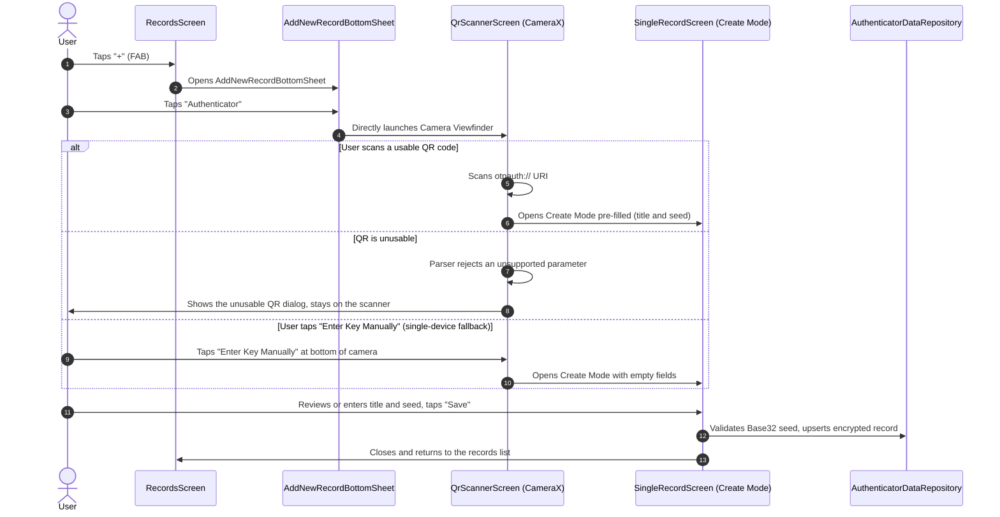
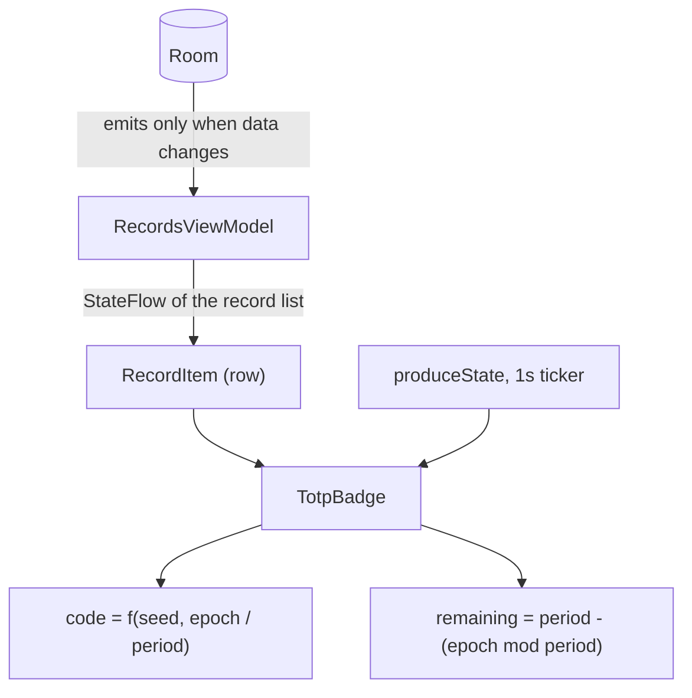

# Safe-Box 2FA (TOTP) Authenticator — Architecture & Design Document

## 1. Overview & Architectural Principles

This document defines the technical and UX design for the **2FA (TOTP — RFC 6238) Authenticator**
record type in **Safe-Box**.

### Core Principles

1. **Full Architectural Uniformity:** Standardised with the existing record types (`Login`,
   `Bank Account`, `Card`, `Note`). Uses the
   unified [RecordsScreen](../app/src/main/java/com/andryoga/safebox/ui/home/records/RecordsScreen.kt)
   filter
   and [SingleRecordScreen](../app/src/main/java/com/andryoga/safebox/ui/singleRecord/SingleRecordScreen.kt)
   dynamic layout engine.
2. **Simplified Data Model:** Streamlined to `Title` and `Secret Key`, with no separate account name
   field.
3. **Consistent List Interaction:** Tapping a row opens the View screen; a dedicated copy button on
   the row copies the current one-time code.
4. **Universal Vault Security:** Every operation happens inside the authenticated session (master
   password or biometrics).

---

## 2. Data Model & Encryption

### 2.1 Entity Schema

[AuthenticatorDataEntity](../app/src/main/java/com/andryoga/safebox/data/db/entity/AuthenticatorDataEntity.kt)
backs the `authenticator_data` table.

| Column                       | Type            | Notes                                                    |
|------------------------------|-----------------|----------------------------------------------------------|
| `key`                        | `Int`           | Primary key, auto-generated.                              |
| `title`                      | `String`        | User-defined, e.g. "Google", "GitHub - work".             |
| `secretKey`                  | `String`        | **Encrypted.** Base32 seed, AES-GCM at rest.              |
| `algorithm`                  | `TotpAlgorithm` | Plain text. Issuer generation parameter, not a secret.    |
| `digits`                     | `Int`           | Plain text.                                               |
| `period`                     | `Int`           | Plain text. Time step in seconds.                         |
| `creationDate`, `updateDate` | `Date`          |                                                           |

### 2.2 Secure DAO Layer

`AuthenticatorDataDaoSecure` encrypts `secretKey` on write and decrypts it on read using
`SymmetricKeyUtils` (AES-GCM/NoPadding). Only the seed is encrypted; see
[§6](#6-notes) for why the generation parameters are not.

---

## 3. End-to-End Add Flow (Creation Workflow)

### 3.1 Notable points

* **The camera opens immediately.** There is no intermediate "scan or type" chooser.
* **Manual entry lives inside the scanner.** It covers same-device enrolment, where the QR is on the
  very screen doing the scanning and cannot be captured.
* **Save is blocked until the seed decodes.** Validation runs on every keystroke, not just on
  submit.

---

## 4. UI & Screen Technical Architecture

### 4.1 Timer & ViewModel Interaction Architecture

The rolling code is derived inside the composable, not pushed down from a ViewModel timer. The
database layer stays event-driven, so nothing above the badge recomposes on the one-second tick.

`rememberTotpCodeState` holds the ticker and the derivation, and is shared by `TotpBadge` in the
list and `TotpCodeField` on the detail screen, so both surfaces derive the code the same way and
align to the same time step. Each call site still runs its own ticker. Only the badge recomposes
each second; the list itself does not.

---

### 4.2 Camera & QR Code Scanner Placement

* **Immediate launch on record creation:** tapping `Authenticator`
  in [AddNewRecordBottomSheet.kt](../app/src/main/java/com/andryoga/safebox/ui/home/records/components/AddNewRecordBottomSheet.kt)
  opens the viewfinder instantly.
* **Manual fallback on the camera screen:** an `"Enter key manually"` button at the bottom of the
  scanner, for single-device setups.
* **No clutter in form fields:** no redundant trailing camera buttons inside input fields.

---

### 4.3 `SingleRecordScreen` & `LayoutPlan` Extension Architecture

Rather than an ad-hoc screen that breaks the generic pattern, the existing
[LayoutPlan](../app/src/main/java/com/andryoga/safebox/ui/singleRecord/dynamicLayout/models/LayoutPlan.kt)
and [FieldUiState](../app/src/main/java/com/andryoga/safebox/ui/singleRecord/dynamicLayout/models/FieldUiState.kt)
system is extended with two properties on `FieldUiState.Cell`:

| Property                     | Purpose                                                                                                                  |
|------------------------------|--------------------------------------------------------------------------------------------------------------------------|
| `visibleIn: Set<ViewMode>`   | Modes the cell renders in. Replaced a pair of independent booleans, which could express nonsensical combinations and still could not say "create only" — exactly what the seed needs. |
| `type: FieldType`            | `DefaultText` or `Totp`. `FieldType.Totp` carries the generation parameters and makes `RowField` render the live code and countdown ring instead of plain text. |

[AuthenticatorLayoutImpl](../app/src/main/java/com/andryoga/safebox/ui/singleRecord/dynamicLayout/layouts/AuthenticatorLayoutImpl.kt)
assembles the plan:

| Field                        | Visible in | Notes                                                              |
|------------------------------|------------|---------------------------------------------------------------------|
| `AUTHENTICATOR_TITLE`        | all        | Mandatory, copyable.                                                 |
| `AUTHENTICATOR_TOTP_DISPLAY` | VIEW       | `FieldType.Totp`. Its `data` holds the **seed**, so `isCopyable = false`. |
| `AUTHENTICATOR_SECRET_KEY`   | NEW        | Mandatory, password field.                                           |
| `CREATION_DATE`              | VIEW       |                                                                      |
| `UPDATE_DATE`                | VIEW       |                                                                      |

It also overrides `checkMandatoryFields` to additionally require a decodable Base32 seed, and
`getShareableFields` to share the derived code rather than the stored seed.

> [!IMPORTANT]
> `AUTHENTICATOR_TOTP_DISPLAY` holds the **seed** in its `data`, not the code, because the UI needs
> the seed to roll the code locally every second. That is why the cell is `isCopyable = false` and
> why sharing emits `generateCode(config)` instead of the field's own value. Sharing the raw seed
> would hand over permanent access to the second factor.

> [!NOTE]
> Since the seed is `NEW` only and the code and dates are `VIEW` only, **edit mode shows the title
> and nothing else.**

---

## 5. Backup & Restore Architecture & Compatibility

### 5.1 Backup ([BackupDataWorker.kt](../app/src/main/java/com/andryoga/safebox/worker/BackupDataWorker.kt))

* `ExportAuthenticatorData` is serialised via `kotlinx.serialization`.
* `authenticatorDataDaoSecure.exportAllData()` participates in the `shouldExport()` check.
* The payload is encrypted with the user's backup password and stored in `exportMap` under
  `CommonConstants.AUTHENTICATOR_DATA_KEY`, the numeric string `"8"`. This continues the sequence
  already used by the other record types (`"4"` login, `"5"` bank account, `"6"` bank card,
  `"7"` secure note). **These keys are part of the on-disk backup format and can never be renamed
  without breaking every existing backup.**

### 5.2 Restore ([RestoreDataWorker.kt](../app/src/main/java/com/andryoga/safebox/worker/RestoreDataWorker.kt))

* Decrypts `importMap[AUTHENTICATOR_DATA_KEY]` into `List<ExportAuthenticatorData>` and inserts via
  `insertMultipleAuthenticatorData()`.
* A seed that cannot be decoded is dropped individually rather than failing the whole restore.

### 5.3 Compatibility with older backup files

| Scenario                         | Behaviour                                                                                                              |
|----------------------------------|--------------------------------------------------------------------------------------------------------------------------|
| Old backup restored on new app   | **Backward compatible.** `importMap["8"]` is absent, decrypt returns null and insertion is skipped. Logins, cards, accounts and notes restore normally. |
| New backup restored on old app   | **Forward compatible.** The old app reads the map and ignores the unrecognised `"8"` key.                                  |

> [!IMPORTANT]
> Restore replaces the vault rather than merging into it. Every record type, authenticators
> included, is deleted before the backup contents are inserted. Restoring a backup taken before
> authenticator support therefore removes any authenticator records saved since. This is the
> long-standing behaviour for all five types, and the restore screen warns about it up front.

---

## 6. Notes

### Key decisions

| Decision | Why |
|---|---|
| The seed is **create-only**, not masked | Masking would still leave the row tap-to-copy, which is the opposite of what a second factor needs. Editing a saved record therefore cannot put the seed back on screen. |
| Share and copy emit the **derived code**, never the seed | The seed is permanent access to the second factor; a code expires within its period. |
| A scanned seed reaches the create screen through an in-memory, single-consumption holder, **not a navigation argument** | Route arguments are serialised into the destination's `Bundle`, which `onSaveInstanceState` writes to unencrypted system storage outside the vault, where it survives process death and is not cleared by auto-lock. |
| The RFC 6238 engine is **synchronous and stateless**, with `timeSeconds` injected rather than a `DispatchersProvider` | One HMAC takes microseconds, so dispatching it would cost more than the calculation, and it happens once per second per visible row. Injecting the timestamp also makes every RFC test vector a plain deterministic assertion. |
| **Only TOTP is supported; counter-based HOTP is rejected** | The two share an algorithm and differ only in the moving factor, so the crypto would be nearly free. The cost is state: HOTP needs a counter persisted and incremented per code, which breaks a passively rendered live code, cannot survive a backup snapshot being restored behind the server, and would need a re-sync flow the app does not have. |
| A **present but unsupported** URI parameter is rejected, while an absent one falls back to its default | Defaulting something the issuer explicitly asked for would generate wrong codes forever, silently. Absent parameters have spec-defined defaults, so they are safe to fill in. |
| The Base32 seed is validated **at save time**, not only at render time | A one-character seed once passed validation, persisted, then threw from inside composition when the records list rendered it. The bad row survived, so the crash repeated on every launch, and the list itself was what crashed, leaving the user unable to reach the record to delete it. |
| Generation parameters are stored in **plain text**; only the seed is encrypted | They are not secrets, and keeping them readable avoids a decrypt on every list row render. |
| A seed that cannot be decoded is **dropped individually** during restore | One bad authenticator record must never cost the user their logins, cards and notes. |
| There is **no "scan or type" chooser**; the camera opens directly and manual entry lives inside the scanner | Manual entry is reached from where a user who cannot scan actually is, and it is kept because same-device enrolment is the common case on a phone-only app. |
| The in-app "copied" snackbar is suppressed on Android 13+ | The system shows its own clipboard overlay from Tiramisu onwards, so showing both is a double confirmation. |

### Supported Key URI parameters

A parameter below that is **present with an unsupported value** is rejected with a specific
[TotpUriError](../app/src/main/java/com/andryoga/safebox/totp/models/TotpUriError.kt) and explained
to the user, rather than being silently coerced. A query key that is not in this table is ignored:
the Key URI spec lets an issuer add its own, and rejecting those would fail QR codes that are
otherwise perfectly usable.

| Parameter   | Accepted                                                          | Default when absent |
|-------------|-------------------------------------------------------------------|---------------------|
| type        | `totp` only; `hotp` is rejected                                     | n/a, required       |
| label       | Path segment, used as the account part of the title                 | empty title         |
| `secret`    | Valid RFC 4648 Base32, long enough to decode to at least one byte   | n/a, required       |
| `issuer`    | Free text, prefixed to the label as `Issuer - Account`              | label alone         |
| `algorithm` | `SHA1`, `SHA256`, `SHA512`                                          | `SHA1`              |
| `digits`    | `6`–`8`                                                             | `6`                 |
| `period`    | Any positive integer                                                | `30`                |

### Known limitations

* **Codes follow the device clock.** The ticker reads `System.currentTimeMillis()` with no NTP check
  or skew correction, so a device with a wrong clock silently produces codes the server rejects,
  with nothing in the UI explaining why.
* **A copied code stays on the clipboard** until something else overwrites it. Timed auto-clear is
  tracked separately because it applies to passwords and card numbers just as much.
