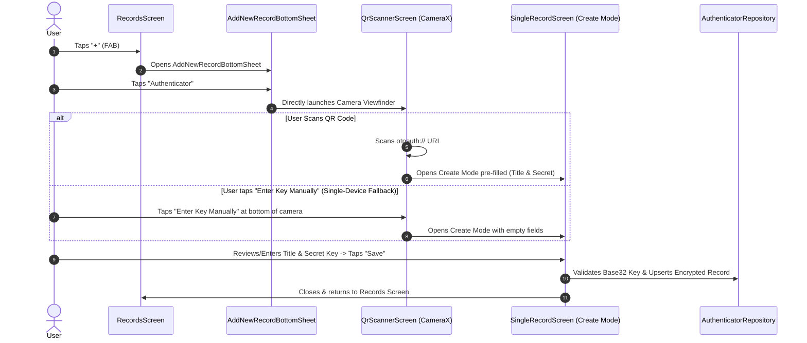

# Safe-Box 2FA (TOTP) Authenticator — Architecture & Design Document

## 1. Overview & Architectural Principles

This document defines the complete technical and UX specifications for the **2FA (TOTP - RFC 6238)
Authenticator** feature in **Safe-Box**.

### Core Principles

1. **Full Architectural Uniformity:** Standardized with existing record types (`Login`,
   `Bank Account`, `Card`, `Note`). Uses the
   unified [RecordsScreen](file:///Users/nitinvermaa/AndroidStudioProjects/Safe-Box/app/src/main/java/com/andryoga/safebox/ui/home/records/RecordsScreen.kt)
   filter
   and [SingleRecordScreen](file:///Users/nitinvermaa/AndroidStudioProjects/Safe-Box/app/src/main/java/com/andryoga/safebox/ui/singleRecord/SingleRecordScreen.kt)
   dynamic layout engine.
2. **Simplified Data Model:** Streamlined to `Title` and `Secret Key` (no separate account name
   field).
3. **Consistent List Interaction:** Tapping a card opens the View page; a dedicated clipboard icon
   button on the card copies the 6-digit code.
4. **Universal Vault Security:** All operations occur within the authenticated session (Master
   Password / Biometrics).

---

## 2. Data Model & Encryption

### 2.1 Entity Schema

```kotlin
package com.andryoga.safebox.data.db.entity

import androidx.room.Entity
import androidx.room.PrimaryKey
import java.util.Date

@Entity(tableName = "authenticator_data")
data class AuthenticatorDataEntity(
    @PrimaryKey(autoGenerate = true)
    val key: Int = 0,
    val title: String,                // User-defined title (e.g., "Google", "GitHub - work")
    val secretKey: String,            // AES-GCM Encrypted Base32 secret string
    val creationDate: Date,
    val updateDate: Date,
)
```

### 2.2 Secure DAO Layer

Handled via `AuthenticatorDataDaoSecure`, encrypting `secretKey` on write using`SymmetricKeyUtils` (
AES-GCM/NoPadding) and decrypting on read.

---

## 3. End-to-End Add Flow (Creation Workflow)



### 3.1 Step Details

1. **Entry Point:** User taps `+`
   on [RecordsScreen](file:///Users/nitinvermaa/AndroidStudioProjects/Safe-Box/app/src/main/java/com/andryoga/safebox/ui/home/records/RecordsScreen.kt) $\rightarrow$
   taps **"Authenticator"**
   in [AddNewRecordBottomSheet](file:///Users/nitinvermaa/AndroidStudioProjects/Safe-Box/app/src/main/java/com/andryoga/safebox/ui/home/records/components/AddNewRecordBottomSheet.kt).
2. **Direct Camera Launch:** Camera opens **immediately** with no intermediate dialogs.
3. **Single-Device Mobile Fallback:**
    * If setting up 2FA directly on the same phone (e.g. mobile browser where camera cannot scan its
      own screen), a simple `"Enter key manually"` text button at the bottom of the camera screen
      opens `SingleRecordScreen` in Create mode with empty fields.
4. **Save & Commit:** Tapping **Save** validates the Base32 seed, encrypts the record via AES-GCM,
   saves to DB, and returns to the Records list.

---

## 4. UI & Screen Technical Architecture

### 4.1 Timer & ViewModel Interaction Architecture

```
+----------------------------------------------------------------------------------------------------+
|                                Reactive Timer Architecture                                         |
|                                                                                                    |
|   +--------------------------+                                                                     |
|   |  RecordsViewModel (DB)   |  Emits list snapshots only on DB changes (No 1s polling!)           |
|   +------------+-------------+                                                                     |
|                | StateFlow<List<RecordListItem>>                                                   |
|                v                                                                                   |
|   +--------------------------+                                                                     |
|   |    RecordItem (Card)     |                                                                     |
|   +------------+-------------+                                                                     |
|                |                                                                                   |
|                v                                                                                   |
|   +--------------------------+                                                                     |
|   |   TotpBadge Composable   |  <-- Runs internal 1s ticker via produceState(epochSeconds)        |
|   +--------------------------+  <-- Atomically derives: Code = f(Secret, Epoch/30)                 |
|                                 <-- Atomically derives: RemainingSeconds = 30 - (Epoch % 30)       |
|                                 <-- ONLY this badge recomposes every 1s (Zero full-list recompose) |
+----------------------------------------------------------------------------------------------------+
```

#### How the Timer Renders Dynamically:

* **Database & ViewModel Layer:
  ** [RecordsViewModel.kt](file:///Users/nitinvermaa/AndroidStudioProjects/Safe-Box/app/src/main/java/com/andryoga/safebox/ui/home/records/RecordsViewModel.kt)
  remains purely reactive and event-driven. It does **not** run an active 1-second coroutine timer,
  preventing unnecessary ViewModel allocations and full-list recompositions.
* **Composable Level (`TotpBadge`):**
  ```kotlin
  @Composable
  fun TotpBadge(secretKey: String, modifier: Modifier = Modifier) {
      val epochSeconds by produceState(initialValue = System.currentTimeMillis() / 1000) {
          while (true) {
              delay(1000)
              value = System.currentTimeMillis() / 1000
          }
      }
      val remainingSeconds = (30 - (epochSeconds % 30)).toInt()
      val otpCode = remember(epochSeconds / 30) {
          TotpGenerator.generateCode(secretKey, epochSeconds)
      }

      Row(verticalAlignment = Alignment.CenterVertically) {
          Text(text = otpCode, style = MaterialTheme.typography.titleMedium, fontFamily = FontFamily.Monospace)
          Spacer(Modifier.width(8.dp))
          CircularCountdownRing(progress = remainingSeconds / 30f, text = "${remainingSeconds}s")
      }
  }
  ```

---

### 4.2 Camera & QR Code Scanner Placement

* **Immediate Launch on Record Creation:** Tapping `Authenticator`
  in [AddNewRecordBottomSheet.kt](file:///Users/nitinvermaa/AndroidStudioProjects/Safe-Box/app/src/main/java/com/andryoga/safebox/ui/home/records/components/AddNewRecordBottomSheet.kt)
  opens the Camera Viewfinder instantly.
* **Manual Setup Fallback Button on Camera Screen:** A prominent `"Enter key manually"` text button
  at the bottom of the camera screen provides immediate fallback for single-device mobile browser
  setups.
* **No Clutter in Form Fields:** Eliminates redundant trailing camera buttons inside input fields.

---

### 4.3 `SingleRecordScreen` & `LayoutPlan` Extension Architecture

Rather than creating an ad-hoc screen that breaks the generic pattern, we extend the
existing [LayoutPlan](file:///Users/nitinvermaa/AndroidStudioProjects/Safe-Box/app/src/main/java/com/andryoga/safebox/ui/singleRecord/dynamicLayout/models/LayoutPlan.kt)
and [FieldUiState](file:///Users/nitinvermaa/AndroidStudioProjects/Safe-Box/app/src/main/java/com/andryoga/safebox/ui/singleRecord/dynamicLayout/models/FieldUiState.kt)
system with a single clean, backward-compatible property:

#### 1. Additions to [FieldUiState.kt](file:///Users/nitinvermaa/AndroidStudioProjects/Safe-Box/app/src/main/java/com/andryoga/safebox/ui/singleRecord/dynamicLayout/models/FieldUiState.kt)

```kotlin
@Immutable
data class Cell(
    @param:StringRes val label: Int = -1,
    val isMandatory: Boolean = false,
    val isPasswordField: Boolean = false,
    val singleLine: Boolean = true,
    val minLines: Int = 1,
    val maxLines: Int = if (singleLine) 1 else Int.MAX_VALUE,
    val keyboardType: KeyboardType = KeyboardType.Unspecified,
    val isVisibleOnlyInViewMode: Boolean = false,
    val isCopyable: Boolean = false,
    val visualTransformation: VisualTransformation = VisualTransformation.None,
    val maxLength: Int = Int.MAX_VALUE,

    // NEW EXTENSION FOR AUTHENTICATOR / TOTP SUPPORT:
    val isTotpCodeField: Boolean = false, // In View Mode, renders live rolling 6-digit code + timer ring
)
```

#### 2. Additions to [FieldId.kt](file:///Users/nitinvermaa/AndroidStudioProjects/Safe-Box/app/src/main/java/com/andryoga/safebox/ui/singleRecord/dynamicLayout/models/FieldId.kt)

```kotlin
enum class FieldId {
    // ... Existing field IDs ...

    // AUTHENTICATOR field ids
    AUTHENTICATOR_TITLE,
    AUTHENTICATOR_TOTP_CODE,
    AUTHENTICATOR_SECRET_KEY,

    // ... Common field IDs ...
}
```

#### 3. How `RowField.kt` Composes the New Field

In [RowField.kt](file:///Users/nitinvermaa/AndroidStudioProjects/Safe-Box/app/src/main/java/com/andryoga/safebox/ui/singleRecord/dynamicLayout/RowField.kt):

* **In View Mode (`viewMode == ViewMode.VIEW`):**
    * If `uiState.cell.isTotpCodeField == true`: Renders
      `TotpCodeDisplayCard(secretKey = uiState.data)` displaying the large 6-digit rolling code,
      circular countdown progress, and single-tap copy.
    * Standard fields (Title, Creation Date) render as existing text fields.
* **In Edit/Create Mode (`viewMode != ViewMode.VIEW`):**
    * Title and Secret Key render as standard `OutlinedTextField` composables.

#### 4. New `AuthenticatorLayoutImpl.kt`

```kotlin
class AuthenticatorLayoutImpl(
    private val recordId: Int?,
    private val authenticatorRepository: AuthenticatorRepository,
) : Layout {
    override suspend fun getLayoutPlan(): LayoutPlan {
        val record = recordId?.let { authenticatorRepository.getAuthenticatorByKey(it) }
        return LayoutPlan(
            id = LayoutId.AUTHENTICATOR,
            arrangement = listOf(
                listOf(LayoutPlan.Field(FieldId.AUTHENTICATOR_TITLE)),
                listOf(LayoutPlan.Field(FieldId.AUTHENTICATOR_TOTP_CODE)), // Visible in View Mode
                listOf(LayoutPlan.Field(FieldId.AUTHENTICATOR_SECRET_KEY)), // Visible in Edit/Create Mode
                listOf(LayoutPlan.Field(FieldId.CREATION_DATE)),
                listOf(LayoutPlan.Field(FieldId.UPDATE_DATE)),
            ),
            fieldUiState = mapOf(
                FieldId.AUTHENTICATOR_TITLE to FieldUiState(
                    cell = FieldUiState.Cell(
                        label = R.string.title,
                        isMandatory = true,
                        isCopyable = true
                    ),
                    data = record?.title.orEmpty()
                ),
                FieldId.AUTHENTICATOR_TOTP_CODE to FieldUiState(
                    cell = FieldUiState.Cell(
                        label = R.string.totp_code,
                        isVisibleOnlyInViewMode = true,
                        isTotpCodeField = true
                    ),
                    data = record?.secretKey.orEmpty()
                ),
                FieldId.AUTHENTICATOR_SECRET_KEY to FieldUiState(
                    cell = FieldUiState.Cell(
                        label = R.string.secret_key,
                        isMandatory = true,
                        isPasswordField = true
                    ),
                    data = record?.secretKey.orEmpty()
                ),
            )
        )
    }
}
```

---

## 5. Screen & Component Changes Summary

| Screen / Component                                                                                                                                                                  | Change Type | Description                                                                            |
|-------------------------------------------------------------------------------------------------------------------------------------------------------------------------------------|-------------|----------------------------------------------------------------------------------------|
| [RecordType.kt](file:///Users/nitinvermaa/AndroidStudioProjects/Safe-Box/app/src/main/java/com/andryoga/safebox/domain/models/record/RecordType.kt)                                 | Modified    | Added `AUTHENTICATOR` enum entry.                                                      |
| [AddNewRecordBottomSheet.kt](file:///Users/nitinvermaa/AndroidStudioProjects/Safe-Box/app/src/main/java/com/andryoga/safebox/ui/home/records/components/AddNewRecordBottomSheet.kt) | Modified    | Displays Authenticator option in the bottom sheet.                                     |
| [RecordTypeFilterRow.kt](file:///Users/nitinvermaa/AndroidStudioProjects/Safe-Box/app/src/main/java/com/andryoga/safebox/ui/home/records/components/RecordTypeFilterRow.kt)         | Modified    | Adds filter chip for Authenticator records.                                            |
| [RecordItem.kt](file:///Users/nitinvermaa/AndroidStudioProjects/Safe-Box/app/src/main/java/com/andryoga/safebox/ui/home/records/components/RecordItem.kt)                           | Modified    | Renders live TOTP code, timer, and clipboard copy button for Authenticator records.    |
| `AuthenticatorLayoutImpl.kt`                                                                                                                                                        | **New**     | Implements `Layout` interface for `SingleRecordScreen` (View/Edit/Create layout plan). |
| `QrScannerScreen.kt` / Dialog                                                                                                                                                       | **New**     | CameraX QR code scanner with ML Kit for instant `otpauth://` URI parsing.              |

---

## 6. Backup & Restore Architecture & Compatibility

### 6.1 Backup Changes ([BackupDataWorker.kt](file:///Users/nitinvermaa/AndroidStudioProjects/Safe-Box/app/src/main/java/com/andryoga/safebox/worker/BackupDataWorker.kt))

* Introduce `ExportAuthenticatorData` model serialized via `kotlinx.serialization`.
* `authenticatorDataDaoSecure.exportAllData()` is added to `shouldExport()` check.
* Export payload is encrypted with user's backup password and stored in `exportMap` under a new key
  constant:
  ```kotlin
  CommonConstants.AUTHENTICATOR_DATA_KEY = "authenticator_data"
  ```

### 6.2 Restore Changes ([RestoreDataWorker.kt](file:///Users/nitinvermaa/AndroidStudioProjects/Safe-Box/app/src/main/java/com/andryoga/safebox/worker/RestoreDataWorker.kt))

* Decrypts `importMap[CommonConstants.AUTHENTICATOR_DATA_KEY]` into `List<ExportAuthenticatorData>`.
* Inserts records via `authenticatorDataDaoSecure.insertMultipleAuthenticatorData()`.

### 6.3 Impact on Old Backup Files & Backward Compatibility

```
+---------------------------------------------------------------------------------------------------+
|                                 Backup Compatibility Matrix                                      |
+------------------------------------+--------------------------------------------------------------+
| Scenario                           | Behavior & Impact                                            |
+------------------------------------+--------------------------------------------------------------+
| Restoring Old Backups on New App   | 100% Backward Compatible. importMap["authenticator_data"] is  |
|                                    | null; decrypt safely returns null and skips insertion        |
|                                    | without errors. All Logins, Cards, Accounts & Notes restore. |
+------------------------------------+--------------------------------------------------------------+
| Restoring New Backups on Old App   | 100% Forward Compatible. Old app reads the Map and ignores   |
|                                    | unrecognized "authenticator_data" key gracefully.            |
+------------------------------------+--------------------------------------------------------------+
```

---

## 7. Technical Stack & Best Practices Compliance

* **100% Kotlin & Jetpack Compose:** Material 3 standards.
* **Main Safety & Testability:** RFC 6238 calculation driven by injected `DispatchersProvider` and
  verified with unit tests.
* **Analytics Logging:** Events defined in `AnalyticsKey.kt` (`AUTHENTICATOR_ADD_CLICK`,
  `AUTHENTICATOR_QR_SCAN_SUCCESS`, `AUTHENTICATOR_COPY_CLICK`, `AUTHENTICATOR_RECORD_SAVED`).

---

## 8. Implementation Roadmap & MR Breakdown

To ensure high code quality, testability, and zero risk to existing functionality, the work is
partitioned into 6 modular Merge Requests (MRs):

```
+---------------------------------------------------------------------------------------------------------------+
|                                            Merge Request Roadmap                                              |
+-----+---------------------------------------+---------------+-------------------------------------------------+
| MR  | Title                                 | Size Estimate | Primary Scope                                   |
+-----+---------------------------------------+---------------+-------------------------------------------------+
| MR1 | Core TOTP Engine & URI Parser         | S (~250 LOC)  | RFC 6238 engine, Base32 decoder, URI parser, UTs|
| MR2 | Data Layer & Room Migration           | M (~350 LOC)  | Schema migration, Entity, Secure DAO, Repo, UTs |
| MR3 | Backup & Restore Integration          | S (~200 LOC)  | Export model, Backup/Restore worker keys, UTs   |
| MR4 | CameraX & QR Code Scanner             | M (~300 LOC)  | ML Kit scanner, Viewfinder UI, Camera rationale |
| MR5 | SingleRecordScreen (View/Edit/Create) | M (~400 LOC)  | AuthenticatorLayoutImpl, Live TOTP Composable   |
| MR6 | Records List, Filter & Add Flow       | M (~350 LOC)  | List card copy UX, Filter chip, Add bottom sheet|
+-----+---------------------------------------+---------------+-------------------------------------------------+
```

### Detailed MR Scopes

#### MR 1: Core TOTP Engine & URI Parser (Size: Small, ~250 lines)

* **Scope:**
    * `TotpGenerator` interface and `TotpGeneratorImpl` implementation (RFC 6238 HMAC-SHA1/256/512
      calculation).
    * Base32 decoder and input validation logic.
    * `TotpUriParser` for extracting title and secret from `otpauth://` URIs.
    * Deterministic Unit Tests asserting standard RFC 6238 test vectors.

#### MR 2: Data Layer & Room Migration (Size: Medium, ~350 lines)

* **Scope:**
    * Room migration script adding `authenticator_data` table
      to [SafeBoxDatabase.kt](file:///Users/nitinvermaa/AndroidStudioProjects/Safe-Box/app/src/main/java/com/andryoga/safebox/data/db/SafeBoxDatabase.kt).
    * `AuthenticatorDataEntity`, `AuthenticatorDataDao`, and `AuthenticatorDataDaoSecure` (AES-GCM
      encryption).
    * `AuthenticatorDataRepository` & `AuthenticatorDataRepositoryImpl`.
    * Room migration test and Repository unit test suite.

#### MR 3: Backup & Restore Integration (Size: Small, ~200 lines)

* **Scope:**
    * `ExportAuthenticatorData` model with `kotlinx.serialization`.
    *
  Update [BackupDataWorker.kt](file:///Users/nitinvermaa/AndroidStudioProjects/Safe-Box/app/src/main/java/com/andryoga/safebox/worker/BackupDataWorker.kt)
  with `CommonConstants.AUTHENTICATOR_DATA_KEY`.
    *
  Update [RestoreDataWorker.kt](file:///Users/nitinvermaa/AndroidStudioProjects/Safe-Box/app/src/main/java/com/andryoga/safebox/worker/RestoreDataWorker.kt)
  to handle backward-compatible restoration.
    * Unit tests validating backward compatibility when restoring backups with and without 2FA data.

#### MR 4: CameraX & QR Scanner Viewfinder (Size: Medium, ~300 lines)

* **Scope:**
    * CameraX dependency setup and Google ML Kit Barcode Analyzer.
    * Camera runtime permission handling and rationale dialog.
    * `QrScannerScreen` / Viewfinder Composable returning parsed `TotpData`.

#### MR 5: Single Record Integration (View / Edit / Create) (Size: Medium, ~400 lines)

* **Scope:**
    * Add `RecordType.AUTHENTICATOR`
      to [RecordType.kt](file:///Users/nitinvermaa/AndroidStudioProjects/Safe-Box/app/src/main/java/com/andryoga/safebox/domain/models/record/RecordType.kt).
    * Implement `AuthenticatorLayoutImpl`
      for [SingleRecordScreen.kt](file:///Users/nitinvermaa/AndroidStudioProjects/Safe-Box/app/src/main/java/com/andryoga/safebox/ui/singleRecord/SingleRecordScreen.kt).
    * Live rolling OTP code component with circular timer and toggleable/masked Secret Key.
    * TopAppBar Share action formatting `"<Title>: <TOTP>"`.
    * Unit tests for layout plan generation and save/edit workflows.

#### MR 6: Records List, Filter & Add Flow Integration (Size: Medium, ~350 lines)

* **Scope:**
    *
  Update [RecordItem.kt](file:///Users/nitinvermaa/AndroidStudioProjects/Safe-Box/app/src/main/java/com/andryoga/safebox/ui/home/records/components/RecordItem.kt)
  with live TOTP code, timer countdown, and dedicated clipboard copy icon button.
    * Add `Authenticator` chip
      to [RecordTypeFilterRow.kt](file:///Users/nitinvermaa/AndroidStudioProjects/Safe-Box/app/src/main/java/com/andryoga/safebox/ui/home/records/components/RecordTypeFilterRow.kt)
      and filter handling
      in [RecordsViewModel.kt](file:///Users/nitinvermaa/AndroidStudioProjects/Safe-Box/app/src/main/java/com/andryoga/safebox/ui/home/records/RecordsViewModel.kt).
    *
  Update [AddNewRecordBottomSheet.kt](file:///Users/nitinvermaa/AndroidStudioProjects/Safe-Box/app/src/main/java/com/andryoga/safebox/ui/home/records/components/AddNewRecordBottomSheet.kt)
  with choice dialog ("Scan QR Code" vs "Enter Manually").
    * Clipboard auto-clear logic and Android 13 sensitive content mask.
    * Analytics events
      in [AnalyticsKey.kt](file:///Users/nitinvermaa/AndroidStudioProjects/Safe-Box/app/src/main/java/com/andryoga/safebox/common/AnalyticsKey.kt)
      and full E2E / ViewModel test coverage.


