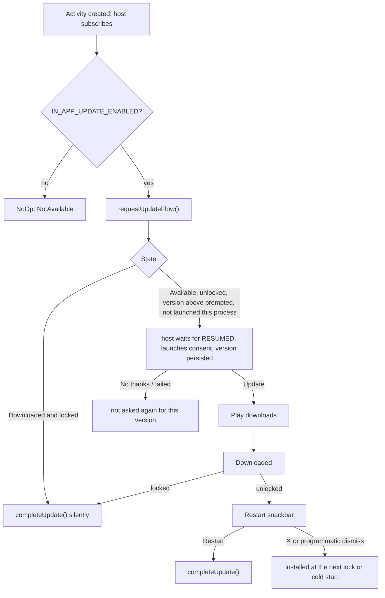

# In-app updates

How Safe-Box offers Play updates from inside the app. The decisions and their evidence are in
[ADR-0005](../decisions/0005-in-app-updates-flexible-only.md); this page covers the design and how
to test it.

## Components

All in `ui/core/appupdate/` unless noted.

| Piece | Role |
|---|---|
| `AppUpdateController` | Play-agnostic boundary: `state`, `startFlexibleUpdate(launcher)`, `completeUpdate()` |
| `PlayAppUpdateController` | Over ktx `requestUpdateFlow()`. Caches the `AppUpdateInfo` needed to start the flow. Swallows every Play failure. |
| `NoOpAppUpdateController` | Used when `BuildConfig.IN_APP_UPDATE_ENABLED` is off (`debug`, `qa`) |
| `AppUpdateStateMapper` | `AppUpdateResult` to `AppUpdateState`, a pure function |
| `di/AppUpdateModule` | Chooses Play or NoOp by the flag. Separate so androidTest can replace it. |
| `InAppUpdateViewModel` | The policy. Activity-scoped. |
| `InAppUpdateSessionGuard` | Per-process flags that must outlive the ViewModel |
| `InAppUpdateHostRoot` | Invisible composable beside the root `NavHost` in `AppNavigation`. Owns the result launcher and reports the root destination. |
| `InAppUpdateRestartPromptRoot` | Shows the restart snackbar on Home's existing `SnackbarHostState` |
| `UpdateFlowResult` | Consent outcome. The host translates the activity result code, so the ViewModel has no Android result codes. Unknown codes count as failed. |

`AppUpdateState` is `NotAvailable`, `Available(versionCode)`, `Downloading` (pending, downloading or
installing) or `Downloaded`. Every failure, including a device without Play, is `NotAvailable`.

## Flow

**Unlocked** means the root nav is in `HomeGraph` *and* the away timeout has not fired since the
graph was entered. The away dialog (`UserAwayDialogRoute`) sits inside the Home graph but only leads
to a new login, so it counts as locked. Driven by `ActiveSessionManager.logoutEvent`.

The host collects with `collectAsState`, not a lifecycle-aware collector. So a lock that happens in
the background is seen straight away, and Play installs silently while the app is not in the
foreground. The flow is checked again whenever the ViewModel's `WhileSubscribed(5_000)` upstream
restarts, which in practice means a new activity.

The consent launch waits for `Lifecycle.State.RESUMED`. The OS can block activity starts from the
background, and a launch that Play accepts still uses up that version's only prompt.

## Analytics bounds

`state` re-emits on every check, so no event is logged per emission. Each event is bounded by one of
three mechanisms:

- **P:** the persisted version code `IN_APP_UPDATE_PROMPTED_VERSION_CODE`.
- **T:** a state transition, tracked in `InAppUpdateSessionGuard.lastObservedState`, which survives
  re-subscription.
- **G:** a guard flag, reset only when the process dies.

| Key | When | Mechanism | Bound |
|---|---|---|---|
| `IN_APP_UPDATE_FLOW_SHOW` | Play accepted the consent launch | P + G | once per Play version |
| `IN_APP_UPDATE_FLOW_ACCEPT` / `_CANCEL` / `_FAILED` | consent result. Unknown codes count as failed, so show = accept + cancel + failed | 1:1 with a launch | once per version |
| `IN_APP_UPDATE_DOWNLOADED` | `Downloading → Downloaded` | T + G | once per process |
| `IN_APP_UPDATE_RESTART_SNACKBAR_SHOW` | first `showRestartPrompt = true` | G | once per process |
| `IN_APP_UPDATE_RESTART_SNACKBAR_CLICK` | Restart action | result of the snackbar | at most once per process |
| `IN_APP_UPDATE_RESTART_SNACKBAR_DISMISSED` | ✕, or a programmatic dismiss (`ClipboardActions` on API < 33) | result of the snackbar | at most once per process |
| `IN_APP_UPDATE_AUTO_COMPLETE` | `Downloaded` while locked | G | once per process. It repeats across cold starts only if Play's install keeps failing, which is worth seeing. |

The snackbar cannot come back in a new process. After a dismiss the update stays downloaded, and the
next lock or cold start (which begins locked) installs it.

No availability or check-failure events are logged. They would fire on every launch, and adoption is
visible in Play Console.

## Snackbar interplay

The restart snackbar is `SnackbarDuration.Indefinite`, and `showSnackbar` queues behind it.
`ClipboardActions` dismisses the current snackbar before showing its own, so copy confirmations
still appear, at the cost of ending ours as *dismissed*. A future snackbar caller that does not
dismiss first will wait behind the restart prompt.

## Testing

| Layer | Where | What |
|---|---|---|
| Unit | `AppUpdateStateMapperTest` | every Play result and install status |
| Unit | `UpdateFlowResultTest` | consent result codes, including unknown codes counting as failed |
| Unit | `InAppUpdateViewModelTest` | gating, once-per-version and once-per-process bounds, lock and away-timeout handling, every analytics key |
| Instrumentation | `InAppUpdateE2ETest` | the consent appears after login and not on the login screen; accept and download show the snackbar; Restart completes the update; ✕ hides it |

`androidTest/di/FakeAppUpdateModule` replaces `AppUpdateModule` in **every** instrumentation test. It
wires Play's `FakeAppUpdateManager` into the real `PlayAppUpdateController` and bypasses the flag. The
fake reports no update until a test calls `setUpdateAvailable`. The fake never launches the intent,
so consent results (`FLOW_ACCEPT` and the others) are covered by unit tests only.

### Driving the fake in instrumentation tests

Verified 2026-09-28 against Play `app-update` 2.1.0, as `InAppUpdateE2ETest` does it:

- Call `setUpdateAvailable(BuildConfig.VERSION_CODE + 1, AppUpdateType.FLEXIBLE)` **before**
  launching the activity. Touch the fake only via `instrumentation.runOnMainSync`: the app reads it
  on the main thread, and its simulation methods notify listeners synchronously on the calling
  thread.
- Remove `CommonConstants.IN_APP_UPDATE_PROMPTED_VERSION_CODE` in setup and teardown. It lives in
  shared preferences, so an earlier test that prompted for the same version suppresses the prompt.
- The fake **never starts Play's activity**: `startUpdateFlowForResult` ignores the launcher and
  returns `true`. Assert on `isConfirmationDialogVisible` / `isInstallSplashScreenVisible`, and act
  as the user with `userAcceptsUpdate()`, `downloadStarts()` and `downloadCompletes()`.

### Manual test with real Play

The only way to exercise real Play is internal app sharing or an internal testing track. Both builds
must come from Play with the `release` application id.

1. On the device, enable internal app sharing in Play Store: *Settings → About*, tap *Play Store
   version* seven times, then turn on *Internal app sharing*.
2. Upload a `release` AAB with version code *N* to internal app sharing. Install it from its link
   and sign up.
3. Upload a second AAB with a higher version code. Open its link, but **do not** tap Update.
4. Open Safe-Box and log in. Expect the flexible consent sheet.
5. Accept, wait for the download, and expect the snackbar. Check both paths:
   - **Restart** leads to Play's install screen and then a relaunch into *N+1*.
   - **✕**, then lock the vault (background it past the away timeout, or log out), leads to a
     silent install.
6. Repeat with the vault locked during the download. It installs without a snackbar.

Tagged releases publish `app-release.aab` as a GitHub Release asset. Two consecutive tags give you
two version codes without a local signing setup.
