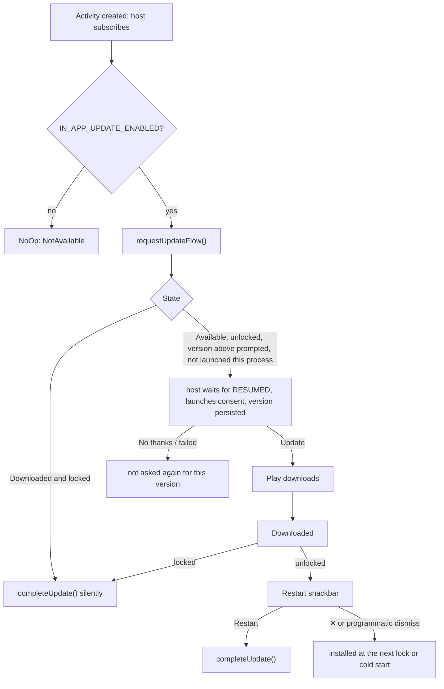

# In-app updates

How Safe-Box offers Play updates from inside the app. The decisions and their evidence are in
[ADR-0008](../decisions/0008-in-app-updates-flexible-only.md); this page covers the design and how
to test it.

## Components

All in `ui/core/appupdate/`. The Play boundary sits in its `controller/` sub-package; the policy
and the UI stay at the root.

| Piece | Role |
|---|---|
| `controller/AppUpdateController` | Play-agnostic boundary: `state`, `startFlexibleUpdate(launcher): Boolean`, `completeUpdate(): Boolean` |
| `controller/PlayAppUpdateController` | Over ktx `requestUpdateFlow()`. Caches the `AppUpdateInfo` needed to start the flow. Swallows every Play failure and reports it as `NotAvailable` or `false`. |
| `controller/NoOpAppUpdateController` | Used when `BuildConfig.IN_APP_UPDATE_ENABLED` is off (`debug`, `qa`) |
| `controller/AppUpdateResultMapping.kt` | `AppUpdateResult.toAppUpdateState()`, a pure function. Kept out of the controller because the controller cannot run on the JVM (see Testing). |
| `di/AppUpdateModule` | Chooses Play or NoOp by the flag. Separate so androidTest can replace it. |
| `InAppUpdateViewModel` | The policy. Obtained once in `AppNavigation`, outside any `NavHost`, so it is activity-scoped, and passed as a parameter to both composables below. |
| `InAppUpdateSessionGuard` | Per-process flags that must outlive the ViewModel |
| `InAppUpdateHostRoot` | Invisible composable beside the root `NavHost` in `AppNavigation`. Owns the result launcher, reports the root destination, and signals when it is resumed and a prompt is due. |
| `InAppUpdateRestartPromptRoot` | Shows the restart snackbar on Home's existing `SnackbarHostState` |
| `UpdateFlowResult` | Consent outcome. The host translates the activity result code, so the ViewModel has no Android result codes. Unknown codes count as failed. |

`AppUpdateState` is `NotAvailable`, `Available(versionCode)`, `Downloading` (pending, downloading or
installing) or `Downloaded`. Every failure, including a device without Play, is `NotAvailable`.

The only UI → ViewModel action that carries more than a fact is `OnReadyToLaunchUpdateFlow(launcher)`.
Every `startUpdateFlowForResult` overload needs an Activity-bound launcher, and the ViewModel must
not retain one, so the host hands it over at launch time. The ViewModel still decides which version
is offered, from its own state, and whether an attempt is allowed.

## Flow

**Unlocked** means the root nav is in `HomeGraph` *and* the away timeout has not fired since the
graph was entered. The away dialog (`UserAwayDialogRoute`) sits inside the Home graph but only leads
to a new login, so it counts as locked. Driven by `ActiveSessionManager.logoutEvent`.

The host collects with `collectAsState`, not a lifecycle-aware collector. So a lock that happens in
the background is seen straight away, and Play installs silently while the app is not in the
foreground. The flow is checked again whenever the ViewModel's `WhileSubscribed(5_000)` upstream
restarts, which in practice means a new activity.

The consent launch waits for `Lifecycle.State.RESUMED`. The OS can block activity starts from the
background, and a launch that Play accepts still uses up that version's only prompt.

The prompted version is written on the `@ApplicationScope` scope, not `viewModelScope`. Play's
sheet is a separate activity, so the user can finish ours while it is open; a `viewModelScope`
write queued behind the IO dispatch would be cancelled with the ViewModel and the same version would
be offered again in the next process. `launch(NonCancellable)` on `viewModelScope` was rejected: it
makes the coroutine outlive the scope it is launched in, which is what the application scope is for.

## Analytics bounds

`state` re-emits on every check, so no event is logged per emission. Each event is bounded by one of
three mechanisms:

- **P:** the persisted version code `IN_APP_UPDATE_PROMPTED_VERSION_CODE`.
- **T:** a state transition, tracked in `InAppUpdateSessionGuard.lastObservedState`, which survives
  re-subscription.
- **G:** a guard flag, reset only when the process dies.

| Key | When | Mechanism | Bound |
|---|---|---|---|
| `IN_APP_UPDATE_FLOW_SHOW` | Play accepted the consent launch | P + G | once per Play version |
| `IN_APP_UPDATE_FLOW_LAUNCH_FAILED` | Play refused the consent launch, so nothing was shown and the version is not persisted | G | once per process |
| `IN_APP_UPDATE_FLOW_ACCEPT` / `_CANCEL` / `_FAILED` | consent result. Unknown codes count as failed, so show = accept + cancel + failed | 1:1 with a launch | once per version |
| `IN_APP_UPDATE_DOWNLOADED` | `Downloading → Downloaded` | T + G | once per process |
| `IN_APP_UPDATE_RESTART_SNACKBAR_SHOW` | first `showRestartPrompt = true` | G | once per process |
| `IN_APP_UPDATE_RESTART_SNACKBAR_CLICK` | Restart action | result of the snackbar | at most once per process |
| `IN_APP_UPDATE_RESTART_SNACKBAR_DISMISSED` | ✕, or a programmatic dismiss (`ClipboardActions` on API < 33) | result of the snackbar | at most once per process |
| `IN_APP_UPDATE_AUTO_COMPLETE` | `Downloaded` while locked | G | once per process. It repeats across cold starts only if Play's install keeps failing, which is worth seeing. |
| `IN_APP_UPDATE_COMPLETE_FAILED` | `completeUpdate()` returned `false`, after Restart or the silent attempt | follows the two triggers above | at most twice per process |

The snackbar cannot come back in a new process. After a dismiss the update stays downloaded, and the
next lock or cold start (which begins locked) installs it.

No availability or check-failure events are logged. They would fire on every launch, and adoption is
visible in Play Console.

## Snackbar interplay

The restart snackbar is `SnackbarDuration.Indefinite`, and `showSnackbar` queues behind it.
`ClipboardActions` dismisses the current snackbar before showing its own, so copy confirmations
still appear, at the cost of ending ours as *dismissed*. A future snackbar caller that does not
dismiss first will wait behind the restart prompt.

## Testing

| Layer | Where | What |
|---|---|---|
| Unit | `controller/AppUpdateResultMappingTest` | every Play result and install status |
| Unit | `UpdateFlowResultTest` | consent result codes, including unknown codes counting as failed |
| Unit | `InAppUpdateViewModelTest` | gating, once-per-version and once-per-process bounds, lock and away-timeout handling, every analytics key |
| Instrumentation | `controller/PlayAppUpdateControllerTest` | the real controller over `FakeAppUpdateManager`, no Hilt or activity: emissions for no update, an offer and an accepted download; one flow per check; both `completeUpdate()` outcomes |
| Instrumentation | `InAppUpdateE2ETest` | the consent appears after login and not on the login screen; accept and download show the snackbar; Restart completes the update; ✕ hides it; the away timeout after a download installs silently |

`PlayAppUpdateController` **cannot be unit tested on the JVM** (checked 2026-10-02 against
`app-update-ktx` 2.1.0): `requestUpdateFlow()` and `requestCompleteUpdate()` await GMS `Task`s whose
listeners are posted to `TaskExecutors.MAIN_THREAD`. With `unitTests.returnDefaultValues = true`
there is no main looper, the post is dropped and the coroutine never resumes. There is no Robolectric
in the project. That is why the result mapping is a separate pure function.

`androidTest/di/FakeAppUpdateModule` replaces `AppUpdateModule` in **every** instrumentation test. It
wires Play's `FakeAppUpdateManager` into the real `PlayAppUpdateController` and bypasses the flag. The
fake reports no update until a test calls `setUpdateAvailable`. The fake never launches the intent,
so consent results (`FLOW_ACCEPT` and the others) are covered by unit tests only.

### Driving the fake in instrumentation tests

Verified 2026-09-28 against Play `app-update` 2.1.0, as `InAppUpdateE2ETest` does it:

- Call `setUpdateAvailable(BuildConfig.VERSION_CODE + 1, AppUpdateType.FLEXIBLE)` **before**
  launching the activity. Touch the fake only via `instrumentation.runOnMainSync`: the app reads it
  on the main thread, and its simulation methods notify listeners synchronously on the calling
  thread.
- Remove `CommonConstants.IN_APP_UPDATE_PROMPTED_VERSION_CODE` in setup and teardown. It lives in
  shared preferences, so an earlier test that prompted for the same version suppresses the prompt.
- The fake **never starts Play's activity**: `startUpdateFlowForResult` ignores the launcher and
  returns `true`. Assert on `isConfirmationDialogVisible` / `isInstallSplashScreenVisible`, and act
  as the user with `userAcceptsUpdate()`, `downloadStarts()` and `downloadCompletes()`.

### Manual test with real Play

The only way to exercise real Play is a Play-served build with the `release` application id. Since
[ADR-0009](../decisions/0009-play-upload-testing-tracks.md) every `v*` tag lands on the internal,
closed and open testing tracks by itself, so two consecutive tags give two version codes with no
local signing and no internal app sharing.

1. Be on the closed testing track's tester list and install Safe-Box from Play on the device.
2. Tag *N* (an RC is fine). When `release_on_play` is green and Play has reviewed the release,
   update to it from Play and sign up.
3. Tag *N+1*. Wait for its release, but **do not** update from the Play Store.
4. Open Safe-Box and log in. Expect the flexible consent sheet.
5. Accept, wait for the download, and expect the snackbar. Check both paths:
   - **Restart** leads to Play's install screen and then a relaunch into *N+1*.
   - **✕**, then lock the vault (background it past the away timeout, or log out), leads to a
     silent install.
6. Repeat with the vault locked during the download. It installs without a snackbar.

Play can take a while to offer a new testing release to a device; "Play Store → account → Settings
→ About → Update Play Store" is the usual nudge. Internal app sharing still works as a fallback
(enable it under *Play Store → Settings → About* by tapping the version seven times) with the
`app-release.aab` of any GitHub release.
