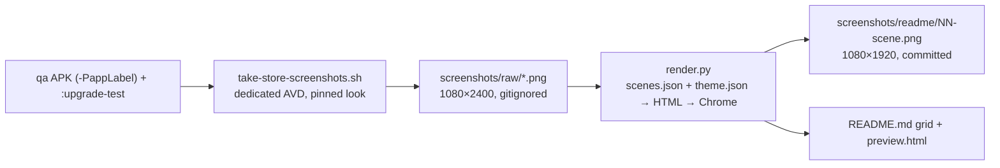

# Store listing images

How the Play Store screenshots and the README grid are produced, what the committed files mean,
and the presentation issues the images exposed. The runbook is the
[store-screenshots skill](../.agents/skills/store-screenshots/SKILL.md); the decision and its
alternatives are [ADR-0006](decisions/0006-store-screenshots-from-emulator-captures.md).

## Pipeline



Capture and compositing are separate on purpose. A copy or theme change re-renders in seconds from
the captures on disk; a UI change recaptures, and the compositor does not care which run the
captures came from. A raw capture is never modified: every store image is rasterised afresh from a
page, so deleting the output and re-running reproduces it byte-for-byte on the same Chrome.

`screenshots/raw/` is the contract between the layers, and only the tour is UI-dependent. Device
pinning (demo status bar, night mode, palette seeds, the emulator-console capture of the
`FLAG_SECURE` biometric sheet) and the compositor are not, and a PNG placed in `raw/` by hand is
indistinguishable from a tour capture. So when a UI change breaks a tour step, the fallback is per
scene — recapture the rest with `--scenes`, shoot that one by hand, render — rather than all or
nothing; and if the tour ever costs more repair than it saves, the cut is the tour alone, with the
pinning and the compositor kept (settled 2026-10-04). The tour earns its keep because a refresh needs
28 captures with identical demo data, clock and status bar, in both appearances and four palettes.

## The scenes

`scenes.json` is the listing, in store order. One scene is one store image; its `captures` fill its
layout's slots in order, so the last capture is the front phone.

| # | Scene | Layout | Shows |
|---|---|---|---|
| 1 | `records` | duo | vault list behind the search screen with the keyboard up |
| 2 | `authenticators` | single | authenticator list, live codes and countdowns |
| 3 | `unlock` | duo | master-password screen behind the biometric sheet |
| 4 | `add` | duo | record-type sheet behind the new-login form |
| 5 | `login_detail` | single | a login with its password revealed |
| 6 | `backup` | single | backup set up, last backup timestamp |
| 7 | `appearance` | split | the vault list, one phone split light / dark |
| 8 | `palette` | quad | the unlock screen under four Material You seeds |

Choices settled with the owner on 2026-10-04, so they are not re-opened casually:

- **One dedicated light/dark image** (`appearance`) instead of every image mixing a light and a dark
  phone, as the previous listing did. All other phones are light.
- **Two-phone images pair two different screens**, not two appearances of one screen.
- **Settings was dropped** to stay within Play's eight; its line ("auto-lock, privacy mode") lives in
  the unlock subhead. Candidates for the slot if the set is revisited: settings, a second
  authenticator view.
- **Theme A, "soft"**: light teal gradient and dark ink. The bold dark-teal variant was rendered and
  rejected as too heavy against dark phones.
- **Font**: Inter (variable), committed under `scripts/store-screenshots/fonts/` with its OFL, so
  renders do not depend on what the machine has installed.
- **Palette seeds** `1565C0 6750A4 B3261E 2E7D32`: four hues a wallpaper might produce, far enough
  apart to read at thumbnail size. The regular captures pin `006A65`, the app's own primary.

## Demo content

The vault is built by `StoreScreenshotTour#setUpDemoVault` from `DemoVault.kt` every run, against a
fresh install: persona Aarav Mehta, a handful of logins, cards, bank accounts, notes and
authenticators whose names a reader recognises (Amazon, GitHub, Netflix, HDFC). Adding an
authenticator opens the QR scanner first, so the tour taps its manual-entry button and types a
valid Base32 seed (the list then shows live codes and countdown rings rather than the invalid-seed
message); the host grants `CAMERA` beforehand, otherwise the scanner shows a rationale dialog
instead of that button.

What is pinned around the app, and undone at exit: SystemUI demo mode (10:00, full wifi and
signal, full battery, no notifications), font scale 1.0, night mode per pass, the Material You seed.
Window and transition animations are off through the harness's `clean_slate`.

## File formats

### `scenes.json`

```json
{
  "readme": { "columns": 3, "width": 200 },
  "scenes": [
    { "id": "unlock", "layout": "duo",
      "captures": ["unlock_password-light", "unlock_biometric-light"],
      "headline": "Master password\nor fingerprint",
      "subhead": "Auto-locks when you leave.\nNothing ever leaves your device" }
  ]
}
```

- `id` — `[a-z0-9_]+`, unique; the output is `NN-<id>.png` with `NN` the 1-based position.
- `layout` — a key of `theme.json` `layouts`; `captures` must have exactly as many entries as the
  layout has slots, each a file stem under `screenshots/raw/`.
- `headline` required, `subhead` optional; `\n` is a manual line break. The README `alt` is the
  headline with the break replaced by a space.
- 2 to 8 scenes, Play's limits.

### `theme.json`

| Section | Keys |
|---|---|
| `canvas` | `width`, `height` — Play phone screenshots are 1080×1920 |
| `frame` | directory name under `scripts/store-screenshots/frames/` holding Android Studio device art (`back.webp`, `mask.webp`, `layout`) |
| `font` | `family`, `files` (paths relative to the script directory, loaded through `@font-face`) |
| `background` | `fill` (any CSS background) and `shapes` (absolutely positioned blurred discs) |
| `copy` | `top`, `sideInset`, `align`; `headline` and `subhead` with `weight`, `size`, `lineHeight`, `letterSpacing`, `color`; `subhead.gap` |
| `phone` | `shadow` — a CSS `filter` value applied to each phone |
| `layouts` | name → list of slots `{left, top, scale, rotate?, clip?}`; slots are drawn in order |

A slot's `clip` is a polygon in percent of the phone's footprint, applied after the shadow and
before the rotation. Points may lie outside 0–100 so the shadow survives; the `split` layout's second
slot overlaps the seam by 0.15 % so the anti-aliased edge shows no background.

`frames/pixel_8/mask.webp` is Studio's **foreground** overlay (opaque at the rounded corners and the
camera cut-out), not an alpha mask; it is drawn above the capture and below the frame.

## Compositor guarantees

`render.py` refuses, with a one-line reason and exit 1, to: render a missing or wrong-size capture,
use an undefined layout, mismatch captures and slots, duplicate ids, exceed 2–8 scenes, or touch a
README without the marker block. Every output is verified as the canvas size, 8-bit RGB with no
alpha. Chrome emits RGB for an opaque page; should that change, `strip_alpha` re-encodes losslessly
from the pure-Python PNG decoder. `--only` renders a subset and holds the README and preview back
until every image exists; a full render removes `NN-*.png` outputs that are no longer in the set.

## Presentation issues the images exposed

App-side work, visible in the current listing until fixed. Re-render after each fix.

| Issue | Where | What the fix must do | Check |
|---|---|---|---|
| Detail screens print `Date.toString()` ("Sun Oct 04 11:15:03 GMT+05:30 2026") for created/updated | `login_detail` image | format with `DateUtils`/`DateTimeFormatter` in the user's locale | the detail capture shows a localised date |
| Dark-theme unlock screen has a near-white header with white status icons (clock invisible) | not in the listing — avoided by using light captures for `unlock` and `palette` | `AnimatedCurveBackground.kt` should take its colours from the dark scheme | a dark `unlock_password` capture is dark, after which `palette` can mix appearances |
| "Backup was last taken on NA" before the first backup | avoided — the tour takes a backup first | wording that reads as a state, not a value | the fresh-install backup capture reads naturally |

## Not automated

Uploading to Play Console is manual (Main store listing → Phone screenshots, in `NN` order). The
`r0adkll/upload-google-play` action could take the images as `mappings`, but it also needs a
service-account key in repository secrets and would upload the AAB; that is a release-process
decision, separate from this pipeline.
