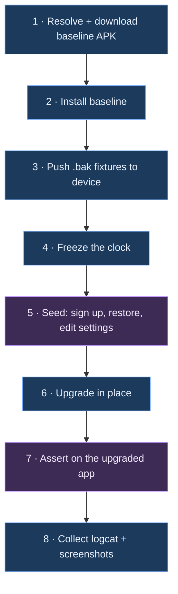

# APK-over-APK upgrade testing — design

Install a previously shipped QA APK, put real data in it, upgrade in place to the build under
test, and verify nothing was lost or corrupted.

---

## 1. Why this test exists

Field encryption uses an `AndroidKeyStore` AES-GCM key under alias `symmetricDataKey`
([SecurityModule.kt:50-74](../../app/src/main/java/com/andryoga/safebox/di/SecurityModule.kt#L50-L74)):

```kotlin
if (!keyStore.containsAlias(alias)) {
    keyGenerator.generateKey()
}
```

If that alias is ever lost across an upgrade, the app **silently generates a fresh key**. Nothing
throws. Every record becomes permanently undecryptable, and the user sees a vault full of garbage
with no explanation.

The key does not live in `/data/data`, so it is invisible to every test you currently have.

| Layer | Room migration test | Golden `.bak` test | This test |
|---|---|---|---|
| Room schema + data | yes | no | yes |
| `EncryptedSharedPreferences` | no | no | yes |
| DataStore | no | no | yes |
| WorkManager internal DB | no | no | yes |
| **Keystore alias continuity** | **no** | **no** | **yes** |

---

## 2. Verified ground truth

All checked on 2026-09-20/21 against the real artifacts, not assumed.

| Constraint | Status | How it was verified |
|---|---|---|
| Old QA APKs are archived | **already done** | `release.yml` attaches `SafeBox-qa.apk` to every tag. 15 of 18 releases carry one, back to `v1.3.3.0` |
| Signing certificate is stable | yes | `v2.0.4.0`, `v2.1.4.0-rc3` and a local build all report SHA-256 `257ab204…7b113d` |
| Same `applicationId` | yes | `com.andryoga.safebox.qa` on all |
| `versionCode` is monotonic | yes | 23 → 28 → 9999999 (local) |
| Black-box automation works on the minified APK | yes | `uiautomator dump` returned `Welcome !`, `Password*`, `Sign Up`, `content-desc="Toggle sensitive data visibility"` |
| No app change needed for selectors | yes | production has zero `testTag`; the existing suite already uses text and content description exclusively |
| Runs without Google Play services | yes | ML Kit is the **bundled** `com.google.mlkit:barcode-scanning`, so `aosp-atd` images suffice |

### Hard constraints

Three build types mean three `applicationId`s (`.debug`, `.qa`, none), and Android refuses to
upgrade one into another. A Play Store install also cannot be upgraded by a local build, because
Play re-signs with its own key.

**`qa → qa` is the only vehicle available.** That variant is release-like — `initWith(release)`,
R8 on, resource shrinking on — but it is not byte-identical to the production APK. Close, not same.

---

## 3. Architecture



| | Steps | Runs where |
|---|---|---|
| **Host harness** (bash on the CI runner) | 1, 2, 3, 4, 6, 8 | the runner, over `adb` |
| **On-device driver** (UI Automator) | 5, 7 | inside an instrumentation process on the device |

### Why the work has to be split

Step 6 is `adb install -r`, and it happens **between** two on-device runs. A single
`connectedAndroidTest` invocation cannot upgrade the app underneath itself. So the host owns the
lifecycle and invokes the device driver twice, with a different `-e phase` argument each time.

This is also why Gradle Managed Devices cannot run this job: GMD owns its emulator lifecycle inside
one Gradle task, with no way to interleave an `adb install` in the middle.

### Why a separate Gradle module is required

You asked why this needs a module at all. Two reasons, and the first is not negotiable.

**1. UI Automator only runs on the device.** There is no host-side driver — it is an Android
library (`androidx.test.uiautomator`) that talks to the device's accessibility layer from inside an
instrumentation process. Running it therefore requires an **instrumentation APK**, and the only way
to produce one is a Gradle module. A shell script alone can do `adb shell input tap 540 1200`, but
coordinate-tapping is unmaintainable and cannot read text back to assert on it.

**2. It must not be `:app`'s `androidTest`.** That source set is already bound to
`CustomHiltTestRunner`, pulls in the Hilt test Application, and gets minified alongside the app —
which is exactly what makes it unable to run against a minified build
([ADR-0001](../decisions/0001-instrumentation-tests-run-on-debug-only.md)).

So: a new `com.android.test` module, **self-instrumenting**, with no compile dependency on `:app`.

```groovy
// upgrade-test/build.gradle — as shipped
plugins { alias(libs.plugins.android.test) }

android {
    namespace 'com.andryoga.safebox.upgradetest'
    targetProjectPath = ':app'
    experimentalProperties["android.experimental.self-instrumenting"] = true
    defaultConfig {
        testInstrumentationRunner 'androidx.test.runner.AndroidJUnitRunner'
    }
    kotlin { jvmToolchain(17) }
}

dependencies {
    implementation libs.androidx.test.uiautomator
    implementation libs.androidx.test.ext.junit
    implementation libs.androidx.test.runner
}
```

No Kotlin plugin is applied: AGP 9 has built-in Kotlin support and `:app` applies none either.
Note also that `alias(...)` only resolves if the root `build.gradle` declares the same plugin
`apply false` — otherwise Gradle reports "already on the classpath with an unknown version".

`self-instrumenting` — the same mechanism Macrobenchmark uses — makes the test process target
*itself* rather than the app. Three consequences:

1. No signature match required between test APK and app APK, so this harness can later be pointed
   at a **Play-Store-signed** build.
2. Upgrading the app mid-run does not kill the test process.
3. Zero compile coupling to `:app`, so R8 can never break it.

Build-time cost of the extra module is small: it compiles a handful of Kotlin files and links no
app code.

---

## 4. Golden backup fixtures

The format, for context: a Java-serialized `HashMap<String, ByteArray>` with numeric keys,
payloads PBE-encrypted under a **backup password supplied at export time** (independent of the
vault master password). `BACKUP_VERSION` is currently 3. Full detail in
[persistence-and-crypto.md](../architecture/persistence-and-crypto.md).

**Where they get committed:** `upgrade-test/src/main/assets/fixtures/`. They are a few hundred KB
each, binary, and never edited after creation, so plain git is fine — no LFS needed.

| Fixture | Produced by | Guards |
|---|---|---|
| `v1_legacy.bak` | `v1.3.3.0` QA APK (oldest with an archived APK) | the 1-byte `creationDate` legacy path; a backup with no authenticator key at all |
| `v2_pre_totp.bak` | **`v2.1.4.0-rc3` — captured 2026-09-21** | the format the entire current user base has on disk |
| `v3_current.bak` | this branch | the new format including authenticators |
| `v3_adversarial.bak` | this branch, hand-seeded | emoji + RTL + 4000-char fields, all-optionals-empty record, max-length card number, a `SHA512`/8-digit/60s authenticator, an authenticator with an **invalid Base32 seed**, duplicate titles |
| `corrupt.bak` | `head -c 2048 v3_current.bak` | the `CORRUPT_OR_INVALID_FILE` path, and that a failed restore leaves the vault intact |

All use one fixed backup password committed in the harness. Synthetic data only — never a real
vault.

> [!CAUTION]
> `v2_pre_totp.bak` is the only irreversible item in this whole design, and it now **exists**:
> `BACKUP_VERSION = 2`, 2 login / 2 bank account / 2 bank card / 1 secure note, no authenticator
> key. Once TOTP ships, this format can no longer be produced, so the risk has moved from failing
> to capture it to losing it. Never regenerate it, never "clean up" its contents, and verify with
> `scripts/InspectBackup.java` rather than by opening it.

---

## 5. Scenarios

### Phase A — establish state on the baseline app

| # | Step | Why |
|---|---|---|
| A1 | install baseline APK, launch | |
| A2 | sign up with master password + hint | creates the password hash **and generates the `symmetricDataKey` alias** |
| A3 | restore a golden `.bak` through the real SAF picker | seeds every record type in one interaction instead of ~50 taps |
| A4 | create one extra record **of each type through the UI** | restore writes via the worker, the UI writes via the repository — two different encryption call sites |
| A5 | set the backup directory and move 2–3 settings off their defaults | a prefs/DataStore migration bug is invisible if every value is still the default |
| A6 | copy a password to the clipboard | enqueues `ClipboardClearWorker`, so WorkManager's DB is non-empty across the upgrade |
| A7 | capture the oracle: per-type counts, every field of one known record per type, current TOTP code | |
| A8 | `adb shell am force-stop` | **never** `pm clear`, **never** `uninstall` |

### Phase B — the upgrade

```bash
adb install -r new.apk     # correct: preserves /data
adb uninstall old          # wrong: this is a fresh-install test in disguise
adb install -r -d new.apk  # wrong: -d permits downgrade and hides a versionCode mistake
```

The harness asserts `newVersionCode > oldVersionCode` **before** installing, and afterwards checks
via `dumpsys package` that `firstInstallTime` is unchanged while `versionCode` changed. That single
check is what stops this decaying into a fresh-install test a year from now.

### Phase C — assertions on the upgraded app

**Group 1 — the app is usable at all**
1. Cold launch does not crash; zero `FATAL EXCEPTION` in logcat since install.
2. Lands on the **unlock** screen, not signup. Catches wiped preferences.
3. The password hint shown matches what was set pre-upgrade. Catches `EncryptedSharedPreferences` loss.

**Group 2 — authentication continuity**
4. The original master password unlocks.
5. A wrong password still fails with the normal error — guards the catastrophic inverse, a hash
   change that makes every password succeed.

**Group 3 — data integrity (the Keystore check, highest value here)**
6. Record count matches exactly, per type, across all five types.
7. Open one known record **of every type** and compare **every field** character-for-character
   against the Phase A oracle. A regenerated key shows up here as mojibake or a decrypt throw.
8. Include one long unicode field and one empty optional field — GCM tag and padding edges.
9. Search a known title and assert the record is found — a different query path from the detail
   screen.

**Group 4 — the migration ran, and ran non-destructively**
10. The add-record sheet offers **Authenticator**, proving `MIGRATION_4_5` created the table and
    Room did not fall back destructively.
11. Add a new authenticator post-upgrade and save it — writes into the freshly migrated table.
12. Re-assert Group 3 counts afterwards.

**Group 5 — TOTP across the boundary**
13. For an authenticator restored from the fixture, assert the six displayed digits equal an
    RFC 6238 value computed **inside the test** with a local Base32 + HMAC-SHA1 helper. Never call
    app code for the expected value.
14. Determinism: `adb root` works on `aosp-atd` (userdebug), so `settings put global auto_time 0`
    then set a fixed instant. Without root, assert against the current **and** previous 30-second
    window.
15. This is the only assertion that proves the **seed itself decrypted correctly**, rather than
    that a row exists.

**Group 6 — the escape hatch still works**
16. Take a fresh backup on the upgraded app; assert a `.bak` appears with a plausible size.
17. `pm clear`, sign up again, restore that new `.bak`.
18. Assert the same counts and field values as step 7. Catches "the upgrade worked but the export
    it now produces is broken", which would quietly destroy the user's only recovery path.

**Group 7 — backward-compat matrix** (same fixtures, separate job)
19. On a **fresh** install of the new app, restore each fixture and assert counts and spot-checked
    fields.
20. For `v3_adversarial.bak`, assert the invalid-Base32 authenticator is **absent** while every
    other record is present — the `filterDecodableAuthenticatorData` contract.

**Group 8 — graceful failure**
21. Restore `corrupt.bak`: expect the `CORRUPT_OR_INVALID_FILE` message, no crash, and the existing
    vault untouched.
22. Restore a valid fixture with the wrong password: expect `INCORRECT_PASSWORD`, vault untouched.

**Group 9 — crash sentinel (global gate)**
23. The job fails if logcat contains any `FATAL EXCEPTION` or `ANR in com.andryoga.safebox.qa`
    between install and teardown.

**Group 10 — downgrade guard**
24. `adb install -r old.apk` after the upgrade must fail. Catches an accidentally lowered
    `versionCode` before Play does.

---

## 6. Assertion mechanics

**Reading a field value.** Compose text surfaces to UI Automator as `text` on a leaf node. Scope to
the field's container and read it:

```kotlin
private fun UiDevice.fieldValue(label: String): String {
    val labelNode = wait(Until.findObject(By.text(label)), TIMEOUT)
        ?: error("field label '$label' not found. Screen:\n${dumpWindowHierarchy()}")
    return labelNode.parent.findObject(By.clazz("android.widget.EditText")).text
}
```

**Masked fields.** Passwords, card numbers and TOTP seeds render as bullets. Tap
`content-desc="Toggle sensitive data visibility"` first — it already exists in the shipped APK.

**Driving the SAF picker** is the flakiest interaction in the design, so isolate it behind one
helper with generous retries. Fixtures must be pushed *and* announced to the media store, or
DocumentsUI may not list them:

```bash
adb push v3_current.bak /sdcard/Download/
adb shell content call --uri content://media/external/file --method scan_volume --arg external
```

The restore picker filters on `application/octet-stream`, `application/x-trash` and
`application/x-binary`
([BackupAndRestoreScreen.kt:188-192](../../app/src/main/java/com/andryoga/safebox/ui/home/backupAndRestore/BackupAndRestoreScreen.kt#L188-L192)),
so a `.bak` in Downloads is selectable.

**Every failure must be self-describing.** Wrap all lookups so a miss dumps the window hierarchy
and the last 200 logcat lines. A CI failure reading `NullPointerException at line 47`, on an
emulator you cannot attach to, is worthless.

---

## 7. Choosing baseline versions — derived, not hardcoded

You objected to hardcoded tags in the matrix. You were right; here is the replacement.

The tag convention is `vMAJOR.MINOR.DBVERSION.FIX`, where the third component **is the Room schema
version**. That makes almost everything derivable from the release list alone. A script
(`scripts/resolve-baselines.sh`) emits the matrix at run time using three rules:

| Rule | Meaning | Resolves to today |
|---|---|---|
| `previous` | newest stable release before the tag being built, that has a `SafeBox-qa.apk` | `v2.0.4.0` |
| `schema-boundary` | for each distinct `DBVERSION` older than the current one, the newest stable release carrying it | `v1.3.3.1` (db 3) |
| `oldest` | the oldest release that still has an archived `SafeBox-qa.apk` | `v1.3.3.0` |

After de-duplication that is **two to three jobs**, and it self-adjusts as you ship — no workflow
edits, ever.

Defaults and why:

- **Stable releases only** by default. Users install from Play, which only serves stable builds, so
  an RC baseline tests a state no real user is in. Override with a flag when an RC is the only
  thing carrying a schema.
- **Not every historical pair.** That is `O(n²)` and buys nothing; a v1.5 → v2.2 upgrade exercises
  the same migration chain as v1.4 → v2.2.
- **One optional human-maintained value:** a floor in `upgrade-test/oldest-supported.txt`, if you
  ever decide you no longer care about installs older than some date. "How far back do we support"
  is a product decision and is the only thing a script cannot infer. Default: no floor.

Of the 18 releases, 15 carry a QA APK — the three that do not (`v1.0.0`, `v1.1.0`, `v1.2.2.0`)
predate the upload step, so `oldest` bottoms out at `v1.3.3.0` automatically.

---

## 8. CI wiring

```yaml
  upgrade_test:
    needs: [ qa_pipeline ]
    if: contains(github.ref_name, 'rc')
    runs-on: ubuntu-latest
    strategy:
      fail-fast: false
      matrix: ${{ fromJson(needs.resolve_baselines.outputs.matrix) }}
    steps:
      - uses: actions/checkout@v7

      - name: Download the QA APK built in this run
        uses: actions/download-artifact@v8
        with: { name: QA APK, path: new-apk/ }

      - name: Download the baseline QA APK
        env: { GH_TOKEN: '${{ github.token }}' }
        run: ./scripts/fetch-baseline-apk.sh '${{ matrix.from_tag }}' old-apk/

      - name: Enable KVM
        run: |
          echo 'KERNEL=="kvm", GROUP="kvm", MODE="0666", OPTIONS+="static_node=kvm"' | sudo tee /etc/udev/rules.d/99-kvm4all.rules
          sudo udevadm control --reload-rules && sudo udevadm trigger --name-match=kvm

      - uses: reactivecircus/android-emulator-runner@v2
        with:
          api-level: 34
          target: aosp_atd
          arch: x86_64
          script: ./scripts/run-upgrade-test.sh old-apk/SafeBox-qa.apk new-apk/SafeBox-qa.apk

      - uses: actions/upload-artifact@v7
        if: always()
        with:
          name: upgrade-test-${{ matrix.from_tag }}
          path: upgrade-test-out/
```

`resolve_baselines` is a tiny preceding job that runs the script from section 7 and emits the
matrix as an output.

### Is `reactivecircus/android-emulator-runner` free?

Yes, twice over:

- The action itself is **Apache-2.0 open source** (1.3k stars, actively maintained). No licence
  cost, no account.
- `Ni3verma/Safe-Box` is a **public** repository, and GitHub-hosted standard runners are free with
  no minute cap for public repos.

The only real cost is wall-clock time. You already depend on the same underlying capability —
`nightly.yml` and `release.yml` both run emulators and already contain the KVM-enabling step — so
nothing new is being introduced infrastructurally.

Expect roughly 8–10 minutes per baseline, running in parallel, so about 10 minutes added to an RC
tag build.

### Running the harness

Commands, how to add a phase, selector rules and harness-level triage are in
[upgrade-harness-operations.md](upgrade-harness-operations.md). The short version:
`.github/workflows/upgrade-test.yml` never runs on its own — it is dispatched with a rule or an
explicit tag, or triggered by the `run-upgrade-test` label on a pull request, which is the only
entry point available before the file reaches `master`. Gradle only ever *assembles* the harness —
the upgrade happens between the two on-device phases, so no single Gradle task can straddle it.

### The zero-test guard

`am instrument` exits 0 when the class filter matches nothing. Verified on a real device
2026-09-22, a method name with a typo produces exactly this and nothing else:

```
INSTRUMENTATION_RESULT: stream=

Time: 0.001

OK (0 tests)

INSTRUMENTATION_CODE: -1
```

An empty run is therefore indistinguishable from a passing one to anything that reads the exit
code, which is what made the previous attempt at this harness worthless. Every phase's output is
parsed by `assert_instrumentation_ran` in `scripts/lib/instrumentation-guard.sh`, which fails
unless a minimum number of tests actually executed and passed. That function has its own
device-free test suite, `scripts/tests/instrumentation-guard-test.sh`, run on every PR by `ci.yml`
— the guard rotting silently would restore the exact problem it was written to prevent.

The same reasoning applies to every other check in the harness. A comparison between two values
that were both read as empty strings passes and proves nothing, so `firstInstallTime` is asserted
non-empty before it is compared. Treat "this check cannot fail" as a bug of the same severity as
"this check is wrong".

---

## 9. Failure triage

| Symptom | Almost certainly |
|---|---|
| Lands on **signup** instead of unlock | preferences not preserved — check nothing uninstalled |
| Correct password rejected | password hash storage or hashing changed |
| Records present but fields are mojibake, or decrypt throws | **`symmetricDataKey` regenerated — stop the release** |
| Counts are 0 but the app works | destructive Room migration |
| Authenticator missing from the add sheet | `MIGRATION_4_5` did not run |
| TOTP digits wrong, everything else right | check the clock was frozen before suspecting the seed |
| Post-upgrade backup cannot be restored | export regression — the user's recovery path is broken |

---

## 10. Delivery plan, MR by MR

Each MR is independently reviewable and leaves the repository in a working state.

### MR0 — capture the irreversible fixture (no code)

Install `v2.1.4.0-rc3`, create a representative vault, export a backup, commit it as
`v2_pre_totp.bak` along with a short runbook describing exactly what it contains.

- **Must land before the TOTP feature merges.**
- Review size: a binary fixture plus ~40 lines of markdown.
- Acceptance: the `.bak` restores cleanly on `v2.1.4.0-rc3` and the runbook lists every record.

### MR1 — harness skeleton, end to end, no assertions — **delivered**

`upgrade-test` module, `scripts/resolve-baselines.sh`, `scripts/fetch-baseline-apk.sh`,
`scripts/run-upgrade-test.sh`, plus a CI job that only ever runs manually. One smoke test: sign up
on the baseline, upgrade, assert the unlock screen appears.

- Proved the hard part — install, seed, upgrade, re-run — before any assertion logic exists.
- Acceptance met locally against `v2.0.4.0` on API 35: three consecutive green runs, each with
  `firstInstallTime` unchanged across the upgrade, and a run fails loudly if zero tests executed.
  Getting there took a fourth run: the first stability attempt was 2 green of 3, and the failure was
  a real device-specific flake in the launch recovery, not noise —
  [Launching the app](upgrade-harness-operations.md#launching-the-app) records it. **Not yet
  exercised on CI's API 34 image.**

Three things settled during implementation that later MRs inherit rather than re-decide:

| Decision | Why |
|---|---|
| The smoke test **signs up on the baseline** | A fresh install lands on signup, so "assert the unlock screen appears" is vacuous without it — and signup is what generates the `symmetricDataKey` alias in the first place. |
| Failures carry a **window hierarchy dump**, not a screenshot | Step 8 of section 3 says screenshots. A hierarchy is greppable, diffable, and names the nodes a selector failed to match; a PNG from a headless CI emulator is not. Screenshots can be added later if a visual bug ever escapes. |
| Launch waits on the **expected screen**, never on the app owning the foreground window, and re-issues the launch intent on each retry | A system biometric sheet takes the foreground on any device with a fingerprint enrolled, and the back press that dismisses it can also send the task home. See [upgrade-harness-operations.md](upgrade-harness-operations.md#launching-the-app). |

Deliberately **not** in MR1, despite being cheap: fixture pushing and the SAF picker (MR2) and the
logcat crash sentinel (MR3, Group 9). MR1 also leaves two things behind that a later stage has to
remove rather than merely add to — both are rows in [Carried-forward debt](#carried-forward-debt),
which is the list to check when planning any later MR.

### MR2 — fixtures and seeding

Remaining fixtures, the SAF picker helper, and full Phase A automation.

- Acceptance: Phase A reliably produces an identical vault ten runs in a row.

### MR3 — data integrity assertions

Groups 1–3 and the Group 9 crash sentinel. **This is the MR that delivers the actual value** — the
Keystore continuity check.

- Acceptance: passes against `v2.0.4.0`; fails loudly if the alias is deliberately wiped.

### MR4 — migration, TOTP, backup round trip

Groups 4–6, including the independent RFC 6238 computation and clock freezing.

### MR5 — backward-compat and graceful failure

Groups 7–8 as a separate CI job, plus the Group 10 downgrade guard.

### MR6 — enable in the release pipeline

Wire into `release.yml` behind the RC condition, enable the derived matrix, upload artifacts, and
document triage ownership.

- Acceptance: a real RC tag runs it and the result is visible on the PR.
- **Blocking**: every row of the debt register below is cleared. MR6 is the last stage, so anything
  still open here ships.

### Carried-forward debt

Workarounds that were correct for the stage that introduced them and become wrong if they survive.
Each row names the stage that must remove it and the check that proves it is gone. **The feature
branch does not merge to master with an open row**, and each MR re-checks the register rather than
discovering the debt from a code comment.

| Introduced | What | Why it must not survive | Cleared by | Proof |
|---|---|---|---|---|
| MR1 | `upgrade-test.yml` pins `GITHUB_RUN_NUMBER: 9999984` on the build step, so the build under test gets `versionCode` 9999999 | It invents a version for an APK the job builds itself. In the release pipeline the thing under test must be **the RC artifact that will ship**, not a rebuild wearing a fake version — otherwise the pipeline tests something no user will ever install. | MR6 | `grep -n GITHUB_RUN_NUMBER .github/workflows/upgrade-test.yml` returns nothing, and the job installs the RC's own `SafeBox-qa.apk` |
| MR1 | The downloaded baseline's signing certificate is never verified | A certificate mismatch surfaces as `INSTALL_FAILED_UPDATE_INCOMPATIBLE` partway through a run, which reads like a harness bug rather than "these two APKs were signed by different keys". PROJECT_FACTS records the expected QA SHA-256. | MR6 at the latest; sooner if anyone is already editing `fetch-baseline-apk.sh` | a deliberately re-signed APK is rejected by name before any install |

---

## 11. Open decisions

Grouped by the MR they block. Each carries a recommended default, so accepting all defaults is a
valid position. The MR0 group is settled and kept here as the decision record.

### Blocks MR0 — done

1. **`v2_pre_totp.bak` — captured and verified.** Lives at
   `upgrade-test/src/main/assets/fixtures/v2_pre_totp.bak`, with provenance, contents and a
   SHA-256 in the [README](../../upgrade-test/src/main/assets/fixtures/README.md) beside it.
   It was decrypted with `scripts/InspectBackup.java` before being committed, confirming
   `BACKUP_VERSION = 2`, a 256-byte salt, a 16-byte IV, and **no key `"8"`** — that is, the
   pre-TOTP format this whole exercise exists to preserve. **MR0 is unblocked.**
2. **Fixture credentials — settled.**

   | | Value | Constrained by |
   |---|---|---|
   | Vault master password | `Upgrade@Test12` | `PasswordValidator` |
   | Password hint | `upgrade fixture` | must be non-blank |
   | Backup file password | `Fixture@Backup1` | unconstrained |

   `PasswordValidator.validate()` (`app/src/main/java/com/andryoga/safebox/ui/core/password/PasswordValidator.kt`)
   requires all five of: non-blank; mixed case; **at least two digits** (`MIN_NUMERIC_COUNT = 2`); at
   least one non-alphanumeric character; and length ≥ 7 (`MIN_PASSWORD_LENGTH`). A password with a
   single digit fails `LESS_NUMERIC_COUNT` — which is why the fixture uses two.

   Signup is additionally gated on a non-blank hint (`isSignupButtonEnabled` is
   `validatorState == PASSWORD_IS_OK && hint.isNotBlank()`), so the fixture needs one. It is typed,
   never asserted on.

   The backup password is unconstrained — `PasswordValidator` is referenced only by
   `SignupViewModel` and `UpdatePasswordDialog`, never by the export/import flow.
3. **Baseline vault richness — captured as two records per type**, one with every optional field
   populated and one with only the mandatory fields. This is the shape that matters: without a
   record populating the optional fields, a dropped-column migration bug is invisible, because a
   null is indistinguishable from a value that was never set.

   > [!IMPORTANT]
   > `SECURE_NOTE` has **one** record, not two. Its entity is `title` + `notes` and both are
   > mandatory, so the "mandatory only" and "all fields" shapes are the same record. Assertions
   > must expect 1 for secure notes and 2 for every other type, or the suite fails on its first run.

### Blocks MR1 — done

Answered 2026-09-21. **MR1 is unblocked.**

4. **A new Gradle module is acceptable.** `:upgrade-test` will appear in `./gradlew tasks` and adds a
   small configuration cost to every build; that is accepted. Section 3 explains why there is no
   in-process alternative — the test must survive the app process being replaced.
5. **Module name is `upgrade-test`.** `e2e-blackbox` was considered and rejected as premature; the
   module can be renamed if release-build smoke tests are ever added to it.
6. **API 34 only to start.** API 24 is deferred to MR5, and only if the runtime budget allows. Note
   the emulator available locally is a Pixel 8 on **API 35**, so the CI API level and the local one
   differ deliberately — do not assume a local pass implies a CI pass.

### Blocks MR6

7. **RC tags only, or production tags too?** *Recommendation: both. Production is the last gate
   before real users, and it costs ten minutes.*
8. **What happens when it fails?** Block the release, or report and let a human decide?
   *Recommendation: block on Groups 1–3 and 9 (data loss and crashes), report-only on the rest
   until the flakiness profile is known.*
9. **Who triages a red run?** An unowned flaky job gets ignored within a month, and then deleted.

### Not blocking, but worth deciding

10. **Should there be a fresh-install control arm?** Running the same assertions on a clean install
    distinguishes "the upgrade broke it" from "it is broken generally". *Recommendation: yes, it is
    nearly free once the harness exists.*
11. **`oldest-supported` floor.** *Recommendation: none for now; revisit if the oldest baseline
    starts costing more than it catches.*
12. **Fixture location** — `upgrade-test/src/main/assets/fixtures/` as proposed, or GitHub Release
    assets. *Recommendation: in-repo. They are small, and a test fixture that can disappear from
    under CI is not a fixture.*
