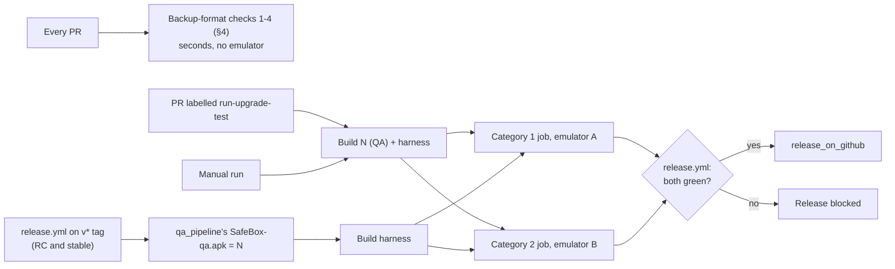
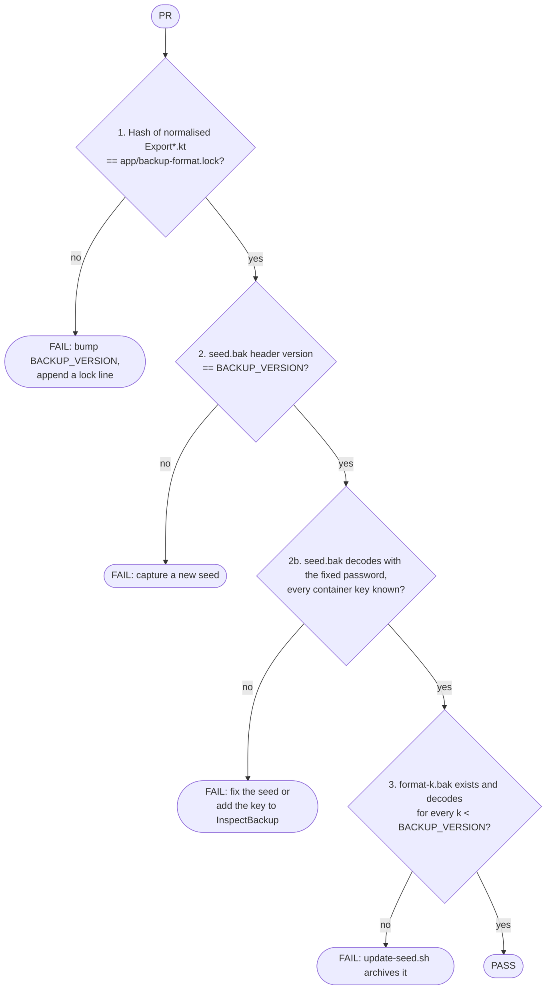
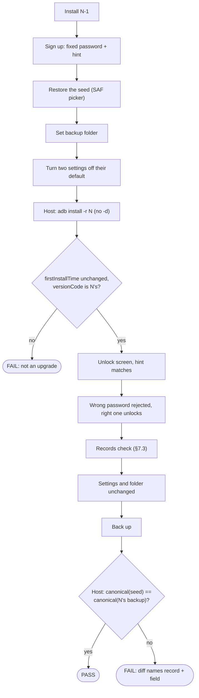
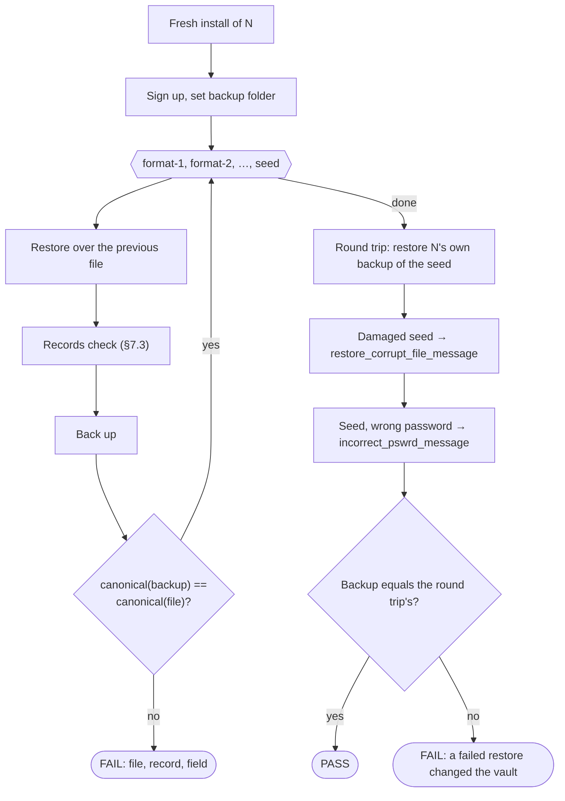

# Upgrade and restore testing

What the black-box upgrade and restore tests prove, how, and why they are shaped this way. How to
run, extend and debug them is in [upgrade-harness-operations.md](upgrade-harness-operations.md);
the decisions and everything ruled out, with evidence, are in
[ADR-0004](../decisions/0004-verify-upgrade-and-restore-by-decoded-backup.md).

## 1. What is tested

Everything runs **black-box on the minified QA APK** (`SafeBox-qa.apk`), driven by UI Automator from
the separate `:upgrade-test` module ([ADR-0002](../decisions/0002-upgrade-testing-via-black-box-uiautomator.md)),
because the thing tested must be the build that ships. An app `androidTest` runs unminified, so an
R8 breakage in restore would pass there ([ADR-0001](../decisions/0001-instrumentation-tests-run-on-debug-only.md)).

| Category | Proves |
|---|---|
| **1. Upgrade** | A user on the previous release (N-1) installs N over it. N reads **everything** N-1 stored, opens on the unlock screen with the same hint, rejects a wrong password, unlocks, and settings and the backup folder survive. |
| **2. Restore** | Every backup file a user could hold, from **any format ever released**, restores completely into N and replaces what was there. N's own backup restores into N. A damaged file and a wrong password fail with the right message and leave the vault untouched. |

| Not tested here | Covered by |
|---|---|
| Adding and editing records through forms | App UI tests and unit tests |
| Upgrades that skip releases (N-3 → N) | `MigrationTest`: every step plus the full chain |
| How a record type looks (2FA code, card formatting) | App UI tests |
| Restore of odd authenticator data (invalid seed, algorithm) | `RestoreDataWorkerTest` |
| Round trip, wrong password, corrupt file on debug builds | `BackupAndRestoreWorkersTest` |
| Downgrades | Android refuses them; the runner's `versionCode` check fails first |
| Clipboard clearing | `ClipboardClearWorkerTest`, `RecordActionsE2ETest` |

## 2. The idea in one paragraph

The expected data is **a backup file**, and the verdict is **another backup file**. A test restores
a committed `.bak` into the app, drives the screens a user would, takes a backup on N, and the host
decodes both files with [`scripts/InspectBackup.java`](../../scripts/InspectBackup.java) and diffs
them. That compares every field of every record, including values no screen shows, with no
hand-written expectations to maintain. The screen is used only for what a user experiences: the
list shows every record, each type opens, search finds it.

## 3. When it runs

- [`upgrade-test.yml`](../../.github/workflows/upgrade-test.yml) is reusable (`workflow_call`,
  `workflow_dispatch`, `pull_request: labeled`). [`release.yml`](../../.github/workflows/release.yml)
  calls it from job `upgrade_test` after `qa_pipeline`, and `release_on_github` needs it. A failure
  in either category **blocks the release**; one re-run is allowed for a suspected flake.
- It is called, not triggered `on: release`: a release created with `GITHUB_TOKEN` never triggers
  other workflows.
- Tag runs test the **artifact being published**. PR and manual runs rebuild N with the local
  `versionCode` fallback (9999999) so the build always supersedes N-1.
- Label a PR `run-upgrade-test` when it touches the database, migrations, backup/restore,
  encryption or the export classes.

## 4. PR-time checks

[`scripts/tests/backup-format-test.sh`](../../scripts/tests/backup-format-test.sh) runs in `ci.yml`
on every PR, and in the pre-commit hook when a staged file touches the export classes,
`CommonConstants.kt`, `app/backup-format.lock`, `upgrade-test/seed/`, `upgrade-test/fixtures/` or
`InspectBackup.java`. It reports every failing check in one run.

- "Normalised" strips comments, blank lines, imports and whitespace, so rewording a comment never
  forces a bump. The lock is **append-only**; CI compares it with the PR's base.
- Adding a field to an export class therefore lands, in one PR, with: the `BACKUP_VERSION` bump, a
  lock line, a new seed captured on that PR's build, and the outgoing seed archived as
  `format-<k>.bak` by [`scripts/update-seed.sh`](../../scripts/update-seed.sh). A new record type
  also needs its key in `InspectBackup`'s `DATA_KEYS`.
- **Required status check:** these checks only protect `master` if the `ci.yml` quality job is
  required on it. Otherwise a format change without a seed surfaces at the next RC, where the
  release gate blocks it.

## 5. Category 1: upgrade

[`scripts/run-upgrade-test.sh`](../../scripts/run-upgrade-test.sh) `<N-1 apk> <N-1 seed> <N apk>`.

**N-1** is the newest **stable** release older than the tag under test that carries a
`SafeBox-qa.apk` ([`scripts/lib/previous-release.sh`](../../scripts/lib/previous-release.sh)).
Prereleases are never N-1: Play serves only stable builds. Its **seed** is
`git show <N-1 tag>:upgrade-test/seed/seed.bak`, so the git tag is the mapping. Releases cut before
the seed existed have a fallback row naming the fixture in their format (today only
`v2.0.4.0 → format-2.bak`).

| Tag under test | N-1 | Seed |
|---|---|---|
| `v2.2.6.0-rc1`, `-rc2` | `v2.1.6.0` | `seed.bak` as of `v2.1.6.0` |
| `v2.2.6.0` | `v2.1.6.0` (the tag itself is excluded) | same |
| untagged (PR, manual) | newest stable release | its seed |

N-1 gets data **only by restoring**, never by typing into forms: forms belong to app tests, and
typing was the slowest and most fragile step. N-1 screens touched: sign-up, restore, backup folder,
settings.

## 6. Category 2: restore

[`scripts/run-restore-test.sh`](../../scripts/run-restore-test.sh) `<N apk>`. Runs in parallel with
category 1; it needs no N-1.

- One install, **each file restored over the previous one**: restore must replace everything, so
  leftovers show up in the comparison.
- The first restore uses the empty screen's **Restore data**; the rest the **Backup & Restore** tab.
  Both entry points are covered.
- The records check runs after **every** file: older formats leave fields empty that newer ones
  fill, and a screen crashing on such a record would pass the backup comparison.
- The round trip proves N's writer and reader agree; the seed alone does not (older build).
- The damaged file is generated at run time (the seed cut to 2 KB), so it is always the current
  format.

### 6.1 Per-format comparison rules

None: `format-1.bak`, `format-2.bak` and the seed all round-trip field for field (three green
runs, 2026-09-26). Anything a later run finds must be narrow (one field, one format), unit-tested in
[`InspectBackupTest`](../../scripts/tests/InspectBackupTest.java) and listed in the
[fixtures README](../../upgrade-test/fixtures/README.md). No blanket ignores. The header (format
version, format 1's creation byte) is never compared, only records.

## 7. Shared components

### 7.1 Committed backups

| File | What |
|---|---|
| [`upgrade-test/seed/seed.bak`](../../upgrade-test/seed/README.md) | The current format, hand-captured. **Fixed path forever**: older tags are read through it. |
| [`upgrade-test/fixtures/format-<k>.bak`](../../upgrade-test/fixtures/README.md) | One frozen file per older format. Never regenerated. |
| [`app/backup-format.lock`](../../app/backup-format.lock) | `<version>=<hash of the export classes>`, append-only |

**One password everywhere:** `Upgrade@@Test123`, for every sign-up and every capture; it satisfies
every release's password rules, including v1's. Exception: `format-2.bak` keeps `Fixture@Backup1`,
because re-encrypting it would need either script-made bytes or a round trip through an old app
that may normalise its `""`/`null` mix.

### 7.2 Why decode instead of comparing bytes

Two backups of identical data never share bytes: a fresh random **salt and IV** per backup, the
**creation time** in the header, and a newer N may change the layout legitimately. `InspectBackup`
mirrors the app's restore (PBKDF2WithHmacSHA1, 1324 iterations, AES/CBC) **on purpose**: using the
app's own decryption would let a bug cancel out on both sides. It fails on any container key it does
not know, so a new record type cannot be skipped silently.

`--canonical` prints one sorted line per field; record identity is type + title + creation date, so
duplicate titles still line up. Two normalisations are unit-tested: an absent type key equals a
present empty one, and a field only one side has must be empty there. `--rows` prints the
`TYPE<tab>title` pairs the records check expects on screen.

### 7.3 Test tags and the records check (N only)

Tags go **only where a visible label cannot identify the element**
([`TestTags.kt`](../../app/src/main/java/com/andryoga/safebox/ui/core/TestTags.kt)); everything with
its own text or content description is matched by resource-name label
([ADR-0003](../decisions/0003-ui-labels-from-resource-names.md)). A tag is warranted for:

1. **structure** read as a unit (a row's title and type);
2. **scroll containers**;
3. **controls whose label is ambiguous or missing** (same text as a heading; no text at all).

| Screen | Tags | Rule |
|---|---|---|
| Records | `records_list` | 2 |
| Records | `record_row`, `record_row_title`, `record_row_type` | 1 |
| Backup & Restore | `backup_button`, `restore_button` (labels equal the section headings) | 3 |
| Settings | the four switch and slider tags | 3 (used once N-1 has them, §9) |

- Tags buy **robustness, not speed**: `By.res` and `By.text` cost the same tree query.
- Text fields stay untagged: the label lookup already works for every field typed into, and N-1
  needs that path anyway.
- **N-1 cannot use tags** until a release containing them becomes N-1. Each step has exactly one
  lookup; there are no "tag, else label" fallbacks, so a missing tag fails instead of silently
  falling back.
- `testTagsAsResourceId` is enabled for debug and qa only (`MainActivity`).

[`RecordsCheck`](../../upgrade-test/src/main/java/com/andryoga/safebox/upgradetest/RecordsCheck.kt)
walks `records_list` reading `(type, title)` from each `record_row` until the visible rows stop
changing, and requires the set to equal `--rows` of the restored file. It then opens one record per
type **via search**, never by scrolling, and waits for the detail screen's edit button.

## 8. Run time

The app's own work is negligible (`RestoreDataWorker` 0.2–0.3 s, `BackupDataWorker` 0.4 s, CI run
36127205711). The time is UI Automator's, which is why the design avoids typing records, scrolling
to each record and dumping the screen per swipe. There are no fixed sleeps: 250 ms polls, with
timeouts as caps. Further levers (UI Automator's idle wait, fewer `am instrument` calls) are adopted
only when the per-phase timings each runner prints show a gain.

Measured locally on an API 35 arm64 emulator, three consecutive green runs each, 2026-09-26:

| Runner | Total | Per phase |
|---|---|---|
| `run-restore-test.sh` | 151–152 s | setup 8 s; each restore with screen checks 25–30 s; refusals 13 s |
| `run-upgrade-test.sh` (v2.0.4.0 → N) | 39–43 s | prepare on N-1 12 s; verify on N 23 s |

## 9. Risks, limits and follow-ups

| Risk | Handling |
|---|---|
| N-1's restore changes a value, so the diff fails without an upgrade bug | Unlikely (the seed was captured on N-1-era code). If it happens: also back up on N-1 and compare against that |
| File assembly changes (`BackupDataWorker`, crypto constants) do not change the export hash | Accepted: rare and obvious in review |
| A release without `SafeBox-qa.apk` silently moves N-1 back | The release process attaches it to every release |
| Only restored records exist before the upgrade | Accepted: records typed on N-1 would test forms, not the upgrade |
| SAF picker automation is flaky | Isolated in `SafDocumentPicker`; failures there are named as picker failures |
| CI runs API 34, local runs API 35 | Deliberate; a local pass does not imply a CI pass |

Triggered follow-ups, not merge-blocking, each removing code that exists only because N-1 predates
this design:

| What | Trigger | Done when |
|---|---|---|
| `v2.0.4.0 → format-2.bak` fallback row | A stable release containing `upgrade-test/seed/` becomes N-1 | The fallback `case` is gone; the test covers only `git show` |
| Settings matched by geometry (`UiSupport.switchBeside`) | A stable release containing the settings tags becomes N-1 | `SettingsChanger` uses `By.res(tag)`; `switchBeside` deleted; ADR-0003 updated |
