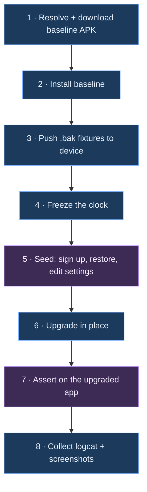

# APK-over-APK upgrade testing — design

Install a previously shipped QA APK, put real data in it, upgrade in place to the build under
test, and verify nothing was lost or corrupted.

---

## 1. Why this test exists

Field encryption uses an `AndroidKeyStore` AES-GCM key under alias `symmetricDataKey`
([SecurityModule.kt:50-74](../../app/src/main/java/com/andryoga/safebox/di/SecurityModule.kt#L50-L74)):

```kotlin
if (!keyStore.containsAlias(alias)) {
    keyGenerator.generateKey()
}
```

If that alias is ever lost across an upgrade, the app **silently generates a fresh key**. Nothing
throws at that point. Every record becomes permanently undecryptable, and the first decrypt crashes
the app with `AEADBadTagException` — which, because the hint shares the key, is the unlock screen's
Show Hint (observed by MR4's wipe proof, 2026-09-24).

The key does not live in `/data/data`, so it is invisible to every test you currently have.

| Layer | Room migration test | Golden `.bak` test | This test |
|---|---|---|---|
| Room schema + data | yes | no | yes |
| `EncryptedSharedPreferences` | no | no | yes |
| DataStore | no | no | yes |
| WorkManager internal DB | no | no | yes |
| **Keystore alias continuity** | **no** | **no** | **yes** |

---

## 2. Verified ground truth

All checked on 2026-09-20/21 against the real artifacts, not assumed.

| Constraint | Status | How it was verified |
|---|---|---|
| Old QA APKs are archived | **already done** | `release.yml` attaches `SafeBox-qa.apk` to every tag. 15 of 18 releases carry one, back to `v1.3.3.0` |
| Signing certificate is stable | yes | `v2.0.4.0`, `v2.1.4.0-rc3` and a local build all report SHA-256 `257ab204…7b113d` |
| Same `applicationId` | yes | `com.andryoga.safebox.qa` on all |
| `versionCode` is monotonic | yes | 23 → 28 → 9999999 (local) |
| Black-box automation works on the minified APK | yes | `uiautomator dump` returned `Welcome !`, `Password*`, `Sign Up`, `content-desc="Toggle sensitive data visibility"` |
| No app change needed for selectors | yes | production has zero `testTag`; the existing suite already uses text and content description exclusively |
| Runs without Google Play services | yes | ML Kit is the **bundled** `com.google.mlkit:barcode-scanning`, so a plain AOSP `default` image suffices. Not `aosp-atd`, though: ATD strips DocumentsUI, and Phase A restores through the real SAF picker — see run [35863723921](https://github.com/Ni3verma/Safe-Box/actions/runs/35863723921) |

### Hard constraints

Three build types mean three `applicationId`s (`.debug`, `.qa`, none), and Android refuses to
upgrade one into another. A Play Store install also cannot be upgraded by a local build, because
Play re-signs with its own key.

**`qa → qa` is the only vehicle available.** That variant is release-like — `initWith(release)`,
R8 on, resource shrinking on — but it is not byte-identical to the production APK. Close, not same.

---

## 3. Architecture



| | Steps | Runs where |
|---|---|---|
| **Host harness** (bash on the CI runner) | 1, 2, 3, 4, 6, 8 | the runner, over `adb` |
| **On-device driver** (UI Automator) | 5, 7 | inside an instrumentation process on the device |

### Why the work has to be split

Step 6 is `adb install -r`, and it happens **between** two on-device runs. A single
`connectedAndroidTest` invocation cannot upgrade the app underneath itself. So the host owns the
lifecycle and invokes the device driver twice, with a different `-e phase` argument each time.

This is also why Gradle Managed Devices cannot run this job: GMD owns its emulator lifecycle inside
one Gradle task, with no way to interleave an `adb install` in the middle.

### Why a separate Gradle module is required

You asked why this needs a module at all. Two reasons, and the first is not negotiable.

**1. UI Automator only runs on the device.** There is no host-side driver — it is an Android
library (`androidx.test.uiautomator`) that talks to the device's accessibility layer from inside an
instrumentation process. Running it therefore requires an **instrumentation APK**, and the only way
to produce one is a Gradle module. A shell script alone can do `adb shell input tap 540 1200`, but
coordinate-tapping is unmaintainable and cannot read text back to assert on it.

**2. It must not be `:app`'s `androidTest`.** That source set is already bound to
`CustomHiltTestRunner`, pulls in the Hilt test Application, and gets minified alongside the app —
which is exactly what makes it unable to run against a minified build
([ADR-0001](../decisions/0001-instrumentation-tests-run-on-debug-only.md)).

So: a new `com.android.test` module, **self-instrumenting**, with no compile dependency on `:app`.

```groovy
// upgrade-test/build.gradle — as shipped
plugins { alias(libs.plugins.android.test) }

android {
    namespace 'com.andryoga.safebox.upgradetest'
    targetProjectPath = ':app'
    experimentalProperties["android.experimental.self-instrumenting"] = true
    defaultConfig {
        testInstrumentationRunner 'androidx.test.runner.AndroidJUnitRunner'
    }
    kotlin { jvmToolchain(17) }
}

dependencies {
    implementation libs.androidx.test.uiautomator
    implementation libs.androidx.test.ext.junit
    implementation libs.androidx.test.runner
}
```

No Kotlin plugin is applied: AGP 9 has built-in Kotlin support and `:app` applies none either.
Note also that `alias(...)` only resolves if the root `build.gradle` declares the same plugin
`apply false` — otherwise Gradle reports "already on the classpath with an unknown version".

`self-instrumenting` — the same mechanism Macrobenchmark uses — makes the test process target
*itself* rather than the app. Three consequences:

1. No signature match required between test APK and app APK, so this harness can later be pointed
   at a **Play-Store-signed** build.
2. Upgrading the app mid-run does not kill the test process.
3. Zero compile coupling to `:app`, so R8 can never break it.

Build-time cost of the extra module is small: it compiles a handful of Kotlin files and links no
app code.

---

## 4. Golden backup fixtures

The format, for context: a Java-serialized `HashMap<String, ByteArray>` with numeric keys,
payloads PBE-encrypted under a **backup password supplied at export time** (independent of the
vault master password). `BACKUP_VERSION` is currently 3. Full detail in
[persistence-and-crypto.md](../architecture/persistence-and-crypto.md).

**Where they get committed:** `upgrade-test/src/main/assets/fixtures/`. They are a few hundred KB
each, binary, and never edited after creation, so plain git is fine — no LFS needed.

| Fixture | Produced by | Guards |
|---|---|---|
| `v1_legacy.bak` | `v1.3.3.0` QA APK (oldest with an archived APK) | the 1-byte `creationDate` legacy path; a backup with no authenticator key at all |
| `v2_pre_totp.bak` | **`v2.1.4.0-rc3` — captured 2026-09-21** | the format the entire current user base has on disk |
| `v3_current.bak` | this branch | the new format including authenticators |
| `v3_adversarial.bak` | this branch, hand-seeded | emoji + RTL + 4000-char fields, all-optionals-empty record, max-length card number, a `SHA512`/8-digit/60s authenticator, an authenticator with an **invalid Base32 seed**, duplicate titles |
| `corrupt.bak` | `head -c 2048 v3_current.bak` | the `CORRUPT_OR_INVALID_FILE` path, and that a failed restore leaves the vault intact |

All use one fixed backup password committed in the harness. Synthetic data only — never a real
vault.

Only `v2_pre_totp.bak` exists today. Each of the others is captured by the stage that first asserts
on it — `v1_legacy`, `v3_current` and `v3_adversarial` in MR5, `corrupt` in MR6 — rather than up
front; see [MR2](#mr2--seeding) for why.

> [!NOTE]
> `v1_legacy.bak` survives the baseline floor being raised to `v2.0.4.0`, and the distinction is
> worth keeping straight: the floor says *we no longer test upgrading from a v1 install*, not *we no
> longer accept v1 backup files*. A `.bak` outlives the install that produced it — a user who
> exported one in 2021 and has upgraded several times since can still restore it today — so the
> file format stays in scope even though the install path does not. Capturing it needs the
> `v1.3.3.0` APK driven by hand, which is fine for a one-off; it is only *automated* seeding that
> the pre-Compose UI rules out.

> [!CAUTION]
> `v2_pre_totp.bak` is the only irreversible item in this whole design, and it now **exists**:
> `BACKUP_VERSION = 2`, 2 login / 2 bank account / 2 bank card / 1 secure note, no authenticator
> key. Once TOTP ships, this format can no longer be produced, so the risk has moved from failing
> to capture it to losing it. Never regenerate it, never "clean up" its contents, and verify with
> `scripts/InspectBackup.java` rather than by opening it.

---

## 5. Scenarios

### Phase A — establish state on the baseline app

| # | Step | Why |
|---|---|---|
| A1 | install baseline APK, launch | |
| A2 | sign up with master password + hint | creates the password hash **and generates the `symmetricDataKey` alias** |
| A3 | restore a golden `.bak` through the real SAF picker | seeds every record type in one interaction instead of ~50 taps |
| A4 | create one extra record **of each type through the UI** | restore writes via the worker, the UI writes via the repository — two different encryption call sites |
| A5 | set the backup directory and move 2–3 settings off their defaults | a prefs/DataStore migration bug is invisible if every value is still the default |
| ~~A6~~ | ~~copy a password to the clipboard~~ | **Dropped 2026-09-23.** `ClipboardClearWorker` does not exist in the `v2.0.4.0` baseline, so Phase A cannot enqueue it. WorkManager's DB is non-empty anyway: A3's restore runs through `RestoreDataWorker`. |
| A7 | capture the oracle: per-type counts and every field of one record per type, read back through the UI | nothing time-varying may enter it, so no timestamps and no TOTP code — those are read where they can be checked, after the upgrade |
| A8 | `adb shell am force-stop` | **never** `pm clear`, **never** `uninstall` |

### Phase B — the upgrade

```bash
adb install -r new.apk     # correct: preserves /data
adb uninstall old          # wrong: this is a fresh-install test in disguise
adb install -r -d new.apk  # wrong: -d permits downgrade and hides a versionCode mistake
```

The harness asserts `newVersionCode > oldVersionCode` **before** installing, and afterwards checks
via `dumpsys package` that `firstInstallTime` is unchanged while `versionCode` changed. That single
check is what stops this decaying into a fresh-install test a year from now.

### Phase C — assertions on the upgraded app

**Group 1 — the app is usable at all**
1. Cold launch does not crash; zero `FATAL EXCEPTION` in logcat since install.
2. Lands on the **unlock** screen, not signup. Catches wiped preferences.
3. The password hint shown matches what was set pre-upgrade. The hint is stored in Room's
   `user_details`, encrypted with `symmetricDataKey`, so this is also the *earliest* Keystore
   check: a lost key crashes the unlock screen's Show Hint with `AEADBadTagException` (observed by
   MR4's wipe proof). It was once thought to live in `EncryptedSharedPreferences`; it does not.

**Group 2 — authentication continuity**
4. The original master password unlocks.
5. A wrong password still fails with the normal error — guards the catastrophic inverse, a hash
   change that makes every password succeed.

**Group 3 — data integrity (the Keystore check, highest value here)**
6. Record count matches exactly, per type, across all five types.
7. Open one known record **of every type** and compare **every field** character-for-character
   against the Phase A oracle. A regenerated key shows up here as mojibake or a decrypt throw.
8. Include one long unicode field and one empty optional field — GCM tag and padding edges.
   *Asserted in MR5 against `v3_adversarial.bak`, not against the Phase A seed, which is
   deliberately ASCII and fully populated so that it stays byte-reproducible.*
9. Search a known title and assert the record is found — a different query path from the detail
   screen.

**Group 4 — the migration ran, and ran non-destructively**
10. The add-record sheet offers **Authenticator**, proving `MIGRATION_4_5` created the table and
    Room did not fall back destructively.
11. Add a new authenticator post-upgrade and save it — writes into the freshly migrated table.
12. Re-assert Group 3 counts afterwards.

**Group 5 — TOTP across the boundary**
13. For an authenticator restored from the fixture, assert the six displayed digits equal an
    RFC 6238 value computed **inside the test** with a local Base32 + HMAC-SHA1 helper. Never call
    app code for the expected value.
14. Determinism: `adb root` works on the `default` image (userdebug), so `settings put global auto_time 0`
    then set a fixed instant. Without root, assert against the current **and** previous 30-second
    window.
15. This is the only assertion that proves the **seed itself decrypted correctly**, rather than
    that a row exists.

**Group 6 — the escape hatch still works**
16. Take a fresh backup on the upgraded app; assert a `.bak` appears with a plausible size.
17. `pm clear`, sign up again, restore that new `.bak`.
18. Assert the same counts and field values as step 7. Catches "the upgrade worked but the export
    it now produces is broken", which would quietly destroy the user's only recovery path.

**Group 7 — backward-compat matrix** (same fixtures, separate job)
19. On a **fresh** install of the new app, restore each fixture and assert counts and spot-checked
    fields.
20. For `v3_adversarial.bak`, assert the invalid-Base32 authenticator is **absent** while every
    other record is present — the `filterDecodableAuthenticatorData` contract.

**Group 8 — graceful failure**
21. Restore `corrupt.bak`: expect the `CORRUPT_OR_INVALID_FILE` message, no crash, and the existing
    vault untouched.
22. Restore a valid fixture with the wrong password: expect `INCORRECT_PASSWORD`, vault untouched.

**Group 9 — crash sentinel (global gate)**
23. The job fails if logcat contains any `FATAL EXCEPTION` or `ANR in com.andryoga.safebox.qa`
    between install and teardown.

**Group 10 — downgrade guard**
24. `adb install -r old.apk` after the upgrade must fail. Catches an accidentally lowered
    `versionCode` before Play does.

---

## 6. Assertion mechanics

**Reading a field value.** Compose text surfaces to UI Automator as `text` on a leaf node. Scope to
the field's container and read it:

```kotlin
private fun UiDevice.fieldValue(label: String): String {
    val labelNode = wait(Until.findObject(By.text(label)), TIMEOUT)
        ?: error("field label '$label' not found. Screen:\n${dumpWindowHierarchy()}")
    return labelNode.parent.findObject(By.clazz("android.widget.EditText")).text
}
```

**Masked fields.** Passwords, card numbers and TOTP seeds render as bullets. Tap
`content-desc="Toggle sensitive data visibility"` first — it already exists in the shipped APK.

**Driving the SAF picker** is the flakiest interaction in the design, so isolate it behind one
helper with generous retries. Fixtures must be pushed *and* announced to the media store, or
DocumentsUI may not list them:

```bash
adb push v3_current.bak /sdcard/Download/
adb shell content call --uri content://media/external/file --method scan_volume --arg external
```

The restore picker filters on `application/octet-stream`, `application/x-trash` and
`application/x-binary`
([BackupAndRestoreScreen.kt:188-192](../../app/src/main/java/com/andryoga/safebox/ui/home/backupAndRestore/BackupAndRestoreScreen.kt#L188-L192)),
so a `.bak` in Downloads is selectable.

**Every failure must be self-describing.** Wrap all lookups so a miss dumps the window hierarchy
and the last 200 logcat lines. A CI failure reading `NullPointerException at line 47`, on an
emulator you cannot attach to, is worthless.

---

## 7. Choosing baseline versions — derived, not hardcoded

You objected to hardcoded tags in the matrix. You were right; here is the replacement.

The tag convention is `vMAJOR.MINOR.DBVERSION.FIX`, where the third component **is the Room schema
version**. That makes almost everything derivable from the release list alone. A script
(`scripts/resolve-baselines.sh`) emits the matrix at run time using three rules:

| Rule | Meaning | Resolves to today |
|---|---|---|
| `previous` | newest stable release before the tag being built, that has a `SafeBox-qa.apk` | `v2.0.4.0` |
| `schema-boundary` | for each distinct `DBVERSION` older than the current one, the newest stable release carrying it | `v2.0.4.0` (db 4; this branch is on db 5) |
| `oldest` | the oldest release that still has an archived `SafeBox-qa.apk`, at or above the floor | `v2.0.4.0` |

After de-duplication that is **one to three jobs**, and it self-adjusts as you ship — no workflow
edits, ever.

Defaults and why:

- **Stable releases only** by default. Users install from Play, which only serves stable builds, so
  an RC baseline tests a state no real user is in. Override with a flag when an RC is the only
  thing carrying a schema.
- **Not every historical pair.** That is `O(n²)` and buys nothing; a v1.5 → v2.2 upgrade exercises
  the same migration chain as v1.4 → v2.2.
- **One human-maintained value:** the floor in
  [`upgrade-test/oldest-supported.txt`](../../upgrade-test/oldest-supported.txt). "How far back do
  we support" is a product decision and is the only thing a script cannot infer.

Of the 18 releases, 15 carry a QA APK — the three that do not (`v1.0.0`, `v1.1.0`, `v1.2.2.0`)
predate the upload step.

### The floor is `v2.0.4.0` — decided 2026-09-23

Two independent reasons, which happen to agree:

1. **Nobody meaningful is still on 1.x**, so upgrades from there are not a path worth protecting.
2. **The harness could not drive them anyway.** Phase A seeds the vault through the UI, and the
   Compose rewrite landed in `331ee64` *"Compose UI - v2.x (#135)"*. Every `v1.x` tag ships eight
   XML layouts and zero `*Screen.kt`; every selector in the harness is a Compose one. Verified with
   `git ls-tree -r --name-only <tag> -- app/src/main/res/layout`.

Supporting a lower floor is therefore not a configuration change but a second Phase A implementation
against a UI that no longer exists in the tree. If that is ever wanted, it needs its own decision.

This currently leaves **one** candidate, so all three rules resolve to it and the matrix is a single
job. That is expected, and self-correcting: when v2.1 ships, `previous` moves to it and `v2.0.4.0`
becomes `oldest` and the schema-4 boundary again. A floor naming a tag that carries no QA APK is
rejected outright rather than ignored, because a silently-ignored floor would resume testing exactly
the upgrades it was written to stop.

---

## 8. CI wiring

```yaml
  upgrade_test:
    needs: [ qa_pipeline ]
    if: contains(github.ref_name, 'rc')
    runs-on: ubuntu-latest
    strategy:
      fail-fast: false
      matrix: ${{ fromJson(needs.resolve_baselines.outputs.matrix) }}
    steps:
      - uses: actions/checkout@v7

      - name: Download the QA APK built in this run
        uses: actions/download-artifact@v8
        with: { name: QA APK, path: new-apk/ }

      - name: Download the baseline QA APK
        env: { GH_TOKEN: '${{ github.token }}' }
        run: ./scripts/fetch-baseline-apk.sh '${{ matrix.from_tag }}' old-apk/

      - name: Enable KVM
        run: |
          echo 'KERNEL=="kvm", GROUP="kvm", MODE="0666", OPTIONS+="static_node=kvm"' | sudo tee /etc/udev/rules.d/99-kvm4all.rules
          sudo udevadm control --reload-rules && sudo udevadm trigger --name-match=kvm

      - uses: reactivecircus/android-emulator-runner@v2
        with:
          api-level: 34
          target: default
          arch: x86_64
          profile: pixel_6
          script: ./scripts/run-upgrade-test.sh old-apk/SafeBox-qa.apk new-apk/SafeBox-qa.apk

      - uses: actions/upload-artifact@v7
        if: always()
        with:
          name: upgrade-test-${{ matrix.from_tag }}
          path: upgrade-test-out/
```

`resolve_baselines` is a tiny preceding job that runs the script from section 7 and emits the
matrix as an output.

### Is `reactivecircus/android-emulator-runner` free?

Yes, twice over:

- The action itself is **Apache-2.0 open source** (1.3k stars, actively maintained). No licence
  cost, no account.
- `Ni3verma/Safe-Box` is a **public** repository, and GitHub-hosted standard runners are free with
  no minute cap for public repos.

The only real cost is wall-clock time. You already depend on the same underlying capability —
`nightly.yml` and `release.yml` both run emulators and already contain the KVM-enabling step — so
nothing new is being introduced infrastructurally.

Expect roughly 8–10 minutes per baseline, running in parallel, so about 10 minutes added to an RC
tag build.

### Running the harness

Commands, how to add a phase, selector rules and harness-level triage are in
[upgrade-harness-operations.md](upgrade-harness-operations.md). The short version:
`.github/workflows/upgrade-test.yml` never runs on its own — it is dispatched with a rule or an
explicit tag, or triggered by the `run-upgrade-test` label on a pull request, which is the only
entry point available before the file reaches `master`. Gradle only ever *assembles* the harness —
the upgrade happens between the two on-device phases, so no single Gradle task can straddle it.

### The zero-test guard

`am instrument` exits 0 when the class filter matches nothing. Verified on a real device
2026-09-22, a method name with a typo produces exactly this and nothing else:

```
INSTRUMENTATION_RESULT: stream=

Time: 0.001

OK (0 tests)

INSTRUMENTATION_CODE: -1
```

An empty run is therefore indistinguishable from a passing one to anything that reads the exit
code, which is what made the previous attempt at this harness worthless. Every phase's output is
parsed by `assert_instrumentation_ran` in `scripts/lib/instrumentation-guard.sh`, which fails
unless a minimum number of tests actually executed and passed. That function has its own
device-free test suite, `scripts/tests/instrumentation-guard-test.sh`, run on every PR by `ci.yml`
— the guard rotting silently would restore the exact problem it was written to prevent.

The same reasoning applies to every other check in the harness. A comparison between two values
that were both read as empty strings passes and proves nothing, so `firstInstallTime` is asserted
non-empty before it is compared. Treat "this check cannot fail" as a bug of the same severity as
"this check is wrong".

---

## 9. Failure triage

| Symptom | Almost certainly |
|---|---|
| Lands on **signup** instead of unlock | preferences not preserved — check nothing uninstalled |
| Correct password rejected | password hash storage or hashing changed |
| Records present but fields are mojibake, or decrypt throws | **`symmetricDataKey` regenerated — stop the release** |
| Phase C fails reading the hint (`Hide Hint` never appears) *and* `crash-scan-verify.txt` shows `AEADBadTagException` | **the same — this is exactly what MR4's wipe proof produced** |
| Counts are 0 but the app works | destructive Room migration |
| Authenticator missing from the add sheet | `MIGRATION_4_5` did not run |
| TOTP digits wrong, everything else right | check the clock was frozen before suspecting the seed |
| Post-upgrade backup cannot be restored | export regression — the user's recovery path is broken |

---

## 10. Delivery plan, MR by MR

Each MR is independently reviewable and leaves the repository in a working state.

### MR0 — capture the irreversible fixture (no code)

Install `v2.1.4.0-rc3`, create a representative vault, export a backup, commit it as
`v2_pre_totp.bak` along with a short runbook describing exactly what it contains.

- **Must land before the TOTP feature merges.**
- Review size: a binary fixture plus ~40 lines of markdown.
- Acceptance: the `.bak` restores cleanly on `v2.1.4.0-rc3` and the runbook lists every record.

### MR1 — harness skeleton, end to end, no assertions — **delivered**

`upgrade-test` module, `scripts/resolve-baselines.sh`, `scripts/fetch-baseline-apk.sh`,
`scripts/run-upgrade-test.sh`, plus a CI job that only ever runs manually. One smoke test: sign up
on the baseline, upgrade, assert the unlock screen appears.

- Proved the hard part — install, seed, upgrade, re-run — before any assertion logic exists.
- Acceptance met locally against `v2.0.4.0` on API 35: three consecutive green runs, each with
  `firstInstallTime` unchanged across the upgrade, and a run fails loudly if zero tests executed.
  Getting there took a fourth run: the first stability attempt was 2 green of 3, and the failure was
  a real device-specific flake in the launch recovery, not noise —
  [Launching the app](upgrade-harness-operations.md#launching-the-app) records it.
- **Green on CI's API 34 `aosp_atd` image** — the target at the time; MR2 had to move off it
  because ATD ships no DocumentsUI — run
  [35818905257](https://github.com/Ni3verma/Safe-Box/actions/runs/35818905257) against the final
  commit: `Baseline: v2.0.4.0` resolved by the script rather than typed in, baseline `versionCode`
  23 upgraded to 9999999, `firstInstallTime` `04:38:49` identical before and after, both phases
  reporting `OK (1 test)` through the guard. The earlier green run
  [35727125638](https://github.com/Ni3verma/Safe-Box/actions/runs/35727125638) is superseded: it
  predates the review fixes to `resolve-baselines.sh`, which the job calls on its critical path, so
  it no longer evidences the code that merged. Getting the first green took three CI runs and
  neither failure was in the harness: both were the build under test carrying a `versionCode`
  *below* the released baseline, because `GITHUB_RUN_NUMBER` counts runs of one workflow and
  `env:` cannot override it. Recorded in the release-and-ci skill.

Three things settled during implementation that later MRs inherit rather than re-decide:

| Decision | Why |
|---|---|
| The smoke test **signs up on the baseline** | A fresh install lands on signup, so "assert the unlock screen appears" is vacuous without it — and signup is what generates the `symmetricDataKey` alias in the first place. |
| Failures carry a **window hierarchy dump**, not a screenshot | Step 8 of section 3 says screenshots. A hierarchy is greppable, diffable, and names the nodes a selector failed to match; a PNG from a headless CI emulator is not. Screenshots can be added later if a visual bug ever escapes. |
| Launch waits on the **expected screen**, never on the app owning the foreground window, and re-issues the launch intent on each retry | A system biometric sheet takes the foreground on any device with a fingerprint enrolled, and the back press that dismisses it can also send the task home. See [upgrade-harness-operations.md](upgrade-harness-operations.md#launching-the-app). |

Deliberately **not** in MR1, despite being cheap: fixture pushing and the SAF picker (MR2) and the
logcat crash sentinel (MR4, Group 9). MR1 also leaves two things behind that a later stage has to
remove rather than merely add to — both are rows in [Carried-forward debt](#carried-forward-debt),
which is the list to check when planning any later MR.

### MR2 — seeding

The SAF picker helper and full Phase A automation, plus the oracle that makes Phase A's result
checkable. Seeding infrastructure only.

**Fixture capture is deliberately not here**, despite the stage's original name. Phase A restores
exactly one fixture and it has to be one the *baseline* can read, which means `v2_pre_totp.bak`
(`BACKUP_VERSION = 2`) — already captured in MR0. Every other fixture in section 4 moves to the
stage whose assertions consume it, because capturing a fixture before the test that reads it is
written means guessing at its contents and re-capturing later:

| Fixture | Moved to | Why it cannot be done usefully now |
|---|---|---|
| `v1_legacy.bak` | MR5 | Needs the `v1.3.3.0` QA APK installed and seeded; it exists to exercise the migration path MR5 asserts on. |
| `v3_current.bak` | MR5 | `BACKUP_VERSION 3`, so the baseline cannot restore it at all. Its required contents are defined by MR5's TOTP and round-trip assertions. |
| `v3_adversarial.bak` | MR5 | Hand-seeded through the UI (emoji, RTL, 4000-char fields, an invalid Base32 seed). Hours of manual work for assertions that do not exist yet. |
| `corrupt.bak` | MR6 | Literally `head -c 2048 v3_current.bak` — it cannot precede `v3_current`, and it is one command when MR6 needs it. |

- Acceptance: **ten consecutive Phase A runs produce a byte-identical oracle.** "Identical vault"
  is not directly observable through a black-box UI, so Phase A ends by writing an oracle file on
  the device — per-type record counts, every field of one known record per type, the backup
  location and the settings moved off their defaults — which the host pulls and diffs across runs.
  Not the password hint: reading it needs the app locked, which Phase A never did, so it was a
  debt row against MR4, which cleared it. Values
  that legitimately vary (the current TOTP code, timestamps) are excluded by construction rather
  than filtered afterwards, so a diff is always a real defect.
- Also in scope, found while starting the stage: the orchestrator resolves its target device once
  and refuses a non-emulator unless `UPGRADE_TEST_ALLOW_PHYSICAL=1`. Phase A is far more
  destructive than MR1's sign-up, and a developer with a handset attached is the normal case.

**Delivered so far** — A1–A5 and A7 are green end to end on the Pixel 8 API 35 emulator: sign up,
restore `v2_pre_totp.bak` through the real picker, create one record of each type through the forms,
assert all eleven rows are listed, grant a backup directory through the tree picker, turn two
settings off their defaults, then read the whole vault back and write the oracle. Five things were
settled by doing it:

| Settled | Consequence |
|---|---|
| Restore **replaces** the vault, it does not merge | The seed order is forced: restore first, then create records. Creating first would have them deleted. |
| UI Automator's `wait`/`Until` read a cached tree that survives app navigations | Every lookup in the harness flushes the accessibility cache per poll. This is not a preference; it is the difference between Phase A passing and hanging for 60 s on a screen that is not there. See [upgrade-harness-operations.md](upgrade-harness-operations.md#the-accessibility-cache-goes-stale-and-it-costs-a-day). |
| Android will not grant a document tree over shared storage's root or over `Download` | The backup location is a dedicated `/sdcard/SafeBoxUpgradeTest`, created and reset by the host each run. The refusal is silent from the test's side, so this is not discoverable from a failure message. |
| The baseline **silently discards** a card expiry longer than four characters | Phase A seeded `12/30` into a field with `maxLength = 4` and the whole value was rejected, so A4's "every field is filled" was false for a week and nothing said so. The oracle caught it because it reads fields back by name. Seeds now carry `1230`. |
| Reading the UI is geometry, and geometry needs a guard | The records list has no node per row, so titles are paired to type chips by position — a method that cannot tell a wrong answer from a right one. The pairing is therefore checked against what Phase A seeded, in both directions. See [upgrade-harness-operations.md](upgrade-harness-operations.md#reading-the-records-list). |

Both guards were proved by making them fail. The missing-directory case was proved by deleting the
host's `mkdir`: Phase A failed in 64 s naming the directory it could not find, rather than granting
something arbitrary. The oracle's "missing record" guard was proved by adding a title Phase A never
creates, which failed with `Missing: [NEGATIVE PROOF]`. Its "unexpected record" guard needed no
contrivance — it caught the list's type-filter row being read as a twelfth record, which is the
defect it exists to catch.

**A6 was removed from this stage, 2026-09-23.** It asked Phase A to copy a field to the clipboard so
`ClipboardClearWorker` would leave rows in WorkManager's database for the upgrade to carry across.
That worker does not exist in the baseline: `git ls-tree v2.0.4.0 -- app/src/main/java/com/andryoga/safebox/worker/`
lists only `BackupDataWorker`, `RestoreDataWorker` and `SafeBoxWorkerFactory`, and
`ClipboardClearWorker.kt` arrives with commit `1540952` (TOTP support, #241), well after the floor.
Phase A drives the baseline, so there was nothing to trigger. The property it was reaching for is
still covered: the restore Phase A already performs runs through `RestoreDataWorker`, so WorkManager's
database is populated before the upgrade either way. Clipboard-worker behaviour moves to a
post-upgrade stage, where the worker exists.

**Acceptance met locally, 2026-09-23.** Ten consecutive runs on the Pixel 8 API 35 emulator produced
a 43-line oracle with a single MD5 across all ten, `b20702ff15ea5e1dd8c44bcdc99c7717`, via
`scripts/check-oracle-determinism.sh`. A run takes about two minutes, of which 112 s is Phase A, so
the ten-run check is something to run when the seeding or the oracle changes — not something to add
to CI.

**Local green was not enough, and the first CI run proved it.** Phase A had never run on the CI
image until PR #261 was labelled, and run
[35863723921](https://github.com/Ni3verma/Safe-Box/actions/runs/35863723921) failed at the first
SAF call: `aosp_atd` ships no DocumentsUI, so `ACTION_OPEN_DOCUMENT` landed on
`com.android.fakesystemapp`. The same run also exposed a second latent problem — with no `profile`
pinned the emulator boots a `320x640` screen, against which every geometry assumption in the
harness was untested. Both are fixed in the workflow, and **a green labelled run is part of MR2's
acceptance**; the lesson is that "green locally" and "green on CI" are different claims for a
harness whose whole job is to drive system UI.

The second labelled run, [35875270225](https://github.com/Ni3verma/Safe-Box/actions/runs/35875270225),
got as far as the last of the four UI-created records and found a third defect of the same family:
`typeInto` set a field and returned, but the value only reaches the ViewModel one Compose
`onValueChange` later, and the form saves `_uiState.value` when Save is pressed. 168 ms was enough
locally and not enough on CI, so the Note record was written **empty** — the form closed like a
success and the run failed 20 s later looking for a row that never existed. `typeInto` now waits
for the field to read back non-empty. Ten local runs had passed over this every time, which is the
argument for running the job on CI before merging rather than after.

**Acceptance met on CI, 2026-09-23**, run
[35883960498](https://github.com/Ni3verma/Safe-Box/actions/runs/35883960498): both phases reported
`OK (1 test)` through the guard, and the oracle it pulled is **byte-identical to the local one** —
MD5 `b20702ff15ea5e1dd8c44bcdc99c7717`, 43 lines, `diff` clean. That is a stronger result than the
job passing. The same vault description now comes back from two different system images (AOSP
`default` vs the Google-APIs local emulator), two API levels (34 vs 35) and two device profiles
(`pixel_6` vs Pixel 8, 411 dpi vs 420 dpi), which is the evidence that the oracle describes the
*data* rather than the device it was read on — exactly the property MR4 needs before it can treat
a pre/post diff as a defect. **MR2 is complete.**

The review on PR #261 found seven real defects, all latent rather than currently failing, and the
acceptance was re-run afterwards: the same MD5, which is what establishes that the fixes changed
robustness and not behaviour. Two are worth carrying forward:

| Found | Why it matters beyond MR2 |
|---|---|
| The picker pinned `com.google.android.documentsui` | The package differs by image, so anything selecting on a system app's package or resource ids must match both spellings — and the symptom, "the picker never came to the foreground", does not point at a package name. The review's stated reason was wrong in a more interesting way: CI's `aosp_atd` image ships **no** DocumentsUI at all, only the `com.android.fakesystemapp` placeholder, which no pattern can match. The regex was right; the image was the bug. |
| `scrollToText` spent its whole 15 s patience *before* scrolling | Every lookup below the fold cost the full timeout: 181 s of a 269 s Phase A, measured from UiAutomator's poll log. Fixing it made Phase A faster than it was before the review round (125 s → 112 s). Later stages add more list reading, so the pattern matters more, not less. |

### MR3 — oracle keyed on resource names

**Re-scoped 2026-09-24**: the original MR3 was split. This stage is the re-key and nothing else;
the assertions it was meant to precede are MR4, and every later stage moved up by one. The reason
is mechanical rather than a matter of taste: the re-key and the hint capture both change the
oracle's bytes, so the ten-run acceptance (about twenty minutes) has to be the *last* thing done in
any MR that touches either. Shipping the re-key on its own pins a stable format before any assertion
is written against it, which is the ordering
[ADR-0003](../decisions/0003-ui-labels-from-resource-names.md) requires.

Delivered:

| What | Settled |
|---|---|
| Every label the harness matches on is an app resource name, resolved at runtime by `AppStrings` through `getResourcesForApplication` | `field.ui login.User Id=…` became `field.0 ui login.user_id=…`, and likewise `record.type.*` and `setting.*`. The re-key was verified *pure* before anything else changed: 43 lines, identical order, identical values — only keys moved. |
| Mandatory form labels are rebuilt as `label + "*"` by `AppStrings.formLabel` | `MandatoryLabelText` appends the asterisk in Compose, inside the same text node, and no resource carries it. Trimming is what makes the concatenation work: `user_id` is `"User Id "` in `strings.xml`. |
| Record types resolve through the `type_display_*` family specifically | The baseline also ships a plain `login` string reading "Login"; the oracle checks that no two type resources render the same text rather than assuming it. |
| UI-created titles carry a `0 ` prefix so they sort above the restored records | They used to sort last, below the fold, and each of twelve lookups paid `scrollToText`'s two-second look at the wrong screen before scrolling. Phase A went from 115.5 s to 80.3 s on the Pixel 8 API 35 emulator. |
| Two review findings left open on PR #261, both confirmed | See below. |

The two #261 findings were verified rather than accepted on argument:

- **`resolve-baselines.sh` did not strip `\r` from the floor.** `[:blank:]` is space and tab only.
  The floor file is committed *data*, and there is no `.gitattributes`, so a Windows edit commits
  CRLF while every `.sh` stays LF and runs fine. A CRLF floor parsed as `v2.0.4.0\r`, failed the
  candidate check, and reported a floor that looked exactly right. Fixed with `tr -d '[:blank:]\r'`.
- **`SafDocumentPicker` pressed back before every retry.** Proved by forcing attempt 0 to reach the
  Downloads root and then decline to look. With the back press Phase A failed with
  `could not find BySelector [DESC='Show roots']` over a hierarchy whose root was the *app* — the
  picker had been dismissed and the message blamed the drawer. Without it, the same forced retry
  recovered. The first version of that experiment was invalid and is worth remembering: the file
  was already listed in *Recent*, so the loop returned before the code under test ran, and the run
  "passed" without testing anything. A forced failure is only evidence once the log shows the
  forced path executed.

- Acceptance: ten consecutive Phase A runs produce a byte-identical oracle in the new format.
  **Met on 2026-09-24** on `emulator-5554`: 10 of 10 runs identical, 43 lines, MD5
  `bfe7a0963ff5c652cecb59f15a4049e3`. An earlier attempt stopped at run 7 because two adb server
  versions on the host killed each other, not because of the harness. That trap is recorded in
  the build-and-test skill.

### MR4 — data integrity assertions — **delivered**

Groups 1–3 and the Group 9 crash sentinel. **This is the MR that delivers the actual value** — the
Keystore continuity check.

- Acceptance: passes against `v2.0.4.0`; fails loudly if the alias is deliberately wiped.
- Every assertion compares against the MR3 oracle's resource-name keys; none may reintroduce a
  displayed label as a key.
- **Group 3 step 8 is not here.** It asks for a long unicode field and an empty optional field, which
  contradicts the Phase A seed's fixed-ASCII, every-field-filled design — the seed is the
  determinism fixture, and those properties are exactly what it trades away. They belong to
  `v3_adversarial.bak`, so step 8 moves to MR5 with it (decided 2026-09-24).

Delivered. `unlockScreenAppearsAfterUpgrade` became `verifyVaultAfterUpgrade`:

| Step | How |
|---|---|
| Group 1, steps 1–2 | Launch lands on `welcome_back`, not `welcome`. Crashes are the host's job: `scripts/lib/crash-sentinel.sh` scans the crash and system buffers after *every* phase. |
| Group 1, step 3 (clears the hint debt row) | Phase A now ends by force-stopping and relaunching to read the hint, so the oracle carries `unlock.hint=…` on both sides. |
| Group 2 | `Wrong@Pass1` must produce `incorrect_pswrd_message` and stay on unlock; then `Upgrade@Test12` must reach `bottom_nav_records`. |
| Group 3, steps 6–7 | Phase C writes `phase-c-oracle.txt` with the same `VaultOracle.describe()` and requires byte equality with Phase A's. |
| Group 3, step 9 | Search `card 2`; `0 ui card` must disappear, and the target must remain as a list row. |
| Backup location | Recorded as `backup.location=set\|not_set`, which is which of `backup_set_message` / `backup_set_location` renders. The path itself was dropped: it is a SAF URI, and the user-facing property is that the screen still says a location is set. |

Settled by running it against the build under test, 2026-09-24:

| Settled | Consequence |
|---|---|
| The upgraded build's records screen raises a notification-permission rationale on every cold start while a backup location is set. Back cannot dismiss it. | The host grants `POST_NOTIFICATIONS` after installing the baseline. See [operations](upgrade-harness-operations.md#verifying-after-the-upgrade). |
| Five type chips overflow into a nested `HorizontalScrollView`, which `By.scrollable(true)` returned | `scrollList` takes the largest scrollable. Phase A could not have found this, because the baseline's four chips fit. |
| `UiObject2.scroll()` returns false on **every** swipe of this app, locally and on CI, because no `TYPE_VIEW_SCROLLED` event reaches the harness | Every walk stopped after one swipe in every log checked (MR3's passing CI run, three local MR4 runs). The first labelled CI run of MR4 failed Phase A with `Missing: [note]`. `scrollList` now judges movement by diffing the app's text before and after the swipe. See [operations](upgrade-harness-operations.md#reading-the-records-list). |
| `adb exec-out` puts remote stderr on stdout | A missing Phase C oracle was pulled as a non-empty error line. Both pulls now check `test -f` first. |
| The hint is encrypted with `symmetricDataKey`, not held in `EncryptedSharedPreferences` | Corrected in section 5 and in [persistence-and-crypto.md](../architecture/persistence-and-crypto.md). It makes the hint the earliest Keystore check. |

**Every guard was made to fail on purpose:**

| Sabotage | Result |
|---|---|
| `keyStore.deleteEntry("symmetricDataKey")` added to `SecurityModule.getSymmetricKey()`, QA APK built, patch reverted (`git grep deleteEntry -- app` empty) | FAIL twice over. Phase C could not read the hint, and the sentinel reported `javax.crypto.AEADBadTagException` at `AndroidKeyStoreCipherSpiBase.engineDoFinal` as `FATAL: com.andryoga.safebox.qa crashed … during phase verify`. |
| One Phase A oracle value edited on the device, then Phase C re-run | FAIL: `- field.0 ui login.user_id=TAMPERED` / `+ …=ui-user` |
| `WRONG_PASSWORD = MASTER_PASSWORD` | FAIL: `incorrect_pswrd_message` never appeared |
| `SEARCH_TARGET = "card"` (also matches the excluded title) | FAIL: `searching for 'card' still lists '0 ui card'` |
| The sentinel's `Process:` regex broken | 2 of 10 `crash-sentinel-test.sh` cases fail |

The wipe proof shows the oracle comparison is not the first line of defence against a lost key:
the hint read is. The tamper row is what proves the comparison works on its own.

- Acceptance met on `emulator-5554` (2026-09-24). Phase C passes against a HEAD QA build, with
  both oracles byte-identical at 44 lines. Ten consecutive full runs all passed both phases, and
  all twenty oracles (ten Phase A, ten Phase C) share one MD5,
  `4cd0a7c6ae44f37d513aa9764fd98dcc`. The first attempt failed at run 3 on a harness defect, fixed
  before the re-run: the status-bar clock leaked into `readHint`'s before/after diff.
- The first labelled CI run (35970915467, `pixel_6` API 34 x86_64) then failed Phase A with
  `Missing: [note]`: the `UiObject2.scroll()` defect in the Settled table above. After the fix the
  ten-run check was repeated on `emulator-5554`: all passed, all twenty oracles still
  `4cd0a7c6ae44f37d513aa9764fd98dcc`, and each run now makes 41–42 swipes instead of 28, which is
  the walks reaching the end instead of stopping after one swipe. **Still open: a green CI run**
  on the fixed head.

### MR5 — migration, TOTP, backup round trip

Groups 4–6, including the independent RFC 6238 computation and clock freezing, plus Group 3 step 8
(the long unicode field and the empty optional field), asserted against `v3_adversarial.bak`.

- **Follow-up, raised 2026-09-24: `scripts/resolve-baselines.sh` must take the current schema
  version from the `@Database(version = …)` annotation**, via `db_version_of_source` in
  `scripts/lib/tag-db-version.sh`, not from the highest file under `app/schemas/`. An exported
  schema can exist ahead of the version the build actually declares (or lag it), and the release
  tag check already treats the annotation as the truth; two sources for one number will disagree.
  The library reached the feature branch with #267 (merged into it at `44ffe3d`, 2026-09-25), so
  nothing blocks this any more.

- **Required, confirmed 2026-09-23: a `v1_legacy.bak` must restore cleanly into the current build.**
  This is the one v1 concern that survives the baseline floor. Raising the floor to `v2.0.4.0`
  retired v1 *installs*; it did not retire v1 *files*, because a `.bak` outlives the install that
  wrote it and a user who exported one years ago can still restore it today. The fixture is
  captured by hand from the `v1.3.3.0` QA APK — only *automated* seeding is ruled out by that
  release's XML UI, and a one-off manual capture is not automated seeding.
- Acceptance: restoring `v1_legacy.bak` into the build under test yields the record counts and
  field values recorded in the fixture README, including the 1-byte `creationDate` legacy path and
  a backup carrying no authenticator key at all.

### MR6 — backward-compat and graceful failure

Groups 7–8 as a separate CI job, plus the Group 10 downgrade guard.

### MR7 — enable in the release pipeline

Wire into `release.yml` behind the RC condition, enable the derived matrix, upload artifacts, and
document triage ownership.

- Acceptance: a real RC tag runs it and the result is visible on the PR.
- **Blocking**: every row of the debt register below is cleared. MR7 is the last stage, so anything
  still open here ships.

### Carried-forward debt

Workarounds that were correct for the stage that introduced them and become wrong if they survive.
Each row names the stage that must remove it and the check that proves it is gone. **The feature
branch does not merge to master with an open row**, and each MR re-checks the register rather than
discovering the debt from a code comment.

| Introduced | What | Why it must not survive | Cleared by | Proof |
|---|---|---|---|---|
| MR1 | `upgrade-test.yml` runs its build as `GITHUB_RUN_NUMBER=9999984 ./gradlew ...`, so the build under test gets `versionCode` 9999999 | It invents a version for an APK the job builds itself. In the release pipeline the thing under test must be **the RC artifact that will ship**, not a rebuild wearing a fake version — otherwise the pipeline tests something no user will ever install. | MR7 | `grep -n GITHUB_RUN_NUMBER .github/workflows/upgrade-test.yml` returns nothing, and the job installs the RC's own `SafeBox-qa.apk` |
| MR1 | The downloaded baseline's signing certificate is never verified | A certificate mismatch surfaces as `INSTALL_FAILED_UPDATE_INCOMPATIBLE` partway through a run, which reads like a harness bug rather than "these two APKs were signed by different keys". PROJECT_FACTS records the expected QA SHA-256. | MR7 at the latest; sooner if anyone is already editing `fetch-baseline-apk.sh` | a deliberately re-signed APK is rejected by name before any install |
| MR2 | Nothing exercises `ClipboardClearWorker`, because dropping A6 removed the only step that did | The worker clears a password out of the clipboard on a delay. If the upgrade breaks its scheduling, a password stays on the clipboard indefinitely and no test notices — a security regression, not a cosmetic one. It could not be covered from Phase A because the class postdates the baseline. | MR6 | a post-upgrade step copies a password and asserts `ClipboardClearWorker` is enqueued, and that the clipboard is empty once it has run |

---

## 11. Open decisions

Grouped by the MR they block. Each carries a recommended default, so accepting all defaults is a
valid position. The MR0 group is settled and kept here as the decision record.

### Blocks MR0 — done

1. **`v2_pre_totp.bak` — captured and verified.** Lives at
   `upgrade-test/src/main/assets/fixtures/v2_pre_totp.bak`, with provenance, contents and a
   SHA-256 in the [README](../../upgrade-test/src/main/assets/fixtures/README.md) beside it.
   It was decrypted with `scripts/InspectBackup.java` before being committed, confirming
   `BACKUP_VERSION = 2`, a 256-byte salt, a 16-byte IV, and **no key `"8"`** — that is, the
   pre-TOTP format this whole exercise exists to preserve. **MR0 is unblocked.**
2. **Fixture credentials — settled.**

   | | Value | Constrained by |
   |---|---|---|
   | Vault master password | `Upgrade@Test12` | `PasswordValidator` |
   | Password hint | `upgrade fixture` | must be non-blank |
   | Backup file password | `Fixture@Backup1` | unconstrained |

   `PasswordValidator.validate()` (`app/src/main/java/com/andryoga/safebox/ui/core/password/PasswordValidator.kt`)
   requires all five of: non-blank; mixed case; **at least two digits** (`MIN_NUMERIC_COUNT = 2`); at
   least one non-alphanumeric character; and length ≥ 7 (`MIN_PASSWORD_LENGTH`). A password with a
   single digit fails `LESS_NUMERIC_COUNT` — which is why the fixture uses two.

   Signup is additionally gated on a non-blank hint (`isSignupButtonEnabled` is
   `validatorState == PASSWORD_IS_OK && hint.isNotBlank()`), so the fixture needs one. It is typed,
   never asserted on.

   The backup password is unconstrained — `PasswordValidator` is referenced only by
   `SignupViewModel` and `UpdatePasswordDialog`, never by the export/import flow.
3. **Baseline vault richness — captured as two records per type**, one with every optional field
   populated and one with only the mandatory fields. This is the shape that matters: without a
   record populating the optional fields, a dropped-column migration bug is invisible, because a
   null is indistinguishable from a value that was never set.

   > [!IMPORTANT]
   > `SECURE_NOTE` has **one** record, not two. Its entity is `title` + `notes` and both are
   > mandatory, so the "mandatory only" and "all fields" shapes are the same record. Assertions
   > must expect 1 for secure notes and 2 for every other type, or the suite fails on its first run.

### Blocks MR1 — done

Answered 2026-09-21. **MR1 is unblocked.**

4. **A new Gradle module is acceptable.** `:upgrade-test` will appear in `./gradlew tasks` and adds a
   small configuration cost to every build; that is accepted. Section 3 explains why there is no
   in-process alternative — the test must survive the app process being replaced.
5. **Module name is `upgrade-test`.** `e2e-blackbox` was considered and rejected as premature; the
   module can be renamed if release-build smoke tests are ever added to it.
6. **API 34 only to start.** API 24 is deferred to MR6, and only if the runtime budget allows. Note
   the emulator available locally is a Pixel 8 on **API 35**, so the CI API level and the local one
   differ deliberately — do not assume a local pass implies a CI pass.

### Blocks MR7

7. **RC tags only, or production tags too?** *Recommendation: both. Production is the last gate
   before real users, and it costs ten minutes.*
8. **What happens when it fails?** Block the release, or report and let a human decide?
   *Recommendation: block on Groups 1–3 and 9 (data loss and crashes), report-only on the rest
   until the flakiness profile is known.*
9. **Who triages a red run?** An unowned flaky job gets ignored within a month, and then deleted.

### Not blocking, but worth deciding

10. **Should there be a fresh-install control arm?** Running the same assertions on a clean install
    distinguishes "the upgrade broke it" from "it is broken generally". *Recommendation: yes, it is
    nearly free once the harness exists.*
11. **`oldest-supported` floor.** *Recommendation: none for now; revisit if the oldest baseline
    starts costing more than it catches.*
12. **Fixture location** — `upgrade-test/src/main/assets/fixtures/` as proposed, or GitHub Release
    assets. *Recommendation: in-repo. They are small, and a test fixture that can disappear from
    under CI is not a fixture.*
13. **When to stop matching the settings controls by geometry.** Since `feature/expose-test-tags`
    (2026-09-24), the settings switches and sliders have `testTag`s that `debug` and `qa` builds
    expose as resource ids. The names are in `ui/core/TestTags.kt`, for example
    `settings_privacy_switch`. The harness cannot use them yet: Phase A runs on the oldest
    supported baseline, and `v2.0.4.0` predates them. Using tags in Phase B only would mean two
    ways of finding one control in a single run, for no gain. *Recommendation: switch
    `UiSupport.switchBeside` to `By.res(tag)` in the same change that raises the oldest supported
    version to a release that contains the tags. Update ADR-0003's "no text" consequence at the
    same time.* This is deliberately **not** a debt row: it cannot be cleared before this branch
    merges, and a debt row blocks the merge.
